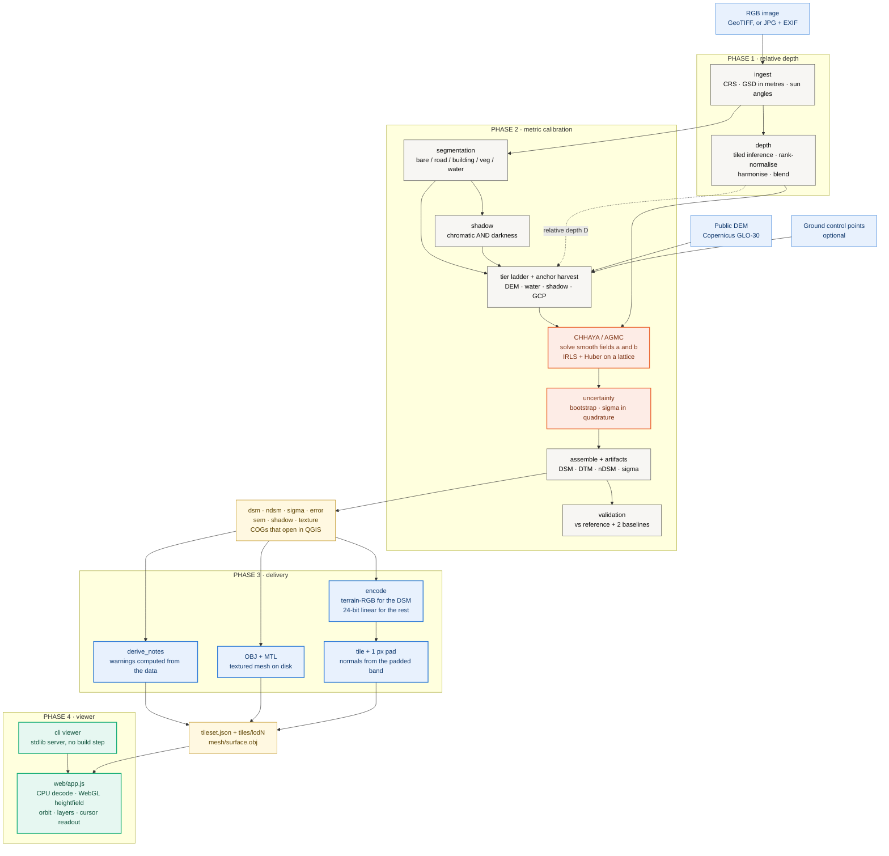
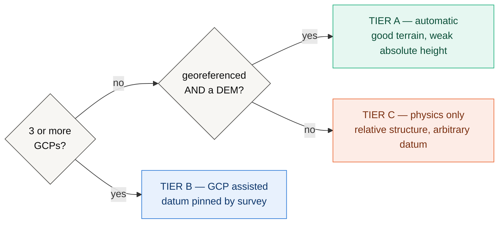

# ĀYĀMA — आयाम

**Metric elevation from a single image.** Relative depth from a pretrained
backbone, converted to metres by **Chhaya** (छाया), an anchor-graph calibration
engine, then delivered as a COG DSM, a textured mesh and a local 3D viewer.

> **Status: Phases 1–4 built, measured on CPU.** Reproducible on a laptop with
> no GPU, no data download and no package manager. The findings include a
> diagnosis of why the calibration does **not** yet work as a DSM estimator —
> and the viewer states that defect on screen rather than hiding it.

| | |
|---|---|
| **POC hardware** | 8-core CPU, no CUDA, `torch 2.13.0+cpu` |
| **Benchmark** | 3 synthetic 1024×1024 scenes @ 0.5 m, exact ground-truth DSM |
| **Phase 2 headline** | MAE **3.30 ± 0.08 m** vs a **3.49 m** DEM-only floor |
| **Central finding** | scale field collapses to its floor; object height recovered is **0.05 m** of a true 12.4 m |
| **Phase 3/4** | tileset + mesh in **2.6 s / 5.1 s**; viewer first paint **4.34 MB, 35 ms** CPU |
| **Test suite** | 162 passed, 7 skipped (GPU-only) |
| **Live** | the 3D viewer runs in the browser on the published site — see [§3](#3-results) |

**Contents** — [1 Proposal](#1-proposal) · [2 Architecture](#2-architecture) ·
[3 Results](#3-results) · [4 The central finding](#4-the-central-finding-scale-field-collapse) ·
[5 The fix, measured](#5-the-fix-measured) · [6 Phase 3 and 4: delivery](#6-phase-3-and-4-delivery) ·
[7 Running it](#7-running-it) · [8 Roadmap](#8-roadmap) · [9 Layout](#9-layout-and-conventions)

---

# 1. Proposal

## The problem

A Digital Surface Model — ground plus everything on it — feeds flood modelling,
solar siting, line-of-sight planning and damage assessment. Every way of getting
one is expensive: lidar needs a flight, stereo needs a second view, InSAR needs a
satellite pair.

Single nadir images are abundant, and monocular depth models (Depth Anything,
MiDaS, Marigold) predict *relative* depth well — a surface correct up to an
unknown, spatially varying scale and offset. They cannot say how many metres.
**The gap is not perception. It is metric grounding.**

## What we propose

*Chhaya* (छाया, "shadow") converts a relative surface into metres by solving for
a smooth calibration field against a graph of **anchors** — statements about the
world in metres, harvested from whatever the scene offers:

| Anchor | What it asserts | Kind |
|---|---|---|
| Public DEM (Copernicus GLO-30) | "this bare-earth pixel is at 412.3 m" | absolute |
| Water bodies | "every pixel of this lake is at one elevation" | absolute |
| Cast shadows | "this roof stands 34.7 m above the ground at its foot" | **relative** |
| Ground control points | "this surveyed pixel is at 118.02 m" | absolute |

Two design claims carry the method:

1. **A global affine fit is the wrong model.** `H = aD + b` with two scalars per
   tile must average away every local disagreement and inherits the worst error
   of each source. Chhaya solves two smooth *fields* on a coarse lattice instead.
2. **A shadow measures a height, never an elevation.** Relative anchors enter as
   a *difference of two rows*, so a roof-height measurement can never be
   reinterpreted as a datum statement.

Every output carries a per-pixel σ, and the σ is validated rather than asserted.

## Scope, and what is out of it

Everything runs on **CPU**. In scope: the full path from image to metric DSM to
3D viewer, on synthetic scenes with exactly known ground truth.

Out of scope, and stated rather than hidden: **no real satellite imagery** (every
number is against a synthetic renderer); **no trained segmentation model** (a
colour heuristic, labelled as such in every artifact); **no network DEM fetching**
(`sim:` is explicit and stamped into provenance); **no GPU claims**.

## Acceptance criteria

| # | Criterion | Result |
|---|---|---|
| C1 | Full pipeline runs unattended on CPU, every stage producing a GIS-openable artifact | **met** — 46.7 s/scene |
| C2 | Uncertainty is honest: 1σ coverage ≈ 0.68 | **met** — 0.674 ± 0.023 |
| C3 | Anchor graph clearly beats a global affine fit | **met** — MAE 3.30 vs 5.49 m |
| C4 | Result clears the DEM-only floor on more than one metric | **NOT met** — 5% better MAE, 2% worse RMSE, identical *r* |
| C5 | Buildings appear at plausible height | **NOT met** — 0.05 m of a true 12.4 m |
| C6 | Delivery does not alter the surface | **met** — 16/16 layer-LOD pairs within half an encoding step |

C4 and C5 fail together, for one reason, diagnosed in [§4](#4-the-central-finding-scale-field-collapse).

---

# 2. Architecture

Four phases, one pipeline. Every stage is a pure function
`stage(input) -> output` over the dataclasses in
[`ayama/core/types.py`](ayama/core/types.py) — no globals. That is what makes the
ablation table cheap: `ablate` runs inference **once** and re-solves only the
calibration for every variant.



**Two edges carry the design.** The dashed one: anchors are harvested from the
image and the DEM, *not* from the depth field — depth supplies shape, the anchor
graph supplies metres. And everything downstream of `COG` only ever **reads**
Phase 2's output, so the viewer cannot show a number the calibration did not
produce.

## The calibration ladder

The system degrades rather than fails, and reports which rung it used.



Shadow physics runs on **every** rung — it needs nothing but the image and the
sun angles, and it is the only absolute-scale cue in Tier C. All three benchmark
scenes selected **Tier A**.

## Key decisions, one line each

- **Rank normalisation per chip**, then robust affine harmonisation on the
  overlap band. Blending alone hides a seam and keeps the error.
- **The semantic gate.** A public DEM approximates bare earth, so a DEM sample on
  a rooftop is not a weak anchor — it is a wrong one, rejected before it enters.
- **Shadow detection is chromatic, not a brightness threshold.** Shadow is dark
  *and* blue-shifted; dark asphalt is dark and not. Precision goes 0.08–0.15 →
  **0.95–0.97**.
- **σ from three independent sources** in quadrature: bootstrap over anchors,
  backbone spread, and the DEM's datasheet accuracy.
- **DSM = DTM + nDSM**, kept apart because a DEM knows terrain and a shadow knows
  height, and neither should inherit the other's error.
- **Two encodings in Phase 3**, because one is not enough — see [§6](#6-phase-3-and-4-delivery).
- **Sign, metres, missing metadata** — conventions in [§9](#9-layout-and-conventions).

---

# 3. Results

Every measured number for every phase, in one place. Two commands produce all of
it, and both write the raw data beside the report so a table can never drift
from what was measured:

```bash
python -m ayama.cli study    --out results                     # Phases 1-2, 450 s
python -m ayama.cli delivery results/seed7/run --out results   # Phases 3-4, 68 s
```

| | raw data | report |
|---|---|---|
| Phases 1–2 | [`results/study.json`](results/study.json) | [`results/README.md`](results/README.md) |
| Phases 3–4 | [`results/delivery.json`](results/delivery.json) | [`results/DELIVERY.md`](results/DELIVERY.md) |

**Environment for everything below:** Windows 11, Python 3.13.5, 8 CPUs,
`torch 2.13.0+cpu`, CUDA unavailable. Three synthetic scenes (seeds 7/21/33) at
1024×1024 and 0.5 m with exact ground truth, `dav2-vits`, simulated Copernicus
GLO-30. All three selected **Tier A**.

## Phase 1 — relative depth

| | |
|---|---|
| backbone | `dav2-vits` (Depth-Anything-V2-Small), 24.8 M params, float32 |
| one 1024² chip | **1.53 s** (0.68 Mpix/s) |
| nine 512² chips, same area | 18.84 s (0.06 Mpix/s) |
| model load | 27–32 s, once |

**Chipping is expensive on CPU** — a 12× penalty for covering the same area,
from the 25% overlap plus per-chip normalisation and harmonisation. Use the
largest chip that fits in RAM. Model load exceeds inference, so batch work
should load once and stream scenes.


## Phase 2 — metric calibration


Three synthetic scenes (seeds 7/21/33), 1024×1024 at 0.5 m, `dav2-vits` on CPU,
simulated Copernicus GLO-30. **450 s to regenerate.** Raw data in
[`results/study.json`](results/study.json), digest in
[`results/README.md`](results/README.md).

### Headline

| metric | **AGMC (ours)** | global affine | **DEM alone (floor)** |
|---|---|---|---|
| MAE (m) | **3.30 ± 0.08** | 5.49 ± 0.85 | 3.49 ± 0.05 |
| RMSE (m) | 5.49 ± 0.14 | 7.80 ± 0.82 | **5.37 ± 0.12** |
| Pearson r | 0.709 ± 0.086 | 0.162 ± 0.145 | 0.708 ± 0.094 |
| bias (m) | −0.60 ± 0.08 | — | — |
| **edge F1** | **0.264 ± 0.014** | **0.780** | 0.196 |
| 1σ coverage | **0.674 ± 0.023** (target 0.68) | — | — |
| ECE (m) | 2.36 ± 0.14 | — | — |
| δ < 1.25 | **undefined — 0 valid px** | — | — |

**Read the third column first.** The reconstruction beats the DEM it was anchored
to by 5% on MAE, loses by 2% on RMSE, and matches its correlation to three
decimals. The anchor graph is carrying the entire result.

**Then the last two rows.** edge F1 of 0.264, and a δ₁ that could not be computed
because not one pixel in three scenes had a *predicted* height above ground over
0.5 m. That is terrain with every structure flattened.

### Error by class

| class | MAE (m) | bias (m) | 1σ cov | % of px |
|---|---|---|---|---|
| road | **1.79 ± 0.15** | −0.07 | 0.807 | 5.3% |
| bare ground | **2.79 ± 0.12** | −0.47 | 0.725 | 85.8% |
| vegetation | 5.51 ± 0.23 | −5.42 | 0.234 | 1.9% |
| water | 7.93 ± 0.39 | +7.76 | 0.106 | 3.9% |
| building | **12.94 ± 0.27** | **−12.94** | 0.021 | 3.1% |


Three things this says that the headline hides. **Terrain is close to solved;
structure is not** — and building `bias = −MAE exactly`, so the error is entirely
one-sided. **σ is honest only on average**: 0.674 scene-wide, but **0.021** on
buildings, because 85.8% of pixels are bare ground. **Water is biased the other
way** (+7.76 m): the flat-water constraint uses the DEM's smoothed median, which
sits above the true surface.

### Ablation

One inference per scene; every variant re-solves only the calibration.

| variant | MAE (m) | RMSE (m) | r | **edge F1** | anchors |
|---|---|---|---|---|---|
| `dem_only` (floor) | 3.49 | **5.37** | 0.708 | 0.196 | 4021 |
| `global_affine` | 5.50 | 7.80 | 0.162 | **0.780** | 4021 |
| `agmc_no_gate` | 3.30 | 5.50 | 0.709 | 0.263 | 4232 |
| `agmc_no_shadow` | 3.30 | 5.49 | 0.711 | 0.263 | 3956 |
| `agmc_no_water` | 3.35 | 5.59 | 0.692 | 0.251 | 3951 |
| **`agmc` (full)** | **3.30** | 5.49 | **0.711** | 0.263 | 4021 |


**The `global_affine` row is the most informative line in this document.** Worst
MAE by 67%, best edge F1 by a factor of three. A single scalar applied to the raw
depth field puts height discontinuities in the right place 78% of the time — the
depth model *does* know where the buildings are, and **AGMC throws that away**
while improving the pixelwise average.

The rest are near-null and saying so is more useful than dressing it up.
Removing shadow anchors changes nothing measurable, because ~65 shadow anchors
are drowned by ~3840 DEM anchors. Removing the semantic gate costs almost
nothing *here*, on 3.1% building cover — it would not hold in a dense city.

### Shadow physics window

Building height from shadow length, **with no depth model involved**.

| sun elev | shadow F1 | anchors | median height error |
|---|---|---|---|
| 15–20° | 0.29–0.34 | 0 | — |
| 25° | 0.46 | 3 | 8.69 m |
| 30° | 0.71 | 50 | 6.41 m |
| 40° | 0.75 | 57 | 4.44 m |
| **50°** | **0.81** | 57 | **1.68 m** |
| **60°** | **0.81** | 58 | **1.70 m** |
| 70° | 0.73 | 48 | 2.33 m |
| 75–80° | 0.38–0.60 | 0 | — |


**The cleanest positive result in the POC.** At 50–60° the physics recovers
building height to **1.7 m median error**. The failure modes differ at the two
ends — low sun keeps precision (0.98) and loses recall as shadows merge; high sun
keeps recall and loses precision as shadows shrink below resolution — which is a
good sign the physics is real rather than fitted. **The shadow branch works and
the pipeline cannot currently use it.**

### Calibration parameter, reliability, CPU cost

**λ is not a knob.** MAE varies 3.24–3.35 m across a 10× range (λ = 0.05 → 0.5)
and degrades monotonically outside it. The shipped default of 1.0 is slightly
over-smoothed; retuning would be noise-fitting. One caveat: the sweep records MAE
but not edge F1, and the λ that minimises MAE is very likely not the λ that
preserves structure.

**σ is well calibrated at scene level** — 1σ coverage 0.674 against a Gaussian's
0.683 — but 2σ undershoots (0.850 vs 0.954), so the error distribution has
heavier tails than a Gaussian. And per §3's class table, it is silent about
structure.

**CPU, per 1024² scene: 46.7 s total.** Depth 22.1 s (47%), uncertainty 8.2 s,
validation 7.5 s, artifacts 4.5 s, anchors 2.3 s — and **calibration 0.3 s**. The
entire contribution of this work costs under 1% of the pipeline; the cost is the
pretrained backbone, which a GPU would move and Chhaya does not need. Chipping is
expensive on CPU: nine 512 px chips take 18.84 s to cover what one 1024 px chip
covers in 1.53 s.

---


## Phases 3 and 4 — delivery

Design and architecture are in [§6](#6-phase-3-and-4-delivery); the numbers are here.


`python -m ayama.cli delivery results/seed7/run --out results` — **68 s on CPU**.
Full report in **[results/DELIVERY.md](results/DELIVERY.md)**, raw data in
[`results/delivery.json`](results/delivery.json).

### Phase 3, building

| | |
|---|---|
| tileset, tiles only | **2.59 s** (0.40 Mpix/s) |
| tileset, with the OBJ | **5.07 s** (OBJ alone 2.47 s) |
| output | 4 LODs, 7 tiles, 43.1 MB |
| **round trip** | **16/16** layer-LOD pairs within half an encoding step |

**PNG compression is the whole cost** — packing runs at 33 Mpix/s, compressing at
2.8. Nothing in `encode.py` is worth optimising until the compressor is.

**Tile size barely matters.** Across a 21× range in file count (24 → 510 files)
the payload moves **0.8%** (9.08 → 9.15 MB). Per-file PNG overhead was expected to
punish small tiles and does not, so tile size is free to be chosen for culling and
request count rather than bytes.

**The OBJ is a text format and it shows** — ~64 bytes a triangle, **79% of the
tileset**:

| stride | triangles | seconds | size |
|---|---|---|---|
| 1 | 2,093,058 | 10.63 | 139.1 MB |
| **2** (default) | 522,242 | 2.46 | 33.6 MB |
| 4 | 130,050 | 0.66 | 7.8 MB |
| 8 | 32,258 | 0.13 | 1.8 MB |

> Build timings are disk-bound. The same 139 MB OBJ took **36 s** in a scratch
> directory and **205 s** written inside the checkout once an on-access virus
> scanner got involved. Every timed build uses one location for that reason.

### Phase 4, the viewer

**The viewer runs live on the published site.** `site/` embeds it as a sub-page
over a committed 2.86 MB tileset, so the 3D view loads with no build step and no
external request — the same `web/app.js` that `ayama viewer` serves locally. It
is assembled by `.github/workflows/pages.yml`, and `scripts/serve.py` reproduces
that assembly locally so what you preview is what deploys:

```bash
python scripts/serve.py        # the whole site, viewer included, at localhost:8000
```

The demo tileset is built with `--no-mesh --bits 12`, which is why it is 2.86 MB
rather than 43.1 MB. Its layers still round-trip within half an encoding step,
and a test asserts both the size ceiling and the tile inventory.

#### What its CPU costs

Measured against the real `web/app.js` under node, best of five with a warm-up.
**GPU rasterisation is not measured and is not claimed.**

| | ms |
|---|---|
| decode terrain-rgb, whole scene | 4.3 |
| decode linear, whole scene | 4.1 |
| build geometry, one tile | 2.5 |
| re-colour, one tile | 1.9 |
| render the side panel (jsdom) | 3.4 |
| **CPU before first paint, whole scene** | **35** |

Decode runs at **244 Mpix/s** in JavaScript. First paint fetches **4.34 MB** —
geometry, normals, the default drape and the two layers the readout needs — and
spends **35 ms** turning it into buffers. A layer switch costs 7.4 ms.

One free win the benchmark found: **reusing the output buffer is 20% faster**
(3.44 ms against 4.30 ms). The viewer allocates a fresh `Float32Array` per tile
per layer; it does not have to.

### Where the bytes go, and what precision costs

| | size | share |
|---|---|---|
| `mesh/surface.obj` + texture | 34.0 MB | 79% |
| sigma tiles | 3.25 MB | 8% |
| error tiles | 3.19 MB | 7% |
| ndsm tiles | 1.95 MB | 5% |
| texture tiles | 0.45 MB | 1% |
| **dsm tiles** | **0.14 MB** | 0.3% |
| normal tiles | 0.09 MB | 0.2% |

The DSM layer is **23× smaller than the σ layer** while covering an 18 m range
against σ's 0.04 m. Terrain-RGB's coarse step leaves a nearly constant low byte
that PNG crushes; the 24-bit linear encoding spends every bit, so its low byte is
noise.

Keeping only the top 12 bits — what a narrower field really stores — **resolves
every layer to better than 0.1% of its own range and takes the linear layers from
6.22 MB to 1.46 MB, a 76% saving.** That is the next delivery change.

Getting there took two wrong answers, both of which the byte count alone endorsed:

- Stepping by fractions of mean σ (3 m) "saved" 99.8% on nDSM — by rounding a
  0.276 m layer with a 0.75 m step, flattening it to a constant. **A saving that
  deletes the measurement is not a saving**, and only the max-error column showed it.
- Rounding in *value* space left the low byte noisy through float jitter and
  produced a **larger** file at 12 bits than at 16 — impossible if the low bits
  are really constant.

Both are now pinned by tests in
[`tests/test_delivery_contract.py`](tests/test_delivery_contract.py).

# 4. The central finding: scale-field collapse

Criteria C4 and C5 failed together, for one reason, localised to one term.

## The symptom

| scene | predicted nDSM max | on buildings | **true** nDSM max | true, on buildings |
|---|---|---|---|---|
| seed7 | **0.28 m** | 0.05 m | 42.54 m | 12.40 m |
| seed21 | **0.27 m** | 0.04 m | 41.04 m | 12.45 m |
| seed33 | **0.24 m** | 0.05 m | 40.48 m | 13.19 m |

Across three scenes with ~60 buildings each, **not one pixel has a predicted
height above ground over 0.5 m.** Measured directly on seed7, buildings against a
15 px ring of surrounding ground: predicted **+0.07 m**, true **+6.81 m**.

## The mechanism

Solving AGMC on seed7 and inspecting the fields:

```
robust global affine on the raw depth field:   a = -14.50,  b = 407.15
solved scale field a(x,y):   min 0.0500   median 0.0500   max 0.0500
                             lattice nodes at the floor:  100%
solved offset field b(x,y):  387.93 .. 409.55   (range 21.62 m)
```

The scale field is **pinned at its floor of 0.05 at every lattice node**. Since
depth runs 0–1, the most the depth model can contribute is `0.05 × 1.0 = 0.05 m`
— exactly the observed building height. The offset field, which carries no prior,
spans 21.62 m and reproduces the terrain by itself. **Chhaya is not calibrating a
depth field; it is interpolating a DEM** — precisely what the `dem_only` baseline
exists to detect.

## The root cause

```
                        seed7      seed21     seed33
   corr(D, true DSM)    -0.271     -0.258     +0.043    <- terrain: anti-correlated
   corr(D, true nDSM)   +0.236     +0.266     +0.253    <- structure: correlated
```

Depth Anything V2 applies a ground-level perspective ramp to nadir imagery. At
**low spatial frequency** that ramp anti-correlates with terrain, so a fit against
3840 terrain anchors concludes the surface is inverted and asks for `a = −14.50`.
At **high frequency** the same field is correct.

The positivity projection then does exactly what it was designed to do. Without
the clamp: an inverted city, roofs rendered as pits. With it: a flattened city.
**The guard is correct and the design is incomplete** — and neither is fixable by
tuning λ or δ.

## Why the headline metric hid it

MAE improved (3.49 → 3.30) while the product became useless. Buildings are 3.1%
of pixels, so flattening every one costs ~0.4 m of MAE — less than the gain from
smoothing the DEM's correlated noise.

| metric | caught it? |
|---|---|
| `dem_only` floor baseline | **yes** — only 5% better on MAE, worse on RMSE |
| edge F1 | **yes** — 0.264 against 0.780 for a plain global affine |
| δ < 1.25 on nDSM | **yes** — undefined, zero valid pixels |
| per-class bias | **yes** — building bias = −MAE exactly |
| MAE / RMSE / r / ρ | no — all improved or held |

This is the harness working as intended. The value of a floor baseline is that it
fires when the headline number is flattering.

---

# 5. The fix, measured

**Split the depth field by spatial frequency before calibration**, and let each
band be anchored by the source that knows about it. Blur `D` (≈60 m radius) to
get its large-scale part and **discard it** — that is where the perspective ramp
lives. Then:

```
H(x,y) = b(x,y)                          terrain, from DEM / GCP / water anchors
       + a(x,y) × D_detail(x,y)          structure, from shadow anchors
```

The key change is what `a` is fitted against. Today it must serve terrain and
buildings at once and the 3840 terrain anchors win; here it never sees terrain.

This is not a new subsystem: `DepthField.terrain`, `DepthField.objects` and the
`branch` field on `Anchor` already exist in
[`ayama/core/types.py`](ayama/core/types.py) and are unused.

## The evidence

**(a) High-passing roughly doubles the structural correlation**, stably across
cutoffs (30 m and 60 m agree to 3 dp):

| scene | corr(D, true nDSM) | **corr(D_detail, true nDSM)** |
|---|---|---|
| seed7 | +0.236 | **+0.431** |
| seed21 | +0.266 | **+0.490** |
| seed33 | +0.253 | **+0.523** |

**(b) Recovered building height goes from 0.4% to 69–77% of truth:**

| scene | current | **proposed (oracle scale)** | truth |
|---|---|---|---|
| seed7 | 0.05 m | **8.80 m** | 12.40 m |
| seed21 | 0.04 m | **8.58 m** | 12.45 m |
| seed33 | 0.05 m | **10.20 m** | 13.19 m |

**(c) Structural fidelity is transformed; pixelwise error is not.** Building
`DEM + max(a·D_detail, 0)` on seed7: edge F1 **0.244 → 0.276 → 0.730** (DEM /
current / proposed), while MAE moves 3.47 → 3.39 → 3.40.

> **Caveat.** The scale in (b) and (c) is fitted against ground truth, so these
> are **oracle upper bounds on the available signal**, not predictions of
> end-to-end performance. In deployment that scale must come from shadow anchors,
> whose own accuracy is 1.7 m median in the 50–60° band.

**Row (c) matters as much as (b): the fix improves edge F1 by 2.6× and does not
improve MAE at all.** If MAE stays the headline, the correct fix looks like a
regression. Recommended, and cheap: promote edge F1 and per-class building MAE to
the headline; add edge F1 to the λ sweep; assert that a scene with buildings must
produce a non-degenerate nDSM; and report the scale field's floor-saturation
fraction, which was 100% and which nothing in the output mentioned.

## Ordered work

| # | change | effort |
|---|---|---|
| 1 | nDSM sanity assertion + floor-saturation in `summary.json` | hours |
| 2 | Frequency split in `DepthField` | days |
| 3 | Route anchors to bands by their existing `branch` field | days |
| 4 | Solve `a` on `D_detail` against object anchors only | days |
| 5 | Edge-aware Laplacian (down-weight smoothness across semantic boundaries) | 1–2 weeks |
| 6 | Trained segmentation model | 2–4 weeks |
| 7 | Real imagery with a reference DSM | procurement |

Items 1–4 are the critical path, all inside `ayama/chhaya/`.

---

# 6. Phase 3 and 4: delivery

**Measurements are in [§3](#3-results); this section is the design.**

Phase 2 produces rasters. Phase 3 turns them into a tiled, browser-loadable
surface plus a textured mesh; Phase 4 renders it. **Neither computes elevation** —
every metre on screen was decoded from a tile Phase 3 wrote from a raster Phase 2
produced, and `tileset.json` records which run.

**One deviation from the spec**, stated up front: the spec says
`web/ — React + Vite + Three.js`; what is here is plain HTML/CSS/JS with a
hand-written WebGL renderer and **no build step, no package manager, no CDN**. A
Vite app needs `npm install` before it renders at all, which puts a toolchain
between a reviewer and the result. The cost is ~300 lines of matrix, shader and
camera code, and no scene graph to grow into.

## Architecture

```mermaid
flowchart LR
    classDef p2   fill:#f7f6f3,stroke:#52514e,color:#0b0b0b
    classDef p3   fill:#e8f1fd,stroke:#2a78d6,stroke-width:2px,color:#0d366b
    classDef p4   fill:#e6f7f1,stroke:#1baf7a,stroke-width:2px,color:#0b4f38
    classDef out  fill:#fff8e1,stroke:#b8860b,color:#5c4200
    classDef ext  fill:#fdece6,stroke:#eb6834,color:#7a2f10

    RUN["Phase 2 run directory<br/>dsm · ndsm · sigma · error<br/>sem · texture · provenance"]:::p2

    subgraph PH3["PHASE 3 · build, read-only"]
        direction TB
        ENC["encode.py<br/>terrain-RGB, 0.1 m step, for the DSM<br/>24-bit linear, range in the manifest, for the rest"]:::p3
        TIL["tiles.py<br/>partition + 1 px halo of the neighbours<br/>normals taken on the padded tile, then cropped"]:::p3
        LOD["pyramid<br/>decimate by 2 per level<br/>never average a DSM"]:::p3
        OBJ["obj.py<br/>Wavefront OBJ + MTL<br/>+X east, +Y north, +Z up"]:::p3
        NOT["derive_notes<br/>inspects the surface it is about to ship"]:::p3
    end

    MAN["tileset.json<br/>THE CONTRACT<br/>encodings · ranges · LODs · tiles<br/>metrics · provenance · notes"]:::out
    PNG["tiles/lodN/*.png · *.jpg"]:::out
    MESH["mesh/surface.obj + .mtl + .jpg"]:::out

    subgraph PH4["PHASE 4 · viewer, no build step"]
        direction TB
        FETCH["fetch manifest, then tiles"]:::p4
        DEC["CPU decode via 2D canvas<br/>exact bytes, not a shader"]:::p4
        GEO["vertex buffers per tile<br/>heights as an attribute"]:::p4
        GL["WebGL heightfield<br/>exaggeration as a uniform"]:::p4
        UI["layers · LOD · wireframe<br/>cursor readout · notes panel"]:::p4
    end

    SRV["cli viewer<br/>stdlib HTTP server<br/>web at / · tileset at /data"]:::p4
    DCC["Blender · MeshLab<br/>CloudCompare · QGIS"]:::ext

    RUN --> ENC --> TIL --> LOD --> PNG
    RUN --> OBJ --> MESH
    RUN --> NOT --> MAN
    TIL --> MAN
    LOD --> MAN
    PNG --> FETCH
    MAN --> FETCH --> DEC --> GEO --> GL --> UI
    DEC -. "same Float32Array" .-> UI
    SRV --> FETCH
    MESH --> DCC
```



**Three properties the diagram is drawing.**

*Everything flows out of the run directory and nothing flows back.* Phase 3 only
reads what Phase 2 wrote, so no number on screen can be one the calibration did
not produce — and `tileset.json` records which run it came from.

*The manifest is the only joint between Python and JavaScript.* It carries the
encodings, the per-layer ranges and the LOD/tile geometry explicitly rather than
letting either side assume a default, because the failure mode of an implied
convention is a viewer that renders a wrong surface confidently. Tests assert
both halves of it.

*The decode is CPU, and deliberately so.* Unpacking 24-bit values in GLSL invites
two silent corruptions — the browser may colour-manage or premultiply a texture
upload, and `mediump` cannot hold 16 777 215 exactly. Decoding through a 2D
canvas returns the exact bytes PIL wrote, and the same `Float32Array` then serves
the cursor readout (the dashed edge). The GPU only ever samples ordinary colour
textures.

## What each part does

| part | job |
|---|---|
| [`mesh/encode.py`](ayama/mesh/encode.py) | terrain-RGB (Mapbox, 0.1 m step) for the DSM; **24-bit linear** for nDSM/σ/error |
| [`mesh/tiles.py`](ayama/mesh/tiles.py) | tiles with a 1 px halo of the **neighbours'** pixels, so per-tile normals have no seam ridge |
| [`mesh/obj.py`](ayama/mesh/obj.py) | Wavefront OBJ + MTL — opens in Blender/MeshLab with no plugin |
| [`mesh/build.py`](ayama/mesh/build.py) | run directory → tileset + manifest + `derive_notes` |
| [`web/`](web/) | layers, 1–200× vertical exaggeration, LOD, wireframe, cursor readout of elevation / height / σ |

**Why two encodings.** Phase 2's nDSM spans 0.276 m *in total*. Terrain-RGB's
fixed 0.1 m step would quantise that into three levels and the viewer would be
drawing an encoding artifact. Round-trip error: **0.050 m** for the DSM (half a
step, as designed) against **1.5 × 10⁻⁸ m** for the linear layers.

**Why the halo.** A normal at a tile's last row needs the first row of its
neighbour. Without it every boundary gets a faint ridge that reads as real
terrain in 3D. Tests assert normals stitched from padded tiles are
**byte-identical** to whole-raster normals across every internal seam — and that
the same test with `pad = 0` fails at exactly the tile boundaries.

**`derive_notes` keeps it honest.** It inspects the surface before shipping it. On
the real seed7 run it fires, unprompted:

> **!!** Predicted height above ground reaches only 0.28 m (99th percentile
> 0.17 m) on a scene where 3.0% of pixels are classified as building. The
> calibration scale field has collapsed to its floor… Raise the vertical
> exaggeration to see what little relief there is — **it is a defect, not a
> rendering choice.**

On the `synthetic` backbone's run, whose nDSM reaches 3.14 m, the same code
downgrades to a `low_relief` warning. It reads the data; it does not know which
scene it is looking at.

## What Phase 3/4 does not do

Tiles are all loaded, not streamed — no frustum culling, no distance-based LOD.
No glTF (OBJ is text and large). σ is drawn as a layer, not as geometry — the
honest rendering of a 3 m-uncertain surface is a band, not a sheet. No profiles,
areas or volumes. One run per tab.

---

# 7. Running it

## Setup

```bash
python -m venv .venv
.venv/bin/pip install -r requirements.txt      # core pipeline, no torch
.venv/bin/pip install torch torchvision transformers
```

The core install has **no torch on purpose**: ingest, tiling, blending, raster IO,
calibration, metrics and the synthetic scene all run without it.
`--backbone synthetic` exercises the whole path with no weights — a plumbing
check, never a result.

## The three commands that produce everything

```bash
python -m ayama.cli study    --out results                     # Phase 2 evidence, 450 s
python -m ayama.cli delivery results/seed7/run --out results   # Phase 3/4 benchmark, 68 s
python -m ayama.cli viewer   results/seed7/run                 # builds if needed, then serves
```

`viewer` opens `http://localhost:8020/` and prints the flat-surface note on the
way past. `mesh/surface.obj` in the tileset opens in Blender or MeshLab.

## Everything else

```bash
python -m ayama.cli doctor --load dav2-vits          # is this machine ready, and how fast
python -m ayama.cli synth  --out data/scene.tif      # town + known DSM + ray-marched shadows
python -m ayama.cli run    data/scene.tif --out out/run \
    --dem sim:data/scene_dtm.tif --ref data/scene_dsm.tif
python -m ayama.cli ablate data/scene.tif --ref data/scene_dsm.tif --dem sim:data/scene_dtm.tif
python -m ayama.cli figures --study results/study.json
python -m ayama.cli mesh   results/seed7/run --out out/tiles3d --obj-stride 4
bash scripts/harness.sh                              # all eight steps, into out/harness/
```

## Reproduce the §4 diagnosis

```bash
python - <<'PY'
import numpy as np, rasterio
from ayama.core.ingest import ingest
from ayama.core.types import Config, DepthField, Tier
from ayama.chhaya.agmc import solve_agmc, global_affine
from ayama.chhaya.ladder import build_anchors
from ayama.eval.simulate import simulate_public_dem
from ayama.measure.derive import slope_deg

scene = ingest('results/seed7/scene.tif')
rd  = rasterio.open('results/seed7/run/relative_depth.tif').read(1)
sem = rasterio.open('results/seed7/run/sem.tif').read(1)
sh  = rasterio.open('results/seed7/run/shadow.tif').read(1).astype(bool)
dtm = rasterio.open('results/seed7/scene_dtm.tif').read(1)
dem = simulate_public_dem(dtm, scene.meta.gsd_m, source='copernicus')

cfg = Config(); cfg.dem_source = 'copernicus'
d = DepthField(relative=rd, meta=scene.meta, backbone='dav2-vits')
anchors, _ = build_anchors(scene, d, sem, sh, Tier.A, dem_m=dem, cfg=cfg,
                           slope_mask=slope_deg(dem, scene.meta.gsd_m) > 25.0)
print('global affine wants a = %.2f' % global_affine(rd, anchors, cfg.huber_delta)[0])
cal = solve_agmc(d, anchors, cfg, tier=Tier.A)
print('a field: min %.4f median %.4f max %.4f' % (cal.a.min(), np.median(cal.a), cal.a.max()))
print('fraction at the 0.05 floor: %.1f%%' % (100 * (cal.a <= 0.0501).mean()))
PY
```

Expected: `a = -14.50`, the field flat at `0.0500`, **100%** at the floor.

## Tests

```bash
python -m pytest tests -q                 # 162 passed, 7 skipped (GPU)
node scripts/check_app.js                 # the viewer, under jsdom
node scripts/check_site.js                # the results site
node scripts/check_math.js                # every equation, through KaTeX
```

Three checks exist to catch failures nothing else would notice. **The two decoders
must agree** — `web/app.js` and `ayama/mesh/encode.py` are independent
implementations of one packing, and drift would render a confidently wrong
surface silently. **The page must degrade, not blank** — jsdom has no WebGL, and
that is used rather than worked around. **A benchmark must not flatter itself** —
the delivery contract tests exist because the quantisation sweep twice produced a
number that looked like a win and was not.

GPU path, Docker and Colab: [docs/GPU.md](docs/GPU.md).

---

# 8. Roadmap

| Phase | Output | Status |
|---|---|---|
| **P1 Baseline** | relative depth raster | **done** |
| **P2 Calibration** | metric DSM + σ + metrics | **done, measured, one blocking defect diagnosed** |
| **P3 Delivery** | tiled surface, normals, OBJ mesh | **done, measured** |
| **P4 Viewer** | local 3D viewer over the tileset | **done, measured** |
| **P2.5 Dual-branch** | structure recovered, per [§5](#5-the-fix-measured) | **next — critical path** |

**P3 and P4 were built before P2.5, and the ordering needs defending.** The risk
was that a textured mesh of a flattened city looks finished. `derive_notes`
answers it: the viewer inspects the surface and states the defect before the
reader touches a control. With that in place the delivery layer became the
fastest way to *see* §4, and it is what will show P2.5 working the moment it
lands.

Queue: §5 items 1–4 in `ayama/chhaya/`. Then, for delivery: 12-bit linear layers
(−76% of tile bytes), glTF instead of OBJ, real tile streaming, and buffer reuse
in the decoder (−20%).

---

# 9. Layout and conventions

```
ayama/
  core/        types.py (the contracts), geo.py, solar.py, ingest.py, progress.py
  depth/       backbones/{base,hf,synthetic}.py, infer.py
  semantics/   segment.py, shadow.py
  chhaya/      agmc.py, anchors.py, ladder.py, uncertainty.py
  dsm/         assemble.py, cog.py - every artifact QGIS can open
  measure/     derive.py - slope, roughness, profile, buildings
  mesh/        encode.py, tiles.py, obj.py, build.py                (P3)
  eval/        metrics, ablation, bench, study, figures, delivery
  api/         pipeline.py - the whole method in one file
web/           index.html, app.js, style.css - vanilla WebGL        (P4)
scripts/       setup*, harness.sh, serve.py, bench_viewer.js,
               check_{site,app,math}.js
results/       study.json, delivery.json, DELIVERY.md, figures, per-seed artifacts
```

**If a reviewer asks "show me your method", open
[`ayama/api/pipeline.py`](ayama/api/pipeline.py)** — the whole thing is one
readable function.

Two deliberate deviations from the spec's layout: a single importable `ayama`
package instead of `packages/ayama.core/` (directory names with dots are not
importable; import paths are exactly as specified), and a vanilla `web/` instead
of React + Vite + Three.js (see [§6](#6-phase-3-and-4-delivery)).

## Conventions worth stating once

- **Sign.** The backbone returns higher values for surfaces closer to the sensor.
  From nadir, closer means higher, so relative depth maps monotonically to
  height. There is no flip anywhere.
- **Metres.** `geo.gsd_metres` is the only place allowed to answer "how many
  metres is one pixel", and it converts degrees when the CRS is geographic.
- **Missing metadata is missing**, not defaulted. No sun angles means
  `has_sun = False` and a lower tier, not an invented number.
- **Shadow anchors are relative.** A shadow measures a height, never an
  elevation; letting one enter as an elevation is how a good height anchor
  silently becomes a bad datum anchor.
- **A batch is a scheduling decision, not a numerical one.** Batched inference
  must produce the identical mosaic; there is a test for it.
- **Simulated inputs are labelled.** `--dem sim:` and `--backbone synthetic` stamp
  their provenance into every artifact they touch.
- **A result that does not clear the `dem_only` floor is not a result.** §4 is
  what that rule is for.

---

## Summary

ĀYĀMA establishes, on CPU and reproducibly, that the pipeline **runs end to end
in 46.7 s per scene** with no GPU; that the **anchor graph beats a global affine
fit decisively** (MAE 3.30 vs 5.49 m); that the **uncertainty field is honest at
scene level** (0.674 against an ideal 0.683) while the calibration engine costs
**0.3 s**; that the **shadow physics works** in its measured 30–70° window,
recovering height to **1.7 m median error** at 50–60°; and that **delivery is
cheap and lossless** — 2.6 s to tile a scene, 16/16 round-trip checks passed, a
viewer that paints in 35 ms of CPU.

And it establishes, just as clearly, that the method **does not yet work as a
surface model**: the scale field collapses to its floor, structure is not
recovered, and the result does not clear the DEM-only floor. The cause is
diagnosed to one term, the fix is specified, and the signal it depends on is
measured at 69–77% of true building height.

That the POC could produce a flattering headline MAE *and* the evidence that the
headline was flattering is the part worth keeping. Phases 3 and 4 extend the same
rule to the 3D view: the viewer draws the surface Phase 2 actually produced, and
says on screen why it is flat.
