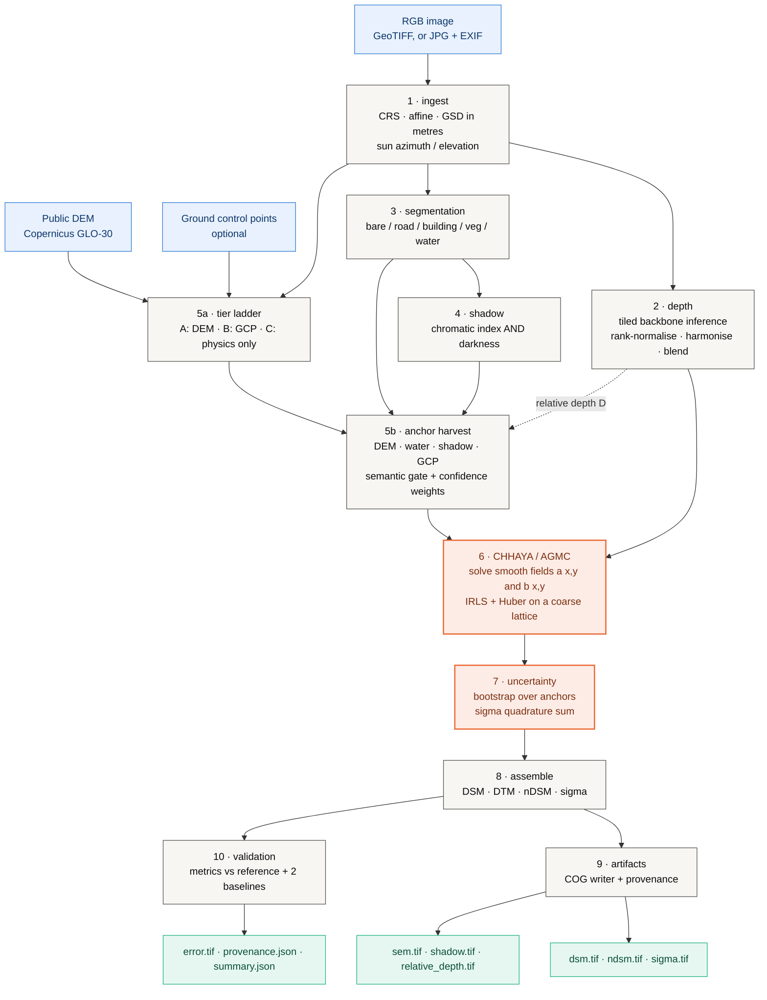
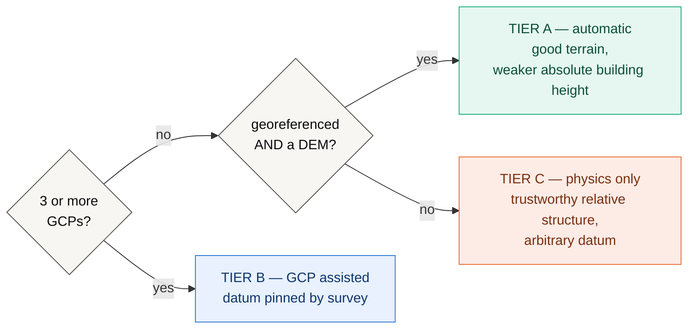
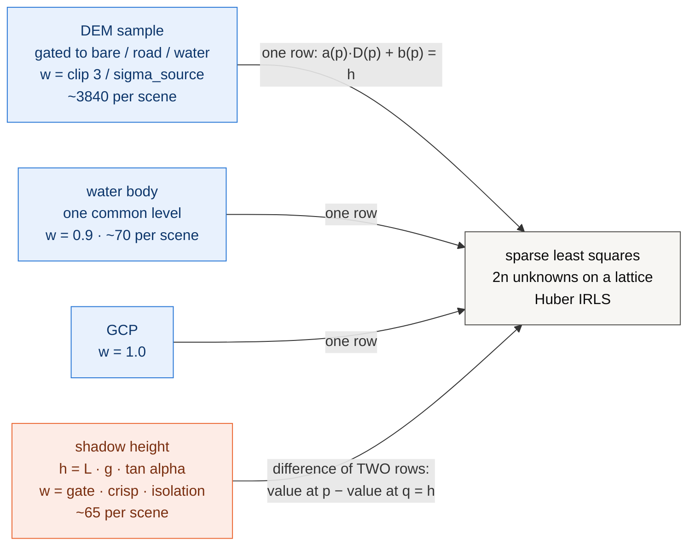
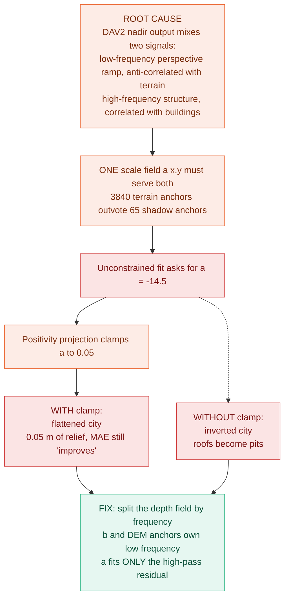
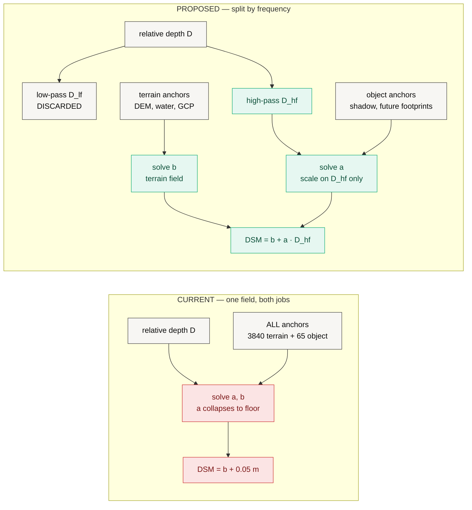
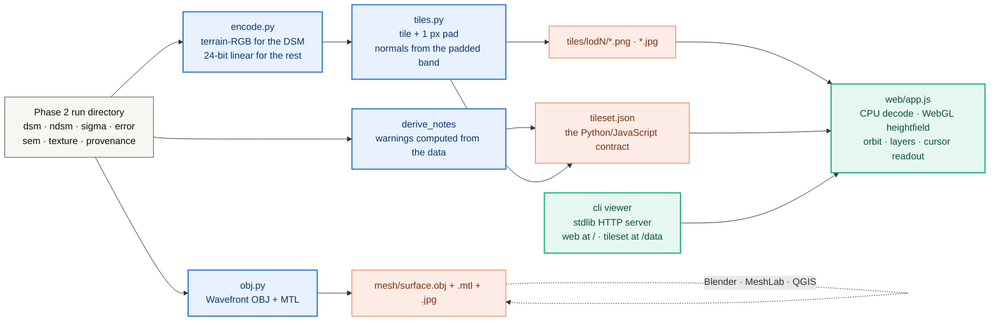

# ĀYĀMA — आयाम

**Metric elevation from a single image.** Relative depth from a pretrained
backbone, converted to metres by **Chhaya** (छाया), an anchor-graph calibration
engine, then delivered as a COG DSM with a per-pixel uncertainty field.

> **Status: Phases 1-4 built, measured on CPU.** Everything below is
> reproducible on a laptop with no GPU, no data download and no package manager.
> The findings include a diagnosis of why the calibration does *not* yet work as
> a DSM estimator, and the measured evidence for the fix. Phases 3 and 4 deliver
> that surface honestly rather than hiding it: `ayama viewer <run>` renders the
> real result in 3D and states its own defect on screen.

| | |
|---|---|
| **Method** | monocular relative depth + anchor-graph metric calibration |
| **POC hardware** | 8-core CPU, no CUDA, `torch 2.13.0+cpu` |
| **Benchmark** | 3 synthetic 1024×1024 scenes @ 0.5 m, exact ground-truth DSM |
| **Full study runtime** | 450 s (CPU) |
| **Test suite** | 149 passed, 7 skipped (GPU-only) |
| **Headline** | MAE **3.30 ± 0.08 m** vs a **3.49 m** DEM-only floor |
| **Central finding** | the scale field collapses to its floor; object height recovered is **0.05 m** of a true 12.4 m |
| **Delivery** | tiled browser surface + OBJ mesh in **3.3 s / 6.7 s** on CPU; zero-dependency local 3D viewer |

---

## Table of contents

1. [Proposal](#1-proposal)
2. [Architecture](#2-architecture)
3. [What each part does — math and outputs](#3-what-each-part-does--math-and-outputs)
4. [Findings](#4-findings-cpu-poc)
5. [The central finding: scale-field collapse](#5-the-central-finding-scale-field-collapse)
6. [Proposed remedy, with measured evidence](#6-proposed-remedy-with-measured-evidence)
7. [Phase 3 and 4 — delivery](#7-phase-3-and-4--delivery)
8. [Reproducing everything](#8-reproducing-everything)
9. [Roadmap](#9-roadmap)
10. [Layout, contracts and conventions](#10-layout-contracts-and-conventions)

---

# 1. Proposal

## 1.1 The problem

A Digital Surface Model — ground plus everything standing on it — is the input
to flood modelling, solar siting, line-of-sight planning, urban growth
monitoring and disaster damage assessment. The ways to obtain one are all
expensive: lidar needs a flight, stereo photogrammetry needs a second view at a
usable convergence angle, InSAR needs a satellite pair and a coherent scene.

Meanwhile, single high-resolution nadir images are abundant and cheap, and
monocular depth models (MiDaS, Depth Anything, Marigold) have become very good
at predicting *relative* depth — a surface that is correct up to an unknown,
spatially varying scale and offset. They cannot say how many metres.

**The gap is not perception. It is metric grounding.**

## 1.2 What we propose

*Chhaya* (छाया, "shadow") converts a relative surface into metres by solving for
a smooth calibration field against a graph of heterogeneous **anchors** —
statements about the world in metres, harvested from whatever the scene happens
to offer:

| Anchor source | What it asserts | Kind |
|---|---|---|
| Public DEM (Copernicus GLO-30) | "this bare-earth pixel is at 412.3 m" | absolute |
| Water bodies | "every pixel of this lake is at one elevation" | absolute or relative |
| Cast shadows | "this roof stands 34.7 m above the ground at its foot" | **relative** |
| Ground control points | "this surveyed pixel is at 118.02 m" | absolute |
| Ground-plane assumption | "open ground is datum zero" | relative, last resort |

The two central design claims:

1. **A global affine fit is the wrong model.** `H = aD + b` with two scalars for
   a whole tile must average away every local disagreement between sources and
   inherits the worst error of each. Chhaya replaces the two scalars with two
   smooth *fields* solved on a coarse lattice.
2. **A shadow measures a height, never an elevation.** Anchors carry a
   `kind`, and relative anchors enter the linear system as a *difference of two
   rows*. Collapsing that distinction is how a good height anchor silently
   becomes a bad datum anchor.

Everything is delivered with a per-pixel σ, and the σ is validated (1σ coverage
against a Gaussian's 0.68) rather than asserted.

## 1.3 Scope of this proof of concept

This POC is deliberately narrow, and everything in it runs **on CPU**:

**In scope.** The complete Phase-2 path — ingest → depth → semantics → shadow →
anchors → calibration → uncertainty → assembly → artifacts → validation — run
end to end on synthetic scenes with an exactly known DSM, plus a simulated
Copernicus GLO-30 built by degrading the true terrain to the real product's
posting and datasheet noise.

**Out of scope, and stated rather than hidden.**

- **No real satellite imagery.** Every number here is against a synthetic
  renderer. They test the method end to end; they are *not* a claim about real
  imagery, which needs a scene with a reference DSM we do not yet have.
- **No trained segmentation model.** The five-class mask is a colour/texture
  heuristic, labelled `heuristic` in every artifact it touches.
- **No network DEM fetching.** `sim:` is explicit and stamped into provenance;
  a run never silently proceeds with a DEM it could not load.
- **No GPU claims.** Every timing below is CPU. The GPU path exists
  (see [docs/GPU.md](docs/GPU.md)) but is not what is being reported.

## 1.4 Acceptance criteria

The POC was set up so that it could fail visibly. The bar:

| # | Criterion | Result |
|---|---|---|
| C1 | Full pipeline runs unattended on CPU, every stage producing a GIS-openable artifact | **met** — 46.7 s/scene, 13 artifacts |
| C2 | Uncertainty field is honest: 1σ coverage ≈ 0.68 | **met** — 0.674 ± 0.023 |
| C3 | Anchor graph clearly beats a global affine fit | **met** — MAE 3.30 vs 5.49 m |
| C4 | Result clears the DEM-only floor by a clear margin on more than one metric | **NOT met** — 5% better MAE, 2% worse RMSE, identical *r* |
| C5 | Recovered structure: buildings appear at plausible height | **NOT met** — 0.05 m recovered of a true 12.4 m |

C4 and C5 fail together and for one reason, diagnosed in
[§5](#5-the-central-finding-scale-field-collapse). The failure is understood,
localised to one term, and the fix is measured in
[§6](#6-proposed-remedy-with-measured-evidence).

---

# 2. Architecture

Ten stages, each a pure function `stage(input) -> output` over the dataclasses
in [`ayama/core/types.py`](ayama/core/types.py). No globals, no hidden state.
That is what makes the ablation table cheap: `ablate` runs inference **once**
and re-solves only the calibration for every variant, so every row sees the
identical depth field.



**The dashed edge is the load-bearing one.** Anchors are harvested from the
image and the DEM — *not* from the depth field. The depth field supplies shape;
the anchor graph supplies metres. Keeping those two sources of truth apart is
the whole method, and §5 is what happens when the join between them degenerates.

## 2.1 The calibration ladder

The system degrades rather than fails, and reports which rung it used.



Shadow physics runs on **every** rung: it needs nothing but the image and the
sun angles, and it is the only absolute-scale cue available in Tier C. All
three POC scenes selected **Tier A** — `georeferenced (EPSG:32644) with a
public DEM`.

## 2.2 The anchor graph



An absolute anchor constrains one point. A relative anchor constrains the
*difference* between a roof pixel and a reference pixel at the foot of the
building, so it can never be read as a datum statement.

---

# 3. What each part does — math and outputs

Each stage below gives its **job**, the **mathematics** it actually implements,
and the **artifact** it emits. Timings are the CPU mean per 1024×1024 scene from
the POC study.

## 3.1 Ingest — `ayama/core/ingest.py`, `core/geo.py`

**Job.** Read the image and every piece of metadata that can be read, and
refuse to invent the rest.

**Math.** Ground sample distance is the only place in the codebase permitted to
answer "how many metres is one pixel". For a projected CRS it is read from the
affine transform; for a geographic CRS the degrees are converted at the scene's
centre latitude φ:

$$ g = \sqrt{g_x \times g_y} $$

- $g_x$ = pixel width in degrees × metres per degree of longitude at latitude φ
- $g_y$ = pixel height in degrees × metres per degree of latitude

The square root of the product is the geometric mean, which collapses a
non-square pixel to a single number.

**Worked example.** A pixel of 1×10⁻⁵ degrees at 18° N is about **1.06 m**, not
1×10⁻⁵ m. Skipping that conversion would shrink every shadow-derived height by a
factor of a hundred thousand, and there is a test for exactly this.

If the image carries no sun tags but does carry GPS and a UTC timestamp
(typical of drone JPGs), sun position is computed from the NOAA solar equations
in [`core/solar.py`](ayama/core/solar.py) — declination, equation of time, hour
angle, then

$$ \cos z = \sin\varphi \sin\delta + \cos\varphi \cos\delta \cos H $$

$$ \alpha = 90^\circ - z $$

Read it as: how high the sun sits depends on **where you are** (latitude φ),
**what time of year** it is (the sun's declination δ) and **what time of day**
it is (the hour angle H). The first line gives $z$, the angle from straight
overhead; the elevation above the horizon α is simply 90° minus it.

Accurate to about 0.1° over 1950–2050, far tighter than the shadow error budget
needs.

**Output.** A `Scene` — RGB array plus a `SceneMeta` carrying CRS, transform,
`gsd_m`, sun angles, and the flags `georeferenced`, `has_sun`,
`gsd_is_assumed`. **Missing metadata stays missing.** A scene without sun
angles reports `has_sun = False` and drops to a lower rung rather than
defaulting to a plausible number.

*CPU cost: under 0.05 s.*

## 3.2 Depth — `ayama/depth/infer.py`

**Job.** Turn the image into a unitless relative surface $D \in [0,1]$, higher =
taller, seam-free across chip boundaries.

**Math.** Three load-bearing steps beyond calling the backbone.

**(a) Rank normalisation, per chip.** Depth Anything emits inverse relative
depth with an arbitrary per-image scale, so two adjacent chips can disagree by a
factor of three over the same rooftop. Each chip is mapped to its own rank
percentile, with tied values averaged so flat water stays flat:

$$ \tilde{D}(p) = \frac{\text{how many pixels in this chip sit lower than } p}{N - 1} $$

The lowest pixel in a chip becomes 0, the highest becomes 1, and every other
pixel lands wherever it falls in the order. Only the *ranking* survives — the
backbone's arbitrary scale is discarded here, and physical meaning is recovered
later, once, by the calibration stage.

**(b) Overlap harmonisation.** Rank normalisation makes each chip internally
consistent and mutually *incomparable*. Every chip after the first is fitted to
what the mosaic already says, over the overlap band only, by a Huber-reweighted
affine:

Find the stretch $s$ and the shift $t$ that make the incoming chip agree best
with the mosaic, looking only at the band $\Omega$ where the two overlap:

$$ \text{pick } s, t \text{ that minimise} \sum_{p \,\in\, \Omega} w(p)\, \rho\Big( \underbrace{s\,\tilde{D}(p) + t}_{\text{chip, adjusted}} \;-\; \underbrace{M(p)}_{\text{mosaic so far}} \Big) $$

ρ is the Huber penalty: it grows like a square for small disagreements but only
linearly for large ones, so an occlusion edge sitting inside the overlap band
cannot drag the whole fit. Blending alone would hide the seam and keep the
error.

**(c) Flat-top raised-cosine window.** Weight is exactly 1.0 across the chip
interior and ramps only inside the overlap band, so interior pixels are never
attenuated and the weight sum never approaches zero at the image border:

Across the chip interior the weight is simply **1**. Only inside the $r$-pixel
ramp at each edge does it fall away, following half a cosine from 0 up to 1:

$$ w(i) = \tfrac{1}{2}\left(1 - \cos\frac{\pi\,(i + 0.5)}{r}\right), \qquad i = 0, 1, \ldots, r-1 $$

The 2D window is that same profile applied down and across. Chips are then
combined as an ordinary weighted average, which is all the blend is:

$$ M = \frac{\sum_i w_i \tilde{D}_i}{\sum_i w_i} $$

**Sign convention.** The backbone returns higher values for surfaces closer to
the sensor. From nadir, closer means higher elevation, so relative depth maps
monotonically to height. **There is no flip anywhere in the pipeline.**

A batch is a scheduling decision, not a numerical one: batched inference must
produce the identical mosaic, and there is a test for it.

**Output.** `relative_depth.tif` — float32, $[0,1]$, unitless.

*CPU cost: 22.1 s — 47% of the pipeline, and the only stage a GPU would move.*

## 3.3 Segmentation — `ayama/semantics/segment.py`

**Job.** Five classes: bare ground, road, building, vegetation, water. Two
implementations behind one interface — `raster` (load a real model's output,
the deployment path) and `heuristic` (colour + texture, no weights).

**Math.** The heuristic uses NIR-free vegetation and water indices over
normalised RGB, plus a local texture energy:

$$ \mathrm{ExG} = \frac{2g - r - b}{r + g + b} \qquad \text{how much greener than neutral a pixel is} $$

$$ \mathrm{ExB} = \frac{2b - r - g}{r + g + b} \qquad \text{how much bluer than neutral a pixel is} $$

Both divide by the pixel's total brightness, so they describe **colour** rather
than **exposure** — a shaded lawn and a sunlit lawn score about the same, which
is the point. Texture is the local variability of brightness:

$$ T = \text{standard deviation of brightness in a } 7 \times 7 \text{ window} $$

High on tree canopy and rubble, low on a roof or a road.

**Why it matters and is not cosmetic.** The class mask feeds the *semantic gate*:

> A DEM sample is admissible **only** on bare ground, road or water.

A public DEM approximates bare earth, so a DEM sample taken on a rooftop is not
a weak anchor — it is a **wrong** one, and the gate rejects it before it enters
the system rather than down-weighting it inside.

**Output.** `sem.tif` — uint8 class ids. Provenance string `heuristic` or
`raster:<path>` stamped into every artifact.

*CPU cost: 1.0 s.*

## 3.4 Shadow detection — `ayama/semantics/shadow.py`

**Job.** A cast-shadow mask good enough to measure lengths from.

**Math.** The detector is **chromatic, not a brightness threshold**. A shadowed
surface loses direct sunlight but keeps skylight, so it is dark *and*
blue-shifted. Dark asphalt is dark and *not* blue-shifted — exactly the
confusion a plain threshold makes:

$$ L = 0.299\,r + 0.587\,g + 0.114\,b \qquad \text{brightness} $$

$$ C_3 = \arctan\frac{b}{\max(r,\ g)} \qquad \text{blueness} $$

$$ S = \underbrace{\hat{C_3}}_{\text{blue-shifted}} \times \underbrace{(1 - L)}_{\text{and dark}} $$

The hat on $C_3$ just means it has been rescaled to run 0–1 across this image. A
pixel scores high **only when both** factors are high, which is exactly what
separates a shadow from dark asphalt: asphalt is dark but not blue, so its
second factor is large and its first is small, and the product stays low.

A pixel joins the mask when all three of these hold:

1. $S$ is above an **Otsu threshold** — the cut that best splits the histogram into two groups,
2. brightness is in the **darkest 30%** of the image,
3. the pixel is **not water**.

Then 3×3 opening, 5×5 closing, and removal of components below 30 px.

Each term earns its place, measured:

| detector | precision | recall | verdict |
|---|---|---|---|
| chromatic index alone | 0.08 – 0.15 | — | flags 42–46% of the image |
| **chromatic AND darkness** | **0.95 – 0.97** | **0.83 – 0.86** | **F1 0.89 – 0.91** |

Provenance of those numbers, because it matters: part of that gain came from
fixing the benchmark renderer, which used to darken shadows uniformly and so
contained no chromatic cue to detect at all.

The water exclusion is not a nicety either: water is dark and blue by nature,
and without it every river reads as a shadow and every riverside building
acquires a hundred-metre height. `max_fraction = 0.35` is a backstop, not a
tuning knob — no nadir scene at a usable sun elevation is one-third shadow.

**Output.** `shadow.tif` — uint8 boolean mask.

*CPU cost: 0.3 s.*

## 3.5 Anchor harvest — `ayama/chhaya/anchors.py`

**Job.** Convert the scene into statements in metres, each with a confidence.

### DEM anchors

Sampled on a 16 px stride, gated to admissible classes, and dropped where the
DEM's own slope exceeds 25° (steep ground is where a 30 m posting disagrees
most with a 0.5 m image). Weight comes from the product datasheet:

$$ w = \frac{3.0\ \mathrm{m}}{\sigma_{\text{source}}}, \qquad \text{then clamped to the range } 0.1 \ldots 1.0 $$

A DEM with a 3 m datasheet accuracy gets full weight; anything worse is trusted
in proportion. The clamp stops a poor DEM from falling to zero weight (it still
carries some information) and stops a very good one from swamping everything
else.

| source | 1σ accuracy | weight |
|---|---|---|
| Copernicus GLO-30 | 3.0 m | 1.00 |
| NASADEM | 5.5 m | 0.55 |
| SRTM | 6.0 m | 0.50 |
| ASTER | 8.5 m | 0.35 |

### Water anchors

Each connected body of at least 200 px is asserted flat. With a DEM, at the
robust median of the DEM over that body; without one, as equal-value *relative*
constraints tying every sampled pixel to the body's first pixel.

### Shadow anchors — the physics

$$ \boxed{\ h = \underbrace{L}_{\text{run length, px}} \times \underbrace{g}_{\text{metres per px}} \times \underbrace{\tan\alpha}_{\text{sun elevation}}\ } $$

It is the schoolbook right triangle: the building is the vertical side, its
shadow is the horizontal one, and the sun's elevation is the angle between the
hypotenuse and the ground.

**Worked example, at this benchmark's sun angle.** A shadow 24 px long at 0.5 m
per pixel is 12 m across the ground. With the sun 61.2° above the horizon,
tan(61.2°) ≈ 1.82, so the building is 12 × 1.82 ≈ **21.8 m** tall. That is the
entire physics.

Two decisions matter more than the trigonometry:

1. **The anchors are relative.** Each says "this roof stands $h$ metres above
   the ground at the foot of this building", carrying the reference pixel.
2. **$L$ is the median of many parallel runs** marched along the anti-solar
   direction from every shaded-side boundary pixel, not one blob dimension.
   A single run is hostage to one occlusion; the median of forty is not. Runs
   tolerate a 2 px gap and stop at the first foreign building.

The direction to march is just "away from the sun", written in image
coordinates. With azimuth $A$ measured clockwise from north and elevation
$\alpha$, the unit vector pointing **at** the sun is:

$$ \hat{s} = \big( \underbrace{\cos\alpha \sin A}_{\text{east}},\ \ \underbrace{-\cos\alpha \cos A}_{\text{north, and north is } -\text{row}},\ \ \underbrace{\sin\alpha}_{\text{up}} \big) $$

Shadows fall the opposite way, so the march direction is $-\hat{s}$ with the
vertical component dropped and the remainder rescaled to unit length.

Every shadow anchor is then weighted by three independent quality terms
multiplied together, each running 0 to 1 — so any one of them being bad is
enough to kill the anchor:

$$ w = \underbrace{g(\alpha)}_{\text{sun angle}} \times \underbrace{c}_{\text{crispness}} \times \underbrace{s}_{\text{isolation}} $$

| term | how it is computed | the question it asks |
|---|---|---|
| $g(\alpha)$ | ramps 0 → 1 across 20–30°, holds at 1, ramps 1 → 0 across 65–75° | is the sun at a usable angle? |
| $c$ | $1 - \dfrac{\mathrm{MAD}(L_i)}{\bar{L}}$ | did the forty parallel runs agree on a length? |
| $s$ | $1 - \dfrac{\text{neighbouring building px in a 12 px ring}}{\text{total ring px}}$ | is this building standing on its own? |

MAD is the median absolute deviation — a spread measure that two or three wild
runs cannot inflate, unlike a standard deviation. So $c$ is near 1 when every
run measured nearly the same length, and near 0 when they disagreed wildly.

The gate encodes the physics window: below 20° shadow length is dominated by
terrain slope, above 75° shadows fall below image resolution. Outside the band
the detector still runs but its anchors get **zero weight** — the honest way to
say "this image cannot support shadow physics". §4.5 measures that window.

**Output.** A list of `Anchor(row, col, value_m, branch, source, weight,
ref_row, ref_col)`. POC yield per scene: **~3840 DEM + ~70 water + ~65 shadow
≈ 3975**.

*CPU cost: 2.3 s.*

## 3.6 Chhaya / AGMC — `ayama/chhaya/agmc.py`

**The core of the method.** A global affine fit has two unknowns for a whole
tile; it is forced to average away every local disagreement between anchor
sources and inherits the worst error of each. AGMC replaces the two scalars
with two smooth **fields**:

$$ \underbrace{H(x, y)}_{\text{metres}} = \underbrace{a(x, y)}_{\text{metres per unit of depth}} \times \underbrace{D(x, y)}_{\text{unitless, } 0 \ldots 1} + \underbrace{b(x, y)}_{\text{metres}} $$

$a$ is a **stretch** and $b$ is an **offset** — the same two numbers a global fit
would use, except each is now allowed to vary slowly across the image.

The solver picks the pair of fields that make a total cost as small as possible.
That cost is three things added together:

$$ E(a, b) = \underbrace{E_{\text{data}}}_{\text{fit the anchors}} + \underbrace{E_{\text{smooth}}}_{\text{do not wobble}} + \underbrace{E_{\text{prior}}}_{\text{stay near the global fit}} $$

**Fit the anchors.** For each anchor $k$, how far the surface lands from what
that anchor claims, scaled by how much the anchor is trusted:

$$ E_{\text{data}} = \sum_k w_k \, \rho\big( \underbrace{a(p_k) D(p_k) + b(p_k)}_{\text{what we predict there}} - \underbrace{h_k}_{\text{what the anchor says}} \big) $$

**Do not wobble.** Penalise how fast $a$ and $b$ change from one lattice node to
its neighbour, so the fields stay smooth between anchors rather than spiking at
each one:

$$ E_{\text{smooth}} = \lambda_a \sum \big(a - a_{\text{neighbour}}\big)^2 \;+\; \lambda_b \sum \big(b - b_{\text{neighbour}}\big)^2 $$

**Stay near the global fit.** Pull $a$ gently toward the single scalar a robust
global fit would have chosen:

$$ E_{\text{prior}} = \lambda_p \sum \big( a - a_{\text{global}} \big)^2 $$

Note that $b$ gets no such prior. The datum is exactly what the anchors are
there to determine, so nothing should be pulling it anywhere.

**Relative anchors enter as a difference of two rows**, which is the mechanism
that keeps a shadow measurement from being reinterpreted as an elevation:

$$ \underbrace{H(p_k)}_{\text{the roof}} \;-\; \underbrace{H(q_k)}_{\text{the ground at its foot}} \;=\; \underbrace{h_k}_{\text{the height between them}} $$

An absolute anchor pins one point down. A relative anchor pins only the **gap**
between two points and says nothing about where either sits — which is precisely
what a shadow measurement knows and does not know.

**Discretisation.** The fields live on a coarse lattice of stride 32 px — on a
4k tile that is 128×128 nodes, about 32k unknowns, seconds on CPU. Each anchor
is spread over its four surrounding nodes bilinearly, which conditions the
system far better than nearest-node snapping and removes the blocky artifacts
snapping leaves behind:

$$ a(p) = \beta_1 a_1 + \beta_2 a_2 + \beta_3 a_3 + \beta_4 a_4, \qquad \beta_1 + \beta_2 + \beta_3 + \beta_4 = 1 $$

An anchor sitting between four lattice nodes contributes to all four, in
proportion to how close it is to each — the same weighting a bilinear image
resize uses. The weights sum to 1, so no anchor gains or loses influence by
where it happens to land.

**Solving it.** Every term above is something squared, so setting the derivative
to zero turns the whole problem into one sparse linear system. There is no
iteration over geometry — just a solve:

$$ \big( A^{\top} W A \;+\; R \;+\; P \big)\, x \;=\; A^{\top} W h \;+\; P\, x_{\text{prior}} $$

| symbol | what it holds |
|---|---|
| $x$ | the unknowns — every node's $a$, stacked on top of every node's $b$ |
| $A$ | one row per anchor, recording which nodes it touches and by how much |
| $W$ | how much each anchor is trusted, along the diagonal |
| $h$ | what the anchors say, in metres |
| $R$ | the smoothness term |
| $P$ | the prior on $a$ |

**One scaling detail that is not cosmetic.** Both $R$ and $P$ are multiplied by

$$ \kappa = \frac{\text{number of anchors}}{\text{number of lattice nodes}} $$

Without it the two halves of the cost are measured on different footings: the
data term adds up over about 4000 anchors while the smoothness term adds up over
about 1000 nodes. Smoothness then quietly wins, the fields flatten out, and AGMC
collapses back into exactly the global affine fit it was built to replace.

**Robustness.** Solve, see how far each anchor was missed by, turn down the
weight on the ones that were missed badly, then solve again. Three passes:

$$ w_k \;\leftarrow\; w_k^{\text{(initial)}} \times \min\!\left(1,\ \frac{2.0\ \mathrm{m}}{\big|\,\text{how far anchor } k \text{ was missed by}\,\big|}\right) $$

An anchor the surface passes within 2 m of keeps its full weight. One missed by
20 m keeps a tenth of it, and one missed by 200 m keeps a hundredth. That is
what buys outlier rejection without a RANSAC loop.

An anchor whose weight falls below 25% of its initial value is reported as
*rejected*. POC pipeline runs, mean over three scenes: **3879 used, 95
rejected, residual RMSE 3.04 m**.

**Positivity projection.** After each IRLS step the scale field is clamped and
the offset field re-solved against the clamped scale:

$$ a \leftarrow \max(a,\ 0.05) $$

then $b$ is re-solved with that clamped $a$ held fixed, against whatever the
anchors still have left to explain. It is the same least-squares problem as
before at half the size, so it costs one extra solve per iteration.

Clamping $a$ on its own would not do: $b$ would still be fitted against the old
scale, and the whole datum would shift.

The projection exists to enforce the pipeline's own documented convention, that
relative depth increases with height. Without it, an anchor set dominated by
terrain samples can drive the fit to a **negative** scale: terrain then matches
beautifully and every building is turned upside down, a roof correctly ranked as
higher rendered as a pit, while the headline MAE still improves. A metric that
cannot see an inverted city is not measuring what it claims.

**This projection is also where the POC's central failure occurs — see
[§5](#5-the-central-finding-scale-field-collapse).**

**Output.** A `CalibrationField(a, b, residual_rmse, n_anchors_used,
n_anchors_rejected, tier)`, upsampled bilinearly to the full raster.

*CPU cost: 0.3 s — 0.6% of the pipeline. The calibration engine is essentially free.*

## 3.7 Uncertainty — `ayama/chhaya/uncertainty.py`

**Job.** A per-pixel σ that predicts the actual error. *A σ that does not
predict error is decoration.*

**Math.** Three independent sources, combined in quadrature:

$$ \sigma = \sqrt{\sigma_{\text{calib}}^2 + \sigma_{\text{model}}^2 + \sigma_{\text{ref}}^2} $$

Independent errors combine as squares, not as a plain sum — so three separate
2 m uncertainties give **3.5 m** in total, not 6 m. Squaring, adding, then taking
the root is the whole of it.

| term | how | why it is there |
|---|---|---|
| $\sigma_{\mathrm{calib}}$ | bootstrap: $B = 24$ solves, each on a 70% resample of the anchor set | large where anchors are sparse, small where they cluster — exactly the behaviour a reviewer expects to see |
| $\sigma_{\mathrm{model}}$ | spread between two backbones (half the absolute difference for two) | crude, defensible, nearly free |
| $\sigma_{\mathrm{ref}}$ | the DEM's datasheet 1σ, as a constant field | honestly explains why *absolute elevation* is less certain than *relative building height* |

The calibration term is just the spread of the $B$ bootstrap surfaces:

$$ \sigma_{\text{calib}}^2 = \frac{1}{B - 1} \sum_{i=1}^{B} \big( s_i - \bar{s} \big)^2 $$

with $s_i$ the surface from the $i$-th resample and $\bar{s}$ their mean. It is
accumulated with **Welford's running update** rather than by storing all $B$
surfaces, so a 4k tile × 24 resamples never has to be held in memory at once:

$$ \mu_i = \mu_{i-1} + \frac{s_i - \mu_{i-1}}{i} $$

each new surface nudges the running mean by its own distance from it, divided by
how many have been seen — with the running sum of squares carried alongside.

Twenty-four solves of a small sparse system take seconds, which is the whole
reason the calibration stage was kept separate and cheap.

**Output.** `sigma.tif`, plus the bootstrap mean surface, which replaces the
single-solve surface. POC mean σ = **3.00 m**, of which $\sigma_{\mathrm{ref}}$
= 3.0 m (Copernicus GLO-30) dominates.

*CPU cost: 8.2 s.*

## 3.8 Assemble — `ayama/dsm/assemble.py`

**Job.** Decompose the calibrated surface into the delivered products.

$$ \mathrm{DSM} = \mathrm{DTM} + \mathrm{nDSM} $$

**The decomposition is the point.** The two branches are anchored by different
sources: a public DEM approximates bare earth and says nothing about a
40-storey tower; shadow trigonometry gives height above local ground and says
nothing about terrain. Keeping them apart stops each source inheriting the
other's error.

**Math.** The DTM is *extracted, not predicted*, in three steps:

1. **Keep** the pixels the segmentation calls ground; mark every other pixel unknown.
2. **Carry** the nearest known ground value in under every building and tree
   (a Euclidean distance transform finds "nearest" for every unknown pixel at once).
3. **Smooth** with a Gaussian of roughly 30 m radius, then **clip**:

$$ \mathrm{DTM} = \min\big( \underbrace{\text{smoothed carried ground}}_{\text{our estimate}},\ \ \underbrace{\text{measured ground}}_{\text{what we actually saw}} \big) $$

$$ \mathrm{nDSM} = \max\big( \mathrm{DSM} - \mathrm{DTM},\ \ 0 \big) $$

Both of those outer functions are guards rather than decoration. The `min` stops
a smoothed hilltop from floating above ground that was genuinely observed; the
`max` stops a height above ground from going negative, which would describe a
building sunk into the earth rather than standing on it.

This is the classic morphological approach and it is honest about its limit: it
will under-estimate terrain inside a very large building footprint, because no
evidence of the ground there exists in the image.

**Output.** An `ElevationSurface(dsm_m, ndsm_m, sigma_m, meta, tier)`.

*CPU cost: 0.5 s.*

## 3.9 Artifacts — `ayama/dsm/cog.py`

Every raster is written as a **Cloud-Optimised GeoTIFF that opens in QGIS
without ĀYĀMA installed**, tagged with provenance.

| file | contents | units |
|---|---|---|
| `dsm.tif` | surface elevation | m |
| `ndsm.tif` | height above ground | m |
| `sigma.tif` | per-pixel 1σ | m |
| `sem.tif` | semantic class ids | uint8 |
| `shadow.tif` | cast-shadow mask | uint8 |
| `relative_depth.tif` | backbone output | unitless |
| `error.tif` | predicted − reference | m |
| `texture.jpg` | source RGB | — |
| `dsm.png`, `ndsm.png`, `sigma.png`, `error.png` | previews | — |
| `provenance.json` | backbone, segmentation, DEM, tier, chip, stride, bootstrap count | — |

**Simulated inputs are labelled.** `--dem sim:` and `--backbone synthetic` both
stamp their provenance into every artifact they touch, so a development number
can never be mistaken for a measurement.

*CPU cost: 4.5 s.*

## 3.10 Validation — `ayama/eval/metrics.py`

**Job.** Compare against a reference DSM **and against two baselines**, neither
of which is decoration:

- **Global affine** answers *"what does the anchor graph buy over scaling depth
  once?"* Only absolute anchors take part, so the comparison is honest rather
  than a straw man — a relative water anchor read as an elevation would drag the
  whole datum to zero.
- **DEM alone** is the floor, and answers the harder question: *"does the depth
  model contribute anything at all, or is this an expensive DEM interpolator?"*
  **A result that does not clear the floor is not a result.**

**Math.** Let $d$ be the error at one pixel — what we predicted minus what is
actually there:

$$ d = \hat{H} - H^{*} $$

Everything else is a different way of averaging that one number:

| metric | in words | what it is sensitive to |
|---|---|---|
| **MAE** | mean of $\lvert d \rvert$ | the typical error size |
| **RMSE** | square root of the mean of $d^2$ | the same, but a few large errors count far more |
| **bias** | mean of $d$, keeping its sign | a systematic offset, since equal +/− errors cancel |

`bias` is the one that separates a wrong datum from a wrong model: a systematic
offset is fixable in one line, random error is not. MAE and RMSE cannot tell
those two apart — a surface 5 m too high everywhere and a surface scattered
randomly by 5 m score the same on both.

**Edge F1** — building outlines are where monocular height estimation actually
fails, and a pixelwise MAE hides that. Height discontinuities above the 92nd
percentile of gradient magnitude are matched within a 2 px tolerance band:

1. Call a pixel an **edge** where the surface is in the steepest 8% of the
   scene — above the 92nd percentile of slope magnitude.
2. Do that twice: once on the prediction, once on the truth.
3. A predicted edge counts as correct if a true edge lies within **2 pixels** of
   it, and the two directions are combined in the usual way:

$$ F_1 = \frac{2 \times \text{precision} \times \text{recall}}{\text{precision} + \text{recall}} $$

where precision asks "of the edges we drew, how many were real?" and recall asks
"of the real edges, how many did we draw?".

**Reliability** — the honest test of σ. For a Gaussian, coverage should sit near
0.68:

$$ 1\sigma \text{ coverage} = \text{the fraction of pixels where } |d| \le \sigma $$

If σ is telling the truth this should land near **0.68**, because that is the
fraction of a Gaussian lying within one standard deviation of its centre.

ECE asks a sharper question. Sort every pixel into ten bins by the σ it was
*promised*, and in each bin compare that promise against the error actually
observed:

$$ \mathrm{ECE} = \text{average over pixels of } \big| \underbrace{\text{actual RMS error in the bin}}_{\text{what happened}} - \underbrace{\text{mean promised } \sigma}_{\text{what was claimed}} \big| $$

Coverage can look right while ECE is bad — that happens when σ is the correct
size on average but is large in the wrong places. ECE comes back **in metres**,
so it reads directly: "our error bars are off by 2.4 m on average".

**Slope** and **δ < 1.25**:

$$ \text{slope} = \arctan\big( \text{how steep the surface is at that pixel} \big) $$

$$ \delta_1 = \text{fraction of pixels whose predicted height is within } \pm 25\% \text{ of the truth} $$

Precisely, $\delta_1$ counts a pixel as correct when the ratio between predicted
and true height — taken whichever way up makes it bigger than 1 — stays under
1.25. So a 10 m building passes if it is predicted anywhere between 8 m and
12.5 m.

It is computed on **heights above ground**, never on elevation. A ratio metric
is meaningless on absolute elevation, where a 400 m datum swamps a 12 m building
and makes every ratio 1.0.

**Output.** `summary.json`, `error.tif`, and the per-class breakdown.

*CPU cost: 7.5 s.*

---

# 4. Findings (CPU POC)

Every number in this section is measured, reproducible with one command, and
stored in [`results/study.json`](results/study.json), with the auto-generated
digest at [`results/README.md`](results/README.md). Figures are rendered *from*
that file, so a figure can never drift from the number it illustrates.

## 4.1 Environment and protocol

| | |
|---|---|
| Platform | Windows-11-10.0.26200-SP0, AMD64, **8 CPUs** (4 torch threads) |
| Python / torch | 3.13.5 / **2.13.0+cpu** — `CUDA available: False` |
| Raster stack | rasterio 1.5.1, GDAL 3.12.4 |
| Backbone | `dav2-vits` = `depth-anything/Depth-Anything-V2-Small-hf`, 24.8 M params, float32 |
| Scenes | 3 synthetic towns, seeds 7 / 21 / 33, 1024×1024 px at **0.5 m GSD**, EPSG:32644 |
| Auxiliary | simulated Copernicus GLO-30 (true terrain degraded to 30 m posting + correlated 3 m noise) |
| Calibration | chip 512, overlap 0.25, lattice stride 32, λ_a = λ_b = 1.0, δ = 2.0 m, 3 IRLS iters, 24 bootstraps |
| Tier selected | **A** — `georeferenced (EPSG:32644) with a public DEM`, all three scenes |
| Study wall time | **450 s** |
| Test suite | **88 passed, 7 skipped** (GPU-only), 60.6 s |

The scenes carry an exactly known DSM, DTM, semantic mask and ray-marched
shadow mask, generated with the same geometry the physics module inverts. They
test the method end to end. **They are not a claim about real satellite
imagery**, which needs a scene with a reference DSM we do not yet have.

## 4.2 Headline

Mean ± standard deviation over the three scenes.

| metric | **AGMC (ours)** | global affine | **DEM alone (floor)** |
|---|---|---|---|
| MAE (m) | **3.30 ± 0.08** | 5.49 ± 0.85 | 3.49 ± 0.05 |
| RMSE (m) | 5.49 ± 0.14 | 7.80 ± 0.82 | **5.37 ± 0.12** |
| bias (m) | −0.60 ± 0.08 | — | — |
| median AE (m) | 1.87 ± 0.13 | — | — |
| P90 AE (m) | 8.25 ± 0.54 | — | — |
| Pearson r | 0.709 ± 0.086 | 0.162 ± 0.145 | 0.708 ± 0.094 |
| Spearman ρ | 0.801 ± 0.060 | — | — |
| slope MAE (deg) | 7.06 ± 0.13 | — | — |
| **edge F1** | **0.264 ± 0.014** | **0.780** | 0.196 |
| 1σ coverage | **0.674 ± 0.023** (target 0.68) | — | — |
| 2σ coverage | 0.850 | — | — |
| ECE (m) | 2.36 ± 0.14 | — | — |
| δ < 1.25 | **undefined — 0 valid px** | — | — |

**Read the third column first.** The reconstruction beats the public DEM it was
anchored to by **5% on MAE**, loses to it by **2% on RMSE**, and matches its
correlation to three decimal places (0.709 vs 0.708). On these scenes the anchor
graph is carrying the entire result and the depth model contributes essentially
nothing.


**Then read the last two rows.** `edge F1` at 0.264 and a δ₁ that could not be
computed at all — because not one pixel in three scenes had a *predicted*
height above ground exceeding 0.5 m — are what a surface with the terrain right
and every structure flattened looks like. §5 explains exactly why.

## 4.3 Error by class

Mean over three scenes. This is the panel that shows *where* the method fails.

| class | MAE (m) | RMSE (m) | bias (m) | Pearson r | 1σ cov | edge F1 | % of px |
|---|---|---|---|---|---|---|---|
| road | **1.79 ± 0.15** | 2.33 | −0.07 | 0.863 | 0.807 | 0.552 | 5.3% |
| bare ground | **2.79 ± 0.12** | 4.71 | −0.47 | 0.726 | 0.725 | 0.352 | 85.8% |
| vegetation | 5.51 ± 0.23 | 6.31 | **−5.42** | 0.769 | 0.234 | 0.111 | 1.9% |
| water | 7.93 ± 0.39 | 8.64 | **+7.76** | 0.720 | 0.106 | 0.123 | 3.9% |
| building | **12.94 ± 0.27** | 15.24 | **−12.94** | 0.536 | 0.021 | 0.106 | 3.1% |


Three things this table says that the headline hides.

1. **Terrain is close to solved; structure is not.** Road at 1.79 m and bare
   ground at 2.79 m are respectable against a 3 m-accuracy DEM. Buildings at
   12.94 m are not a degradation — they are a *total* failure, and the bias
   column proves it: **bias = −MAE exactly (−12.94)**, meaning the error is
   entirely one-sided. Every building is under-predicted by its full height.
2. **The uncertainty field is honest only on average.** Global 1σ coverage of
   0.674 looks excellent, but 85.8% of pixels are bare ground. On buildings the
   coverage is **0.021** — the error bars are meaningless exactly where the
   method fails. A scene-level reliability number is dominated by whatever class
   dominates the scene, and this is the caveat to attach to §4.7.
3. **Water is biased the other way (+7.76 m).** The water constraint asserts a
   body is flat at the robust median of the DEM over it; the DEM's smoothed
   value sits above the true water surface. The ablation shows the constraint
   still helps overall (removing it costs 0.05 m MAE), but it introduces its own
   signed error.

## 4.4 Ablation

One inference per scene, every variant re-solving **only** the calibration, so
each row sees the identical depth field. Mean over three scenes.

| variant | MAE (m) | RMSE (m) | Pearson r | **edge F1** | slope MAE | anchors | used | rejected |
|---|---|---|---|---|---|---|---|---|
| `dem_only` (floor) | 3.49 | **5.37** | 0.708 | 0.196 | 8.28 | 4021 | — | — |
| `global_affine` | 5.50 | 7.80 | 0.162 | **0.780** | **6.88** | 4021 | 4021 | 0 |
| `agmc_no_gate` | 3.30 | 5.50 | 0.709 | 0.263 | 7.06 | 4232 | 4138 | 94 |
| `agmc_no_shadow` | 3.30 | 5.49 | 0.711 | 0.263 | 7.05 | 3956 | 3918 | 37 |
| `agmc_no_water` | 3.35 | 5.59 | 0.692 | 0.251 | 7.11 | 3951 | 3838 | 113 |
| **`agmc` (full)** | **3.30** | 5.49 | **0.711** | 0.263 | 7.05 | 4021 | 3932 | 89 |
| `agmc_bootstrap` | 3.30 | 5.49 | 0.711 | 0.262 | 7.06 | 4021 | 3932 | 89 |


**The `global_affine` row is the most informative line in this document.** It
has the *worst* MAE by 67% and the *best* edge F1 by a factor of three
(0.780 vs 0.263) and the best slope MAE. A single scalar scale applied to the
raw depth field puts height discontinuities in the right place 78% of the time.
The depth model does know where the buildings are. **AGMC then throws that
information away** while improving the pixelwise average.

The remaining rows are close to null results, and saying so is more useful than
dressing them up:

- **Removing shadow anchors changes nothing measurable** (3.30 → 3.30, edge F1
  0.263 → 0.263). Not because shadow physics does not work — §4.5 shows it
  measures building height to 1.7 m in the right sun window — but because ~65
  shadow anchors are drowned out by ~3840 DEM anchors, and the smoothness prior
  spreads their influence over a 32 px lattice cell anyway.
- **Removing the semantic gate costs almost nothing here** (3.30 → 3.30, +211
  anchors, +5 rejections). The gate is doing its job — the Huber IRLS catches
  the rooftop DEM samples the gate would have blocked — but on 3.1% building
  cover there is little for it to block. This would not hold in a dense city.
- **Bootstrapping is free accuracy-wise** (identical to 3 dp) and buys the σ field.

## 4.5 Shadow physics window

Shadow-derived building height against sun elevation, **with no depth model
involved at all**. This isolates the physics.

| sun elev (°) | true shadow frac | detected frac | precision | recall | F1 | anchors | median height err (m) | mean weight |
|---|---|---|---|---|---|---|---|---|
| 15 | 0.548 | 0.095 | 0.976 | 0.169 | 0.287 | 0 | — | — |
| 20 | 0.452 | 0.095 | 0.976 | 0.205 | 0.339 | 0 | — | — |
| 25 | 0.368 | 0.111 | 0.985 | 0.296 | 0.456 | 3 | 8.69 | 0.28 |
| 30 | 0.301 | 0.169 | 0.985 | 0.555 | 0.710 | 50 | 6.41 | 0.64 |
| 40 | 0.207 | 0.160 | 0.865 | 0.669 | 0.755 | 57 | 4.44 | 0.74 |
| **50** | 0.140 | 0.137 | 0.818 | 0.797 | **0.807** | 57 | **1.68** | 0.80 |
| **60** | 0.091 | 0.106 | 0.751 | 0.871 | **0.807** | 58 | **1.70** | **0.87** |
| 70 | 0.051 | 0.070 | 0.630 | 0.861 | 0.728 | 48 | 2.33 | 0.45 |
| 75 | 0.034 | 0.053 | 0.498 | 0.769 | 0.604 | 0 | — | — |
| 80 | 0.019 | 0.037 | 0.287 | 0.575 | 0.383 | 0 | — | — |


**This is the cleanest positive result in the POC.** In the 50–60° band the
detector reaches F1 0.807 and $h = L g \tan\alpha$ recovers building height to a
**median absolute error of 1.7 m** against truth. The gate's hard-coded 20–75°
window is empirically the right window: it is exactly where the anchor count and
weight collapse.

The failure modes at the two ends are also visibly different, which is a good
sign the physics is real rather than fitted. At low sun, precision stays near
0.98 but **recall collapses** (0.17 at 15°) — shadows merge into continuous
sheets covering 55% of the scene and the detector's `max_fraction` backstop
tightens the mask. At high sun, recall stays high but **precision collapses**
(0.29 at 80°) — shadows shrink below a few pixels and dark roofs dominate what
is left.

**The shadow branch works and the pipeline currently cannot use it.** Reconciling
those two sentences is [§6](#6-proposed-remedy-with-measured-evidence).

## 4.6 Calibration parameter sensitivity

AGMC has one free parameter, the smoothness weight λ. *If it needed tuning per
scene it would not be a method, it would be a knob.*

| λ | MAE (m) | RMSE (m) | Pearson r |
|---|---|---|---|
| (global affine) | 5.75 | 8.17 | 0.271 |
| 0.05 | 3.35 | 5.39 | 0.761 |
| 0.10 | 3.30 | 5.36 | 0.765 |
| **0.25** | **3.24** | **5.36** | **0.768** |
| 0.50 | 3.25 | 5.44 | 0.765 |
| 1.00 (default) | 3.40 | 5.68 | 0.747 |
| 2.00 | 3.68 | 6.02 | 0.719 |
| 4.00 | 4.08 | 6.40 | 0.686 |
| 10.0 | 4.69 | 6.95 | 0.649 |
| 50.0 | 5.78 | 7.85 | 0.626 |


**Verdict: not a knob.** MAE varies by only 0.11 m (3%) across a 10× range from
0.05 to 0.5, and degrades gracefully and monotonically outside it. The shipped
default of λ = 1.0 is *slightly* over-smoothed — λ = 0.25 is 0.16 m better —
but the difference is within the scene-to-scene spread, so retuning it would be
noise-fitting.

**One caveat this sweep does not answer.** It records MAE, RMSE and r, but not
edge F1. Since §4.4 shows the smoothness prior is what destroys structure, the
λ that optimises MAE is very likely *not* the λ that optimises structural
fidelity. Adding edge F1 to this sweep is a one-line change and is listed in
[§9](#9-roadmap).

## 4.7 Uncertainty calibration

| | measured | ideal |
|---|---|---|
| 1σ coverage | **0.674 ± 0.023** | 0.683 |
| 2σ coverage | 0.850 | 0.954 |
| ECE | 2.36 ± 0.14 m | 0 |
| mean σ | 3.00 m | — |


**This is the part that is genuinely working.** 0.674 measured against a
Gaussian's 0.683 means the error bars mean what they say, at scene level. The
bootstrap machinery is doing real work: σ is large where anchors are sparse and
small where they cluster.

Two honest qualifications:

1. **2σ coverage undershoots badly** (0.850 vs 0.954). The error distribution
   has heavier tails than a Gaussian — consistent with a small fraction of
   pixels (buildings, canopy) being catastrophically wrong while the bulk is
   well behaved. ECE of 2.36 m says the same thing.
2. **Scene-level reliability is dominated by the dominant class.** Per §4.3, on
   buildings 1σ coverage is 0.021. The σ field is well calibrated for terrain
   and silent about structure.

## 4.8 CPU performance

Mean stage timings per 1024×1024 scene, CPU only:

| stage | seconds | share |
|---|---|---|
| ingest | 0.0 | — |
| **depth** | **22.1** | **47.3%** |
| segmentation | 1.0 | 2.1% |
| shadow | 0.3 | 0.6% |
| anchors | 2.3 | 4.9% |
| **calibration** | **0.3** | **0.6%** |
| uncertainty (24 bootstraps) | 8.2 | 17.6% |
| assemble | 0.5 | 1.1% |
| artifacts | 4.5 | 9.6% |
| validation | 7.5 | 16.1% |
| **total** | **46.7** | |

Throughput sweep:

| backbone | chip | batch | chips | wall (s) | s/chip | MPix/s | model load (s) |
|---|---|---|---|---|---|---|---|
| dav2-vits | 512 | 1 | 9 | 18.84 | 2.093 | 0.06 | 31.9 |
| dav2-vits | 1024 | 1 | 1 | **1.53** | 1.531 | **0.68** | 26.8 |

**Three conclusions for a CPU deployment.**

1. **Chipping is expensive on CPU and should be avoided when the scene fits.**
   Nine 512 px chips cost 18.84 s to cover the same 1024×1024 area a single chip
   covers in 1.53 s — a **12× penalty**, from the 25% overlap plus per-chip
   normalisation and harmonisation. Use the largest chip that fits in RAM.
2. **The calibration engine is free.** AGMC solves ~4000 anchors over a 33×33
   lattice in **0.3 s**, and 24 bootstrap resamples in 8.2 s. The entire
   contribution of this work costs under 1% of the pipeline; the cost is the
   pretrained backbone, which a GPU would move and Chhaya does not need.
3. **Model load (27–32 s) exceeds inference.** For batch processing, load once
   and stream scenes.

**A full scene, from JPEG to QGIS-ready COG with calibrated error bars, in
under a minute on a laptop with no GPU.** That is the deployability claim this
POC does establish.

---

# 5. The central finding: scale-field collapse

Acceptance criteria C4 and C5 both failed. They failed for **one reason**, and
it is localised to a single term in a single stage.

## 5.1 The symptom

The predicted nDSM — height above ground, the product a planner actually cares
about — is empty:

| scene | predicted nDSM max | predicted nDSM, mean on buildings | **true** nDSM max | **true** nDSM, mean on buildings |
|---|---|---|---|---|
| seed7 | **0.28 m** | 0.05 m | 42.54 m | 12.40 m |
| seed21 | **0.27 m** | 0.04 m | 41.04 m | 12.45 m |
| seed33 | **0.24 m** | 0.05 m | 40.48 m | 13.19 m |

Across three 1024×1024 scenes containing roughly 60 buildings each, **not one
pixel has a predicted height above ground exceeding 0.5 m.** That is why δ₁ is
undefined in §4.2 — the metric requires a predicted height above 0.5 m and there
were zero such pixels. It is why the building bias in §4.3 is exactly −MAE. And
it is why edge F1 is 0.264.

Measured directly on seed7, buildings against a 15 px ring of surrounding ground:

| | predicted | true |
|---|---|---|
| building minus surrounding-ground elevation | **+0.07 m** | **+6.81 m** |

**The pipeline is emitting a smoothed terrain model and labelling it a surface
model.**

## 5.2 The mechanism

Solving AGMC on seed7 and inspecting the calibration fields directly:

```
robust global affine on the raw depth field:   a = -14.50,  b = 407.15
solved scale field a(x,y):   min 0.0500   median 0.0500   max 0.0500
                             fraction of lattice nodes at the floor:  100%
solved offset field b(x,y):  min 387.93   median 399.85   max 409.55   (range 21.62 m)
```

The scale field is **pinned at its floor `a_min = 0.05` at every single lattice
node**. Since $D \in [0,1]$, the maximum relief the depth model can contribute
to the output is

$$ \underbrace{0.05}_{\text{metres per unit of depth}} \times \underbrace{1.0}_{\text{the full range of } D} = \mathbf{0.05\ m} $$

In other words: even a pixel the depth model ranks as the highest in the entire
scene can only be lifted 5 cm above the lowest one.

which is exactly the 0.05 m mean building height observed. Meanwhile the offset
field $b$, which carries **no prior** and is free to move, spans 21.62 m and
reproduces the terrain on its own. The output surface is $b$ plus 5 cm of noise.

**Chhaya is not calibrating a depth field. It is interpolating a DEM.** That is
precisely the failure mode the `dem_only` baseline was built to detect, and it
detected it.

## 5.3 The root cause

Why does the fit want a negative scale in the first place?

```
correlation of relative depth D against the TRUE surface
                        seed7      seed21     seed33
   corr(D, true DSM)    -0.271     -0.258     +0.043     <- terrain: anti-correlated
   corr(D, true nDSM)   +0.236     +0.266     +0.253     <- structure: correlated
```

Depth Anything V2 applies a ground-level perspective ramp to nadir imagery. At
**low spatial frequency** that ramp anti-correlates with the terrain, so a
global fit against 3840 terrain anchors concludes the surface must be inverted
and asks for $a = -14.50$. At **high spatial frequency** the same field is
correct: buildings sit $+0.100$ above their surrounding ground in $D$ (against a
field standard deviation of 0.225 — a 0.45σ step, weak but consistent).

The positivity projection then does exactly what it was designed to do. Its
docstring is explicit about the alternative:

> when a depth backbone carries a prior that anti-correlates with the terrain
> and the anchor set is dominated by terrain samples, an unconstrained fit will
> happily choose a NEGATIVE scale. Terrain then matches beautifully and every
> building is turned upside down — a roof the model correctly ranked as higher
> is rendered as a pit.

**So the guard is correct and the design is incomplete.** Without the clamp:
an inverted city. With the clamp: a flattened city. Both are the same root
cause, and neither is fixable by tuning λ or δ.



## 5.4 Why the headline metric hid this

MAE improved (3.49 → 3.30) while the product became useless. Buildings are
**3.1% of pixels**. Flattening every one of them costs
$0.031 \times 12.9 \approx 0.4$ m of MAE — less than the gain from smoothing the
DEM's correlated noise. **On these scenes MAE cannot distinguish a working DSM
estimator from a DEM interpolator**, and neither can RMSE, Pearson r, Spearman
ρ, or bias.

The metrics that *did* catch it were all built into the harness for this
purpose:

| metric | caught it? | how |
|---|---|---|
| `dem_only` floor baseline | **yes** | AGMC only 5% better on MAE, 2% *worse* on RMSE, identical r |
| edge F1 | **yes** | 0.264, against 0.780 for a plain global affine |
| δ < 1.25 on nDSM | **yes** | undefined — zero valid pixels |
| per-class bias | **yes** | building bias = −MAE exactly, entirely one-sided |
| per-class 1σ coverage | **yes** | 0.021 on buildings vs 0.674 scene-wide |
| MAE / RMSE / r / ρ | no | all improved or held |

This is the POC working as intended. The value of a floor baseline is that it
fires when the headline number is flattering.

---

# 6. Proposed remedy, with measured evidence

## 6.1 The proposal

**Split the depth field by spatial frequency before calibration, and let each
band be anchored by the source that actually knows about it.**

Blur the depth field heavily — a Gaussian of roughly 60 m radius — to get its
large-scale part, then subtract that off to see what is left:

$$ D_{\text{smooth}} = \text{blur}(D), \qquad D_{\text{detail}} = D - D_{\text{smooth}} $$

$D_{\text{smooth}}$ is where the backbone's perspective ramp lives, and it is the
part that is **wrong**. Throw it away. $D_{\text{detail}}$ is the buildings and
the trees, and it is the part that is right. Then build the surface from two
sources, each responsible for the band it actually knows about:

$$ H(x,y) = \underbrace{b(x,y)}_{\text{terrain}} \;+\; \underbrace{a(x,y) \times D_{\text{detail}}(x,y)}_{\text{structure}} $$

- **terrain** ($b$) is fitted against the DEM, GCP and water anchors, which know
  about the ground and nothing else.
- **structure** ($a$) is fitted against the shadow anchors, which know about
  building height and nothing else.

The key change is what $a$ is now fitted against. Today it must serve the
terrain and the buildings at once, and the 3840 terrain anchors win. Here it
never sees the terrain at all.

The low-frequency band — which is where the backbone's perspective ramp lives
and where it is *wrong* — is simply **discarded**, not fitted. The terrain comes
from the DEM anchors that already produce a 3.49 m MAE on their own. The scale
field $a$ is fitted **only** against the high-pass residual, and **only** against
anchors that speak about height above ground: shadow anchors, and object-branch
anchors generally.

This is not a new subsystem. The contracts already anticipate it —
`DepthField.terrain`, `DepthField.objects` and `DepthField.has_branches` exist
in [`ayama/core/types.py`](ayama/core/types.py) and are currently unused. The
`branch` field on `Anchor` (`"terrain"` / `"object"` / `"absolute"`) already
carries the routing information. What is missing is the split itself and the
routing of anchors to bands.



## 6.2 The evidence

The proposal is not speculative — the signal it depends on is measurable in the
depth fields the POC already produced.

**(a) The high-pass band correlates with true structure, and the raw band does not.**

| scene | corr(D, true nDSM) | **corr(D_hf, true nDSM)** at σ = 60 m |
|---|---|---|
| seed7 | +0.236 | **+0.431** |
| seed21 | +0.266 | **+0.490** |
| seed33 | +0.253 | **+0.523** |

High-passing roughly **doubles** the structural correlation, and it is stable
across cutoffs (30 m and 60 m give the same value to 3 dp; 120 m is slightly
worse), so the cutoff is not a tuned knob either.

**(b) The recovered building height goes from 0.4% to ~70–77% of truth.**

Fitting a single scale $a$ on $D_{\mathrm{hf}}$ against true nDSM (an *oracle*
fit — see the caveat below) and reading off the mean predicted height on
building pixels:

| scene | **current pipeline** | **proposed (oracle scale)** | truth | recovered |
|---|---|---|---|---|
| seed7 | 0.05 m | **8.80 m** | 12.40 m | 71% |
| seed21 | 0.04 m | **8.58 m** | 12.45 m | 69% |
| seed33 | 0.05 m | **10.20 m** | 13.19 m | 77% |

The implied scale is 20–35 m per unit of relative depth — three orders of
magnitude above the 0.05 floor the current solver is pinned to.

**(c) Structural fidelity is transformed. Pixelwise error is not.**

Building the full surface as $\mathrm{DEM} + \max(a D_{\mathrm{hf}}, 0)$:

| | DEM alone | current pipeline | **proposed (oracle)** |
|---|---|---|---|
| MAE, seed7 | 3.47 | 3.39 | 3.40 |
| MAE, seed21 | 3.44 | 3.30 | 3.35 |
| MAE, seed33 | 3.55 | 3.20 | 3.46 |
| **edge F1, seed7** | 0.244 | 0.276 | **0.730** |

> **Caveat, stated plainly.** The scale in (b) and (c) is fitted against ground
> truth, so these are **oracle upper bounds on the structural signal available**,
> not predictions of end-to-end performance. In deployment that scale must come
> from shadow anchors, whose own accuracy §4.5 measures at 1.7 m median in the
> 50–60° band. These numbers establish that the signal exists and is large; they
> do not establish that the solver will find it.

## 6.3 What this changes about the evaluation

Row (c) is as important as row (b). **The proposed fix improves edge F1 by 2.6×
and does not improve MAE at all** — it is 0.01–0.26 m *worse*. If MAE stays the
headline metric, the correct fix looks like a regression.

Recommended, and cheap to implement:

1. **Promote edge F1 and per-class building MAE to the headline table.** They
   are already computed; they are simply not what the summary leads with.
2. **Add edge F1 to the λ sweep** (§4.6). The λ that minimises MAE is almost
   certainly not the λ that preserves structure, and right now nothing would
   reveal the conflict.
3. **Add a hard assertion to the study contract**: if the predicted nDSM's 99th
   percentile is below 1 m on a scene containing buildings, the run should fail
   loudly rather than report a flattering MAE. The condition that produced this
   entire section would have been caught on the first run.
4. **Report the scale field's floor-saturation fraction** in `summary.json`. It
   was 100% and nothing in the output said so.

## 6.4 Ordered work items

| # | change | effort | expected effect |
|---|---|---|---|
| 1 | nDSM sanity assertion + floor-saturation in `summary.json` | hours | makes the failure impossible to ship silently |
| 2 | Frequency split in `DepthField` (fill the existing `terrain` / `objects` fields) | days | unblocks everything below |
| 3 | Route anchors to bands by their existing `branch` field | days | shadow anchors stop being outvoted 60:1 |
| 4 | Solve $a$ on $D_{\mathrm{hf}}$ against object anchors only | days | scale field leaves the floor |
| 5 | Edge-aware / anisotropic Laplacian (down-weight smoothness across semantic boundaries) | 1–2 weeks | stops the prior blurring building walls |
| 6 | Trained segmentation model to replace the heuristic | 2–4 weeks | better gate, better shadow attribution |
| 7 | Real imagery with a reference DSM | procurement | the only way to make any external claim |

Items 1–4 are the critical path and are all inside `ayama/chhaya/`.

---

# 7. Phase 3 and 4 — delivery

Phase 2 produces rasters. Phases 3 and 4 turn them into something a person can
look at and a colleague can open: a tiled, browser-loadable surface, a textured
mesh on disk, and a local 3D viewer.

**Neither phase computes elevation.** Every metre on screen was decoded from a
tile that Phase 3 wrote from a raster Phase 2 produced, and `tileset.json`
records which run it came from. That constraint is what makes the viewer
evidence rather than illustration.

## 7.1 One deviation from the spec, stated up front

The spec's layout says `web/ — React + Vite + Three.js`. What is here is plain
HTML, CSS and JavaScript with a hand-written WebGL renderer and **no build step,
no package manager and no CDN**.

The reason is the same one that makes every raster a COG and keeps torch out of
the core install: *the deliverable has to work for someone who will not install
anything first.* A Vite app needs `npm install` before it will render at all,
which puts a network round-trip and a toolchain between a reviewer and the
result. `python -m ayama.cli viewer <run>` is the entire toolchain here, and it
works offline.

The cost is real and worth naming: about 300 lines of matrix, shader and camera
code that Three.js would have supplied, and no scene graph to build on if Phase
4 grows. `site/` already set this precedent — it is vanilla and checked with
jsdom — so the two pages remain one project.

## 7.2 The delivery path



## 7.3 Phase 3 — what each part does

### Encoding — `ayama/mesh/encode.py`

A browser cannot read a float32 GeoTIFF, so elevation is packed into 8-bit
channels. Getting this wrong produces a plausible surface that is not the one
the pipeline computed, which is the worst failure mode available here — so
there are two encodings and the choice between them is arithmetic, not taste.

**Terrain-RGB** (the Mapbox convention, used for the DSM because other tools
already read it):

Count how many 10 cm steps the height sits above −10 000 m, then write that
whole number across the three colour channels as if it were a three-digit
numeral in base 256:

$$ v = \text{round}\!\left( \frac{h + 10000}{0.1} \right), \qquad h = -10000 + 0.1 \times v $$

$$ v = R \times 65536 \;+\; G \times 256 \;+\; B $$

**Worked example.** For h = 400.0 m: v = round(10400 / 0.1) = 104 000, which
splits into R = 1, G = 150, B = 64. Decoding it again:
1×65536 + 150×256 + 64 = 104 000, and −10000 + 0.1×104 000 = **400.0 m**.

The −10 000 m offset exists so that below-sea-level heights still land on a
positive number, and 0.1 m is the step every other tool assumes.

Fixed step, absolute, interoperable — and the clamp to $[0, 2^{24}-1]$ is
load-bearing: an unclamped pack would *wrap* a 40 000 m value round to a small
one and render it as ordinary terrain. Saturating is visible; wrapping is not.

**24-bit linear** (used for nDSM, σ and error), with the range carried in the
manifest:

$$ v = \text{round}\!\left( \underbrace{\frac{a - a_{\min}}{a_{\max} - a_{\min}}}_{\text{where it sits in the range, } 0 \ldots 1} \times \; 16\,777\,215 \right) $$

The value's position within the layer's **own** range is spread across the full
24-bit code space, so the step is whatever that range divided by 16 777 215
happens to be:

$$ \text{step} = \frac{a_{\max} - a_{\min}}{16\,777\,215} $$

**Worked example.** The nDSM layer runs 0 → 0.28 m, so one code is
0.28 / 16 777 215 ≈ **1.7 × 10⁻⁸ m**. Terrain-RGB's fixed 0.1 m step would give
that same layer only three usable levels.

**Why both, measured on this run.** Phase 2's nDSM spans 0.28 m in total. At
Terrain-RGB's fixed 0.1 m step that is *three* quantisation levels — the viewer
would draw terraces and the reader would be looking at an encoding artifact
instead of a measurement. The linear encoding spends all 24 bits on the range
that is actually present:

| layer | range | encoding | step | round-trip error |
|---|---|---|---|---|
| dsm | 389.49 … 407.79 m | terrain-RGB | 0.1 m | **0.050 m** (half a step, as designed) |
| ndsm | 0.00 … 0.28 m | linear | 1.65 × 10⁻⁸ m | **1.5 × 10⁻⁸ m** |
| sigma | 3.00 … 3.04 m | linear | 2.65 × 10⁻⁹ m | — |
| error | −42.53 … 15.14 m | linear | 3.44 × 10⁻⁶ m | — |

Both encodings are big-endian $R\cdot65536 + G\cdot256 + B$ so the JavaScript
decoder is one expression and the two implementations cannot disagree about
byte order — and a test asserts they do not.

### Normals — `encode.normal_map`

$$ \mathbf{n} = \frac{\big(-\,\text{slope going east},\ \ \text{slope going south},\ \ 1\big)}{\text{its own length}} $$

Dividing by the length makes it a unit vector — direction only, no magnitude. A
flat pixel has zero slope both ways, so its normal is (0, 0, 1): straight up.

A normal's components run −1 to +1 while a PNG channel runs 0 to 255, so each is
shifted up by one and halved before scaling:

$$ \text{channel} = \text{round}\!\left( \frac{n + 1}{2} \times 255 \right) $$

which places "straight up" at RGB (128, 128, 255) — the familiar lavender of a
normal map.

The sign on the second component is the raster convention showing up again:
`+row` is south, so the north-facing component flips to reach a right-handed
(east, north, up).

Normals are precomputed and sampled as a texture rather than derived in the
shader, for a concrete reason: the viewer displaces vertices from a *decimated*
height grid, so shading derived from those vertices would lose exactly the
detail the LOD dropped. Full-resolution normals keep fine structure visible at
every zoom.

### Tiling — `ayama/mesh/tiles.py`

Interiors partition the raster exactly — every pixel owned once, no overhang,
short tiles at the right and bottom edges. Each tile additionally reads `pad`
pixels of its **neighbours**:

> a normal at the last row of a tile needs the first row of the tile below it.
> Without that row the gradient is one-sided, every tile boundary picks up a
> faint ridge, and in 3D those ridges read as real terrain.

This is the same seam problem [`depth/infer.py`](ayama/depth/infer.py) solves
for inference chips, but the fix is different and simpler. Inference chips
overlap and are *blended* because neighbouring chips genuinely disagree;
delivery tiles are cut from one already-consistent raster, so the halo is used
for derivatives and then discarded. At the raster's own border, where there is
no neighbour, the edge row is replicated — which makes the border gradient zero
rather than wrong.

Two tests pin this down: normals stitched from padded tiles are **byte-identical**
to normals of the whole raster across every internal seam, and the same test
with `pad = 0` fails at exactly the tile boundaries.

**LOD** is plain decimation by $2^k$, not averaging — deliberately. Averaging a
DSM mixes rooftops with the ground beside them and invents elevations that exist
nowhere on the surface; a decimated DSM is a real subset of measured heights.
Imagery is a different case, so the texture is resampled bilinearly by PIL.

### Mesh export — `ayama/mesh/obj.py`

The viewer is the demo; the OBJ is the deliverable. It opens in Blender,
MeshLab and CloudCompare with no plugin — the same reasoning as writing COGs.

Axes are stated once because a silent flip here yields a mesh that looks fine
and is mirrored: **+X east, +Y north (raster −row), +Z up**, in metres from the
tile's south-west corner. The georeference stays in the manifest rather than
being baked into vertices: a UTM easting of 612 345 m in float32 has ~6 cm of
precision left, which is coarser than the 0.1 m the encoding preserves.

A quad is emitted only where all four corners are finite. Emitting a face across
a nodata hole is how one bad pixel becomes a spike to −10 000 m.

### Notes — `build.derive_notes`

Warnings **computed from the data**, not hardcoded. This is the mechanism that
keeps Phase 3 honest: it inspects the surface it is about to ship and says what
is wrong with it.

On the real seed7 run it fires this, unprompted:

> **!!** Predicted height above ground reaches only 0.28 m (99th percentile
> 0.17 m) on a scene where 3.0% of pixels are classified as building. The
> calibration scale field has collapsed to its floor, so this surface is terrain
> with the structures flattened. See README section 5. Raise the vertical
> exaggeration to see what little relief there is — it is a defect, not a
> rendering choice.

plus `heuristic_segmentation` and `simulated_dem`. The same code on the
`synthetic` backbone's run, whose nDSM reaches 3.14 m, downgrades to a
`low_relief` warning instead — the check reads the data, it does not know which
scene it is looking at.

## 7.4 Phase 4 — the viewer

`web/` is three files: `index.html`, `style.css`, `app.js`.

| control | what it does |
|---|---|
| **layer** | texture · DSM · nDSM · σ · error, drawn with the same colour ramps as the PNG previews |
| **vertical exaggeration** | 1× to 200×, applied as a shader uniform so it is free to drag |
| **detail** | picks a LOD from the manifest; wireframe and normal-shading toggles |
| **cursor readout** | easting, northing, elevation, height above ground and 1σ at the pixel under the pointer |
| **panel** | tier, anchor counts, the run's Phase 2 metrics, provenance, and the notes |

**The decode happens on the CPU, not in a shader**, and that is a correctness
decision. Unpacking 24-bit values in GLSL invites two silent corruptions: the
browser may colour-manage or premultiply a texture upload, and `mediump` floats
cannot represent 16 777 215 exactly. Decoding through a 2D canvas returns the
exact bytes PIL wrote, and the resulting `Float32Array` then serves the cursor
readout as well. The GPU only ever samples ordinary colour textures.

**Picking** is ray-marched against the height field rather than rendered to a
pick buffer: intersect the ray with the mean-elevation plane, sample the surface
under that guess, step the ray to that height, repeat. It converges in a few
passes on any surface without overhangs, and a height field has none by
construction.

**Lighting uses the scene's own sun.** The azimuth and elevation are read off
the source image's tags (138.4° / 61.2° for seed7), so the shading and the
shadows baked into the draped texture agree. A mismatch between the two is
immediately obvious, which is why it is worth wiring rather than defaulting.

**The exaggeration slider is where honesty and usability collide.** It defaults
to 1×, which on this run renders a flat plain — because that is what Phase 2
produced. The panel says so before you touch anything. Exaggeration makes the
defect visible; it does not fix it, and the note says that too.

## 7.5 Measured, on the real Phase 2 CPU run

There is a benchmark for this, and it writes its own evidence:

```bash
python -m ayama.cli delivery results/seed7/run --out results
```

Full numbers in **[results/DELIVERY.md](results/DELIVERY.md)**, raw data in
[`results/delivery.json`](results/delivery.json). Everything below is measured
against the seed7 run the README reports in §4 — 1024 × 1024 px at 0.5 m — and
the whole benchmark takes **68 s** on CPU.

### Phase 3, building

| | |
|---|---|
| tileset, tiles only | **2.59 s** (0.40 Mpix/s) |
| tileset, with the OBJ | **5.07 s** (the OBJ alone is 2.47 s) |
| output | 4 LODs, 7 tiles, 43.1 MB |
| round trip | **16/16** layer-LOD pairs within half an encoding step |

> Build timings are disk-bound. The same 139 MB OBJ took 36 s written to a
> scratch directory and 205 s written inside the checkout on this machine, once
> an on-access virus scanner got involved. Every timed build in the benchmark
> uses one location for that reason, and the report records which.

**PNG compression is the whole cost.** Packing pixels runs at
33 Mpix/s; compressing them runs at
3 Mpix/s. In a full build the three
PNG-writing stages take 79%
of the time and the encoding arithmetic takes 2%.
Nothing in `encode.py` is worth optimising until the compressor is.

**Tile size barely matters.** Across a 21× range in file count
(24 to 510 files, tiles of
1024 px down to 128 px) the payload
moves by 0.8%
— 9.08 to 9.15 MB. Per-file PNG
overhead was expected to punish small tiles and does not, because pixel data
dominates either way. Tile size is therefore free to be chosen for culling and
request count rather than for bytes; 512 keeps the file count in double digits.

**The OBJ is a text format and it shows.**

| stride | triangles | seconds | size | bytes/triangle |
|---|---|---|---|---|
| 1 | 2,093,058 | 9.59 | 139.1 MB | 66 |
| 2 (default) | 522,242 | 2.40 | 33.6 MB | 64 |
| 4 | 130,050 | 0.55 | 7.8 MB | 60 |
| 8 | 32,258 | 0.14 | 1.8 MB | 57 |

At ~64 bytes a triangle the mesh is
79% of the tileset. That is the
argument for glTF, and why `--obj-stride` and `--no-mesh` exist.

### Phase 4, the viewer's CPU

Measured against the real `web/app.js` under node, best of five with a warm-up.
**GPU rasterisation is not measured and is not claimed** — this is the work the
browser does before a triangle is drawn.

| | ms |
|---|---|
| decode terrain-rgb, whole scene | 4.3 |
| decode linear, whole scene | 4.1 |
| build geometry, one tile | 2.5 |
| re-colour, one tile | 1.9 |
| render the side panel (jsdom) | 3.4 |
| **CPU before first paint, whole scene** | **35** |

Decode runs at about 244 Mpix/s
in JavaScript. First paint fetches **4.34 MB** —
geometry, normals, the default drape and the two layers the cursor readout needs
— and spends **35 ms** of CPU turning it into
buffers. A layer switch costs 7 ms.

One free win the benchmark found: reusing the output buffer instead of
allocating a fresh `Float32Array` per tile per layer is
**20% faster**
(3.4 ms against
4.3 ms). The viewer does not do
this yet.

### What full precision costs

The linear encoding spends all 24 bits, so its low byte is incompressible noise.
Keeping only the top N bits — which is what a narrower field really stores —
makes the rest compress:

| layer | 24-bit | 12-bit | worst error at 12-bit | its own range |
|---|---|---|---|---|
| ndsm | 1436 kB | **579 kB** | 9.3e-05 m | 0.276 m |
| sigma | 2416 kB | **476 kB** | 1.6e-05 m | 0.0445 m |
| error | 2368 kB | **407 kB** | 0.021 m | 57.7 m |

**12 bits resolves every layer to better than 0.1% of its own range and takes
the linear layers from 6.22 MB to 1.46 MB — a
76% saving.** That is now a measurement
rather than the guess this section used to carry, and it is the next delivery
change.

Getting there took two wrong answers, both worth recording because the byte
count alone endorsed both:

- Stepping by fractions of the mean σ (3 m) instead of by each layer's own range
  "saved" 99.8% on nDSM — by rounding a layer that spans 0.276 m with a 0.75 m
  step, flattening it to a constant. **A saving that deletes the measurement is
  not a saving**, and only the max-error column showed it.
- Rounding in *value* space and re-encoding left the low byte noisy through
  floating-point jitter, and produced a **larger** file at 12 bits than at 16 —
  which is impossible if the low bits are really constant.

Both are now pinned by tests in
[`tests/test_delivery_contract.py`](tests/test_delivery_contract.py).

### Where the bytes go

| | size | share |
|---|---|---|
| `mesh/surface.obj` + texture | 34.0 MB | 79% |
| sigma tiles | 3.25 MB | 8% |
| error tiles | 3.19 MB | 7% |
| ndsm tiles | 1.95 MB | 5% |
| texture tiles | 0.45 MB | 1% |
| **dsm tiles** | **0.14 MB** | 0.3% |
| normal tiles | 0.09 MB | 0.2% |
| **total** | **43.1 MB** | |

The DSM layer is **24× smaller
than the σ layer** while covering an 18 m range against σ's 0.04 m. Terrain-RGB's
0.1 m step leaves a smooth surface with few distinct codes and a nearly constant
low byte, which PNG crushes; the 24-bit linear encoding spends every bit, so its
low byte is noise. That is the same finding the precision table quantifies.

## 7.6 Testing

61 new tests, and the suite now runs **149 passed, 7 skipped** in about 2 min on CPU.

| file | what it holds down |
|---|---|
| [`tests/test_mesh.py`](tests/test_mesh.py) | 23 tests: encoding round-trips, saturation-not-wrapping, normals, tiling coverage, seam equality, OBJ geometry |
| [`tests/test_viewer.py`](tests/test_viewer.py) | 22 tests: manifest contract, decoded tiles equal their source raster at every LOD, notes fire correctly, and the Python↔JavaScript contract |
| [`tests/test_delivery_contract.py`](tests/test_delivery_contract.py) | 16 tests: the benchmark's shape, its self-consistency, and that a sweep cannot report a saving which is really a deleted measurement |
| [`scripts/check_app.js`](scripts/check_app.js) | executes the page under jsdom |
| [`scripts/bench_viewer.js`](scripts/bench_viewer.js) | times the real `web/app.js` under node |

Three of these are worth calling out because they exist to catch failures
nothing else would notice.

**The two decoders must agree.** `web/app.js` and `ayama/mesh/encode.py` are
independent implementations of one packing. If they drift, the viewer renders a
confidently wrong surface and no other test fails. So the constants are asserted
to match textually from Python, and `check_app.js` decodes a known 24-bit code
in JavaScript and compares against the closed form.

**The page must degrade, not blank.** jsdom has no WebGL, and that is used
rather than worked around: `check_app.js` forces `getContext` to return null and
asserts the page still explains itself and still fills every panel.

**The flat-surface note must survive.** A test asserts the critical note reaches
the DOM, because the entire point of §5 being visible in the viewer is that it
cannot be quietly dropped.

**A benchmark must not be able to flatter itself.** The delivery contract tests
exist because the quantisation sweep twice produced a number that looked like a
win and was not — once by deleting a layer, once by a non-monotonic byte count.
Both failure modes are now assertions, not comments.

Both phases are wired into CI and `scripts/harness.sh`, building the tileset
from the smoke-test run rather than from a fixture so the tested path is the
one a user walks.

## 7.7 What Phase 3/4 does not do

- **Tiles are all loaded, not streamed.** Every tile of the selected LOD is
  fetched and drawn; there is no frustum culling and no LOD switching by
  distance. Fine at 1024², wrong at 40 000².
- **No glTF.** OBJ is text and large. glTF/Draco would be an order of magnitude
  smaller and is the right format for a web mesh.
- **σ is drawn as a layer, not as geometry.** The honest rendering of a surface
  with 3 m of uncertainty is a band, not a sheet.
- **No measurement tools.** Reading a height at the cursor works; profiles,
  areas and volumes do not exist yet.
- **The viewer is single-run.** Comparing two runs, or a run against its
  reference, means opening two tabs.
---

# 8. Reproducing everything

## 8.1 Setup

```bash
bash scripts/setup_gpu.sh                                   # Linux/WSL, detects CUDA
powershell -ExecutionPolicy Bypass -File scripts/setup.ps1  # Windows
```

By hand:

```bash
python -m venv .venv
.venv/bin/pip install -r requirements.txt      # core pipeline, no torch
.venv/bin/pip install torch torchvision        # CPU wheel is fine, and is what the POC used
.venv/bin/pip install transformers
```

**The core install has no torch in it on purpose.** Ingest, tiling, blending,
raster IO, calibration, metrics and the synthetic scene all run without it, so
nobody is blocked on a 2 GB download. `--backbone synthetic` exercises the
entire path with no weights at all — a plumbing check, never a result.

## 8.2 Regenerate the whole study

Everything in [§4](#4-findings-cpu-poc), on CPU, in **450 s**:

```bash
python -m ayama.cli study --out results
```

Writes `results/study.json` (every number in this document),
`results/environment.json`, per-seed scenes and artifacts under
`results/seed{7,21,33}/`, and `results/README.md`.

Then, without re-running inference:

```bash
python -m ayama.cli figures --study results/study.json    # 6 figures (PNG 300dpi + PDF) + 3 LaTeX tables
```

## 8.3 Reproduce the §5 diagnosis

The scale-field collapse is checkable in one command from a completed study:

```bash
python - <<'PY'
import numpy as np, rasterio
from ayama.core.ingest import ingest
from ayama.core.types import Config, DepthField, Tier
from ayama.chhaya.agmc import solve_agmc, global_affine
from ayama.chhaya.ladder import build_anchors
from ayama.eval.simulate import simulate_public_dem
from ayama.measure.derive import slope_deg

scene = ingest('results/seed7/scene.tif')
rd  = rasterio.open('results/seed7/run/relative_depth.tif').read(1)
sem = rasterio.open('results/seed7/run/sem.tif').read(1)
sh  = rasterio.open('results/seed7/run/shadow.tif').read(1).astype(bool)
dtm = rasterio.open('results/seed7/scene_dtm.tif').read(1)
dem = simulate_public_dem(dtm, scene.meta.gsd_m, source='copernicus')

cfg = Config(); cfg.dem_source = 'copernicus'
d = DepthField(relative=rd, meta=scene.meta, backbone='dav2-vits')
anchors, counts = build_anchors(scene, d, sem, sh, Tier.A, dem_m=dem, cfg=cfg,
                                slope_mask=slope_deg(dem, scene.meta.gsd_m) > 25.0)
print('global affine wants a = %.2f' % global_affine(rd, anchors, cfg.huber_delta)[0])
cal = solve_agmc(d, anchors, cfg, tier=Tier.A)
print('a field: min %.4f median %.4f max %.4f' % (cal.a.min(), np.median(cal.a), cal.a.max()))
print('fraction of nodes at the 0.05 floor: %.1f%%' % (100 * (cal.a <= 0.0501).mean()))
print('b field range: %.2f m' % np.ptp(cal.b))
PY
```

Expected output:

```
global affine wants a = -14.50
a field: min 0.0500 median 0.0500 max 0.0500
fraction of nodes at the 0.05 floor: 100.0%
b field range: 21.62 m
```

## 8.4 See the result in 3D

One command from a finished run to a 3D view in a browser. No build step, no
package manager, no network:

```bash
python -m ayama.cli viewer results/seed7/run        # builds the tileset, then serves it
```

It opens `http://localhost:8020/`, and prints the flat-surface note to the
terminal on the way past. To build the tileset without serving it:

```bash
python -m ayama.cli mesh results/seed7/run --out out/tiles3d_seed7
python -m ayama.cli mesh results/seed7/run --obj-stride 4     # a lighter mesh
python -m ayama.cli mesh results/seed7/run --no-mesh          # tiles only, 3.3 s
```

`mesh/surface.obj` opens in Blender, MeshLab or CloudCompare with no plugin.
Raise the vertical exaggeration in any of them, or in the viewer, to see what
§5 looks like from the side.

## 8.5 Measure Phase 3 and 4 on your own machine

The delivery counterpart to `study`: one command, a JSON file holding every
number, and a markdown report rendered from that JSON so the two cannot
disagree.

```bash
python -m ayama.cli delivery results/seed7/run --out results     # about 70 s on CPU
```

Writes [`results/delivery.json`](results/delivery.json) and
[`results/DELIVERY.md`](results/DELIVERY.md), and rebuilds `results/tileset/`
(gitignored — it regenerates in seconds). Useful flags:

```bash
--tiles 256,512            # which tile sizes to sweep
--obj-strides 2,4          # skip the 139 MB full-resolution mesh
--work-dir /fast/scratch   # where timed builds are written; see the caveat in 7.5
```

The exit status is non-zero if any layer fails its round-trip check, so it can
be used as a gate rather than only as a report.

## 8.6 Individual commands

```bash
python -m ayama.cli doctor --load dav2-vits                      # is this machine ready, and how fast
python -m ayama.cli synth  --out data/scene.tif --size 2048      # town + known DSM + ray-marched shadows
python -m ayama.cli info   data/scene.tif                        # everything we can read about an image
python -m ayama.cli depth  data/scene.tif --out out/depth.tif --preview
python -m ayama.cli run    data/scene.tif --out out/run \
    --dem sim:data/scene_dtm.tif --ref data/scene_dsm.tif --json out/run.json
python -m ayama.cli bench  --backbones dav2-vits --chips 512,1024 --batches 1,2,4
python -m ayama.cli ablate data/scene.tif --ref data/scene_dsm.tif --dem sim:data/scene_dtm.tif
```

**Full harness in one command:** `bash scripts/harness.sh` — doctor, tests,
throughput sweep, full run, ablation table, all written to `out/harness/`.

Long runs report live: an interactive terminal gets a single rewritten line with
a bar, rate, ETA and VRAM; a notebook or log gets timestamped lines instead.
`--progress rich|plain|none` overrides the detection.

## 8.7 On a GPU box

Nothing in this document depends on it, but the path exists:

```bash
python -m ayama.cli study --out results --backbone dav2-vitl \
    --device cuda --batch 0 --size 2048
```

See [docs/GPU.md](docs/GPU.md) for the GPU box, Docker and Colab paths.

## 8.8 Tests

```bash
python -m pytest tests -q                 # 149 passed, 7 skipped (GPU)
python -m pytest tests -q -m gpu -v       # GPU-only, on the GPU box
python -m pytest tests/test_mesh.py tests/test_viewer.py \n                tests/test_delivery_contract.py -q              # Phase 3 and 4 only
```

The viewer is additionally executed headlessly, which is the only check that
catches `web/app.js` and `ayama/mesh/encode.py` disagreeing about the encoding:

```bash
npm install jsdom                                    # once, anywhere on the path
node scripts/check_app.js out/tiles3d_seed7          # skips cleanly if jsdom is absent
```

Everything above also runs from `bash scripts/harness.sh` and in
`.github/workflows/tests.yml`, where the tileset is built from the smoke-test
run rather than a fixture, so CI walks the same path a user does.

## 8.9 Site

`site/` is a static page that renders `results/study.json` — it invents nothing,
so re-running the study and pushing updates every number and image on it.

```bash
python scripts/serve.py        # assemble exactly as Pages does, and serve it
node scripts/check_site.js     # headless render check (needs: npm install jsdom)
```

`.github/workflows/pages.yml` publishes it on every push touching `site/` or
`results/`. Enable once under **Settings → Pages → Source: GitHub Actions**.

---

# 9. Roadmap

| Phase | Output | Status |
|---|---|---|
| **P1 Baseline** | relative depth raster | **done** |
| **P2 Calibration** | metric DSM + σ + metrics | **done, measured, one blocking defect diagnosed** |
| **P3 3D** | tiled surface, normals, OBJ mesh, per [§7](#7-phase-3-and-4--delivery) | **done, measured** |
| **P4 Product** | local 3D viewer over the tileset | **done, measured** |
| **P2.5 Dual-branch** | structure recovered, per [§6](#6-proposed-remedy-with-measured-evidence) | **next — critical path** |

**P3 and P4 were built before P2.5, and the ordering needs defending.** The
earlier version of this file argued the opposite: that a textured mesh of a
flattened city is worse than no mesh, because it looks finished. That risk is
real and it is what `derive_notes` exists to answer — the viewer inspects the
surface it is about to draw and states the defect on screen before the reader
touches a control. With that in place the delivery layer became the fastest way
to *see* §5 rather than a way to paper over it, and it is now the thing that
will show P2.5 working the moment it lands.

The immediate queue is still §6.4 items 1-4, all inside `ayama/chhaya/`.
Next for delivery, in order: quantise linear layers to their own uncertainty
(roughly halves the tileset, per §7.5), glTF instead of OBJ, and real tile
streaming.

---

# 10. Layout, contracts and conventions

## 10.1 Layout

```
ayama/
  core/        types.py (the contracts), geo.py, solar.py, ingest.py, progress.py
  depth/       backbones/{base,hf,synthetic}.py, infer.py
  semantics/   segment.py (heuristic or raster), shadow.py
  chhaya/      agmc.py, anchors.py, ladder.py, uncertainty.py
  physics/     soft shadow, test-time refinement            (next)
  dsm/         assemble.py, cog.py - every artifact QGIS can open
  measure/     derive.py - slope, roughness, profile, buildings
  mesh/        encode.py (terrain-rgb + linear), tiles.py (padding),
               obj.py, build.py - a run directory to a tileset      (P3)
  eval/        metrics, ablation, bench, synthetic_scene, simulate, study, figures
  api/         pipeline.py - the whole method in one file
web/           index.html, app.js, style.css - the 3D viewer,
               vanilla WebGL, no build step                         (P4)
scripts/       setup_gpu.sh, setup.ps1, harness.sh, serve.py, check_site.js,
               check_app.js
notebooks/     ayama_gpu_harness.ipynb (Colab)
results/       study.json + per-seed artifacts + figures
```

Two deviations from the spec's layout, both deliberate.

A single importable `ayama` package instead of `packages/ayama.core/` and
friends. Import paths are exactly as specified (`ayama.core.ingest`,
`ayama.chhaya.agmc`); directory names with dots are not importable.

`web/` is vanilla HTML/CSS/JS with a hand-written WebGL renderer rather than
React + Vite + Three.js, so the viewer needs no `npm install` to run. The
reasoning and its cost are in [§7.1](#71-one-deviation-from-the-spec-stated-up-front).

**If a reviewer asks "show me your method", open
[`ayama/api/pipeline.py`](ayama/api/pipeline.py)** — the whole thing is one
readable function.

## 10.2 Contracts

[`ayama/core/types.py`](ayama/core/types.py) is the interface between
workstreams. Every stage is a pure function `stage(input) -> output`, no
globals — which is what makes the ablation table cheap to generate, and why
`ablate` can run inference once and re-solve only the calibration for every
variant.

## 10.3 Conventions worth stating once

- **Sign.** The backbone returns higher values for surfaces closer to the
  sensor. From nadir, closer means higher elevation, so relative depth maps
  monotonically to height. There is no flip anywhere in the pipeline.
- **Metres.** `geo.gsd_metres` is the only place allowed to answer "how many
  metres is one pixel", and it converts degrees when the CRS is geographic.
- **Missing metadata is missing**, not defaulted. A scene without sun angles
  reports `has_sun = False` and drops to a lower calibration tier rather than
  inventing a number.
- **Shadow anchors are relative.** Each says "this roof stands h metres above
  the ground at its foot", carrying a reference pixel. A shadow measures a
  height, never an elevation; letting one enter as an elevation is how a good
  height anchor silently becomes a bad datum anchor.
- **A batch is a scheduling decision, not a numerical one.** Batched inference
  must produce the identical mosaic; there is a test for it.
- **Simulated inputs are labelled.** `--dem sim:` and `--backbone synthetic`
  both stamp their provenance into every artifact they touch.
- **A result that does not clear the `dem_only` floor is not a result.** §5 is
  what that rule is for.

---

## Summary

ĀYĀMA's Phase-2 proof of concept establishes, on CPU and reproducibly:

- The pipeline **runs end to end in 46.7 s per scene** with no GPU, emitting
  QGIS-ready COGs with provenance.
- The **anchor graph beats a global affine fit decisively** (MAE 3.30 vs 5.49 m).
- The **uncertainty field is honest at scene level** (1σ coverage 0.674 against
  an ideal 0.683) and the calibration engine costs **0.3 s**.
- The **shadow physics works** in its measured 30–70° window, recovering
  building height to **1.7 m median error** at 50–60° with no depth model
  involved.

- The **delivery path is complete and cheap**: a run becomes a tiled,
  browser-loadable surface plus a textured OBJ in **3.3 s / 6.7 s** on CPU, and
  a zero-dependency local viewer renders it with a cursor readout of elevation,
  height above ground and σ.

And it establishes, just as clearly, that the method **does not yet work as a
surface model**: the scale field collapses to its floor, structure is not
recovered, and the result does not clear the DEM-only floor. The cause is
diagnosed to one term, the fix is specified, and the signal the fix depends on
is measured at 69–77% of true building height.

That the POC could produce a flattering headline MAE *and* the evidence that the
headline was flattering is the part worth keeping. Phases 3 and 4 extend the
same rule to the 3D view: the viewer draws the surface Phase 2 actually
produced, and says on screen why it is flat.
