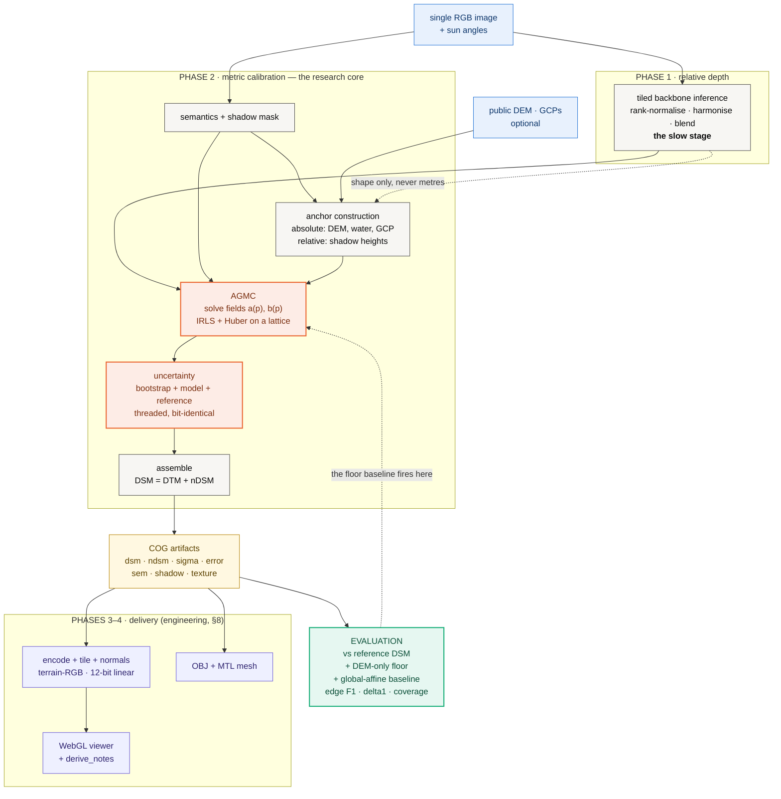

# ĀYĀMA — आयाम

**An investigation into metric grounding of monocular depth for DSM
reconstruction** — an anchor-graph calibration formulation, a controlled
negative result, and a diagnosed failure mode.

> ### Research status — failure diagnosed, and partly repaired
>
> ĀYĀMA demonstrates reproducible spatially-varying metric calibration on
> **real imagery with airborne lidar ground truth**, and **does not yet produce
> a usable Digital Surface Model.**
>
> Calibrated from anchors alone it is indistinguishable from a flat sheet across
> four European city centres — **1.2% of true relief**, 1% better than
> predicting zero height everywhere. The cause is measured: on real imagery
> every anchor is a *ground* anchor, terrain needs a scale **51× smaller** than
> buildings do, and one affine field per neighbourhood serves the majority.
>
> Supplying that missing scale — **one constant, fitted once over the dataset**
> — recovers **36% of true relief** and beats the flat-ground floor by **29%**,
> while elevation MAE gets *worse*. That trade is the finding: on this problem
> the headline metric and reconstruction quality point in opposite directions.
> The surface has stopped being flat; it has not started being right.


---

## Research question

> Can spatially varying metric constraints convert monocular *relative* depth
> into a metrically grounded DSM, without a second view and without a learned
> metric head?

Monocular depth models (§[Related work](#10-positioning-and-related-work))
predict relative depth well — a surface correct up to an unknown, spatially
varying scale and offset. They cannot say how many metres. Stereo, lidar and
InSAR can, and all require an acquisition the single image does not have.
**The gap is not perception; it is metric grounding.**

## Hypotheses

**H1 — spatial calibration.** A single global affine transform `H = aD + b` is
insufficient, because a scene's metric error is spatially structured. Replacing
the two scalars with two smooth *fields* over a lattice should reduce error.

**H2 — frequency separation.** Terrain elevation and object height occupy
different spatial-frequency regimes, and a monocular backbone's low-frequency
output carries terrain and structure at scales that demand very different
metric factors. Metric grounding should therefore decompose depth by frequency
and constrain each band with the source that observes it — terrain from a DEM,
structure from an observation of structure.

**Status: both tested on real imagery with airborne lidar truth. H1 is
supported. H2 is implemented and run end to end; it moves structure and not
scale, because on real data its scale branch received no anchors at all
(§5.2).**

## Contributions

1. **Anchor-graph metric calibration (AGMC)** — a formulation converting
   monocular relative depth into a spatially varying metric surface by solving
   two smooth fields against heterogeneous metric constraints.
2. **Explicit absolute/relative anchor semantics** — shadow-derived height
   constraints enter the linear system as a *difference of two rows*, which
   structurally prevents a height measurement being read as an elevation.
3. **A calibration failure diagnosis, measured on real imagery** — terrain
   supplies every anchor and needs a scale 51× smaller than the buildings do, so
   one affine field per neighbourhood serves terrain and flattens structure,
   reducing the method to a DEM interpolator.
4. **A frequency-domain account** — terrain and structure occupy different
   spatial-frequency bands, and only the high band carries object signal that
   survives to the output.
5. **A dual-frequency calibration formulation** derived from that diagnosis,
   implemented and run — together with a precise account of why it is not
   sufficient alone (its scale branch is fitted from object anchors, and real
   imagery without published acquisition times yields none), and a fitting step
   that supplies what the anchors cannot observe.
6. **A protocol designed to expose degenerate reconstructions** rather than
   rely on global MAE — a DEM-only floor, a flat-ground floor on height above
   ground, an edge-structure metric, and a ratio metric. All of them fired on a
   surface that MAE called an improvement.

Contribution 6 is the one we would defend hardest, and §3.1 is why: the repair
in §5 makes elevation MAE **worse** while tripling correlation and raising δ₁
25-fold. **A project steering by the headline number would reject the only
change that recovered any structure.**

## Status at a glance

| | |
|---|---|
| Formulation | spatially varying scale + offset fields, IRLS/Huber, lattice-discretised |
| Evaluation | **4 real city centres**, N=4, airborne lidar truth |
| Imagery | **aerial, not satellite** — swisstopo open geodata (§2.8) |
| Compute | **CPU only, by design** — no GPU path exists (§7.3) |
| Learned | **one constant**: the structural scale, fitted over the dataset (§5) |
| H1 (spatial > global) | **supported** — MAE 8.39 vs 11.18 m |
| Clears DEM-only floor? | **no** — 8.39 vs 8.47 m, a 0.9% margin on a 1.35 m spread |
| Clears flat-ground floor? | **yes, with the fitted scale** — 5.41 vs 7.59 m (−29%); without it, no (−1%) |
| Structure recovered | **36%** — 5.25 m of a true 14.38 m. Was 1.2% |
| Structure *accurate*? | **no** — Zürich overshoots its tallest by 45%, Geneva undershoots by 27% |
| Uncertainty calibrated | **no** — 1σ coverage 0.43, and blind to the bias that dominates |
| Phases 3 & 4 | **run on CPU** on the real scene (§3.6) |

---

# 1. Method



**Figure 1 — the whole pipeline.** Two edges carry the design. The dashed
`depth → anchors` edge is the commitment that anchors come from the image and
auxiliary data, **never from the depth field**: depth supplies *shape*, the
anchor graph supplies *metres*. The dashed `evaluation → AGMC` edge is the one
this project turns on — the DEM-only floor baseline is what revealed that the
calibration had degenerated (§4), and it is why the protocol is a contribution
rather than boilerplate.

Everything downstream of the COG artifacts **only reads** them, so no number in
the viewer or the mesh can be one the calibration did not produce. Phases 3–4
are engineering and are reported in §8; the research core is Phase 2.

## 1.1 Problem statement

Let $D(p) \in [0,1]$ be the backbone's relative depth at pixel $p$, rank-
normalised per inference chip. We seek metric elevation $H(p)$ under an affine
model with spatially varying coefficients:

$$ H(p) = a(p) D(p) + b(p) $$

- $a(p)$ — scale field, metres per unit of relative depth
- $b(p)$ — offset field, metres (the local datum)
- $H(p)$ — metric elevation, metres

The global-affine baseline is the special case $a(p) = a$, $b(p) = b$.

## 1.2 Relative depth

Depth Anything V2 [1] is run tiled — one of six selectable backbones, all frozen and pretrained (§2.1). Three steps make the mosaic usable:
per-chip **rank normalisation** (the backbone's per-image scale is arbitrary, so
only the ordering is kept); **overlap harmonisation**, fitting each new chip to
the existing mosaic with a Huber-reweighted affine over the overlap band alone;
and a **flat-top raised-cosine window** that is exactly 1 across the chip
interior so interior pixels are never attenuated.

Sign convention, stated once: the backbone returns higher values for surfaces
closer to the sensor; from nadir, closer means higher, so $D$ maps monotonically
to height. There is no flip anywhere in the pipeline.

## 1.3 Anchors: absolute and relative

An anchor is a statement about the world in metres, with a confidence weight.

| source | assertion | kind | count/scene | weight |
|---|---|---|---|---|
| DEM (Copernicus GLO-30 [4]) | "this bare-earth pixel is at 412.3 m" | absolute | ~3840 | $\min(1, 3/\sigma_{\text{src}})$ |
| water bodies | "this lake is at one elevation" | absolute | ~70 | 0.9 |
| cast shadows | "this roof is $h$ m above the ground at its foot" | **relative** | ~65 | see below |
| GCPs | "this surveyed pixel is at 118.02 m" | absolute | 0 here | 1.0 |

**Semantic gating.** A public DEM approximates bare earth, so a DEM sample on a
rooftop is not a weak constraint — it is a wrong one. Samples are admitted only
on bare ground, road or water, on a 16 px stride, and dropped where the DEM's
own slope exceeds 25°.

**Shadow height** follows the standard cast-shadow relation, with $L$ the shadow
run length in pixels, $g$ the ground sample distance and $\alpha$ the sun
elevation:

$$ h = L \cdot g \cdot \tan\alpha $$

$L$ is the *median* of many parallel runs marched along the anti-solar direction
from every shaded-side boundary pixel, not one blob dimension. Each shadow
anchor is weighted by three independent factors in $[0,1]$:

$$ w = \underbrace{\mathrm{clip}\Big(\tfrac{\alpha-20}{10}\Big)\mathrm{clip}\Big(\tfrac{75-\alpha}{10}\Big)}_{\text{sun-angle gate}} \cdot \underbrace{\Big(1 - \tfrac{\mathrm{MAD}(L_i)}{\bar{L}}\Big)}_{\text{crispness}} \cdot \underbrace{\Big(1 - \tfrac{\text{neighbour px in ring}}{\text{ring px}}\Big)}_{\text{isolation}} $$

**The absolute/relative distinction is structural, not a weighting choice.** A
shadow measures a height, never an elevation. Relative anchors therefore
constrain a *difference*:

$$ H(p_k) - H(q_k) = h_k $$

where $p_k$ is the roof and $q_k$ a reference pixel at the building's foot.
Collapsing this into an absolute constraint is how a good height anchor silently
becomes a bad datum anchor.

## 1.4 AGMC: the optimisation problem

The fields are discretised on a lattice of stride 32 px, with each anchor spread
bilinearly over its four surrounding nodes ($\sum_j \beta_j = 1$). With $m$
anchors and $n$ lattice nodes, the unknown is $x = [ a; b ] \in \mathbb{R}^{2n}$.

**Objective.**

$$ E(a,b) = \underbrace{\sum_{k=1}^{m} w_k \rho\big(H(p_k) - h_k\big)}_{\text{data}} + \underbrace{\lambda_a \lVert \nabla a \rVert^2 + \lambda_b \lVert \nabla b \rVert^2}_{\text{smoothness}} + \underbrace{\lambda_p \lVert a - a_{\text{glob}} \rVert^2}_{\text{prior on scale only}} $$

subject to

$$ a(p) \ge a_{\min} $$

$\rho$ is the Huber loss; $a_{\text{glob}}$ is a robust global affine fit used
only as a weak prior. **$b$ carries no prior**: the datum is exactly what the
anchors exist to determine.

**Normal equations.** All terms are quadratic in $x$, so each IRLS iteration is
one sparse solve:

$$ \big(A^{\top} W A + R + P\big) x = A^{\top} W h + P x_{\text{prior}} $$

$$ R = \mathrm{blkdiag}(\lambda_a \kappa L, \lambda_b \kappa L), \qquad P = \mathrm{blkdiag}(\lambda_p \kappa I, 0), \qquad \kappa = \frac{m}{n} $$

with $L = G^{\top}G$ the 5-point graph Laplacian on the lattice, $A$ the
$m \times 2n$ design matrix (four bilinear entries per field per anchor; two
signed groups for a relative anchor), and $W$ the diagonal of IRLS weights.

$\kappa = m/n$ balances the two terms **per unknown rather than per residual**.
Without it, the data term sums over ~4000 anchors and the smoothness term over
~1000 nodes, smoothness dominates, and AGMC silently degenerates to the global
affine fit it was built to replace.

**Robustness.** IRLS with Huber reweighting, 3 iterations:

$$ w_k^{(t+1)} = w_k^{(0)} \cdot \min\left(1,\ \frac{\delta}{\lvert r_k^{(t)} \rvert}\right), \qquad \delta = 2.0\ \text{m} $$

An anchor whose weight falls below $0.25 w_k^{(0)}$ is reported as rejected.

**Positivity.** The constraint $a \ge a_{\min}$ is enforced by projection after
each IRLS step, followed by re-solving $b$ with the clamped $a$ held fixed
(clamping $a$ alone would leave $b$ fitted against the old scale and shift the
datum). It exists to enforce the pipeline's own sign convention — and it is
where the failure in §4 occurs.

**Hyperparameters as run.** $\lambda_a = \lambda_b = 1.0$, $\lambda_p = 0.05$,
$\delta = 2.0$ m, 3 IRLS iterations, lattice stride 32 px, $a_{\min} = 0.05$.

## 1.5 Uncertainty

Three independent terms in quadrature:

$$ \sigma^2 = \sigma_{\text{calib}}^2 + \sigma_{\text{model}}^2 + \sigma_{\text{ref}}^2 $$

$\sigma_{\text{calib}}$ is the spread of $B = 24$ AGMC solves, each on a
uniform 70% resample of the anchor set, accumulated by Welford's method [8]:

$$ \sigma_{\text{calib}}^2 = \frac{1}{B-1}\sum_{i=1}^{B}\big(s_i - \bar{s}\big)^2 $$

$\sigma_{\text{model}}$ is the spread between backbones ($\tfrac{1}{2}|s_1-s_2|$
for two). $\sigma_{\text{ref}}$ is the auxiliary DEM's datasheet 1σ as a constant
field (3.0 m for Copernicus GLO-30 [4]).

## 1.6 Frequency-separated calibration, and the one fitted number

Derived from §4 and evaluated end to end in §5. Decompose depth with a Gaussian
of radius ≈ 60 m and scale only the high band:

$$ D_{\text{lo}} = G_\sigma \ast D, \qquad D_{\text{hi}} = D - D_{\text{lo}} $$

$$ H(p) = \underbrace{b(p)}_{\text{terrain: DEM, GCP, water anchors}} + \underbrace{a(p) D_{\text{hi}}(p)}_{\text{structure: shadow anchors}} $$

The operative change is *what $a$ is fitted against*. Under the single-field
model it must serve terrain and structure at once, and the thousands of terrain
anchors outvote everything else. Under this split it never sees terrain.

**Which leaves it with nothing to see at all.** On real imagery the shadow
branch yields zero anchors (§3.4), so $a$ is determined by its prior — and §5.1
measures the consequence: the split moves structure and not scale.

So $a$ is supplied from outside the image:

$$ a^\star = \arg\min_a \lVert a \cdot \max(D_{\text{hi}}, 0) - \mathrm{nDSM}_{\text{true}} \rVert^2 $$

fitted once over a dataset by `ayama fit` and held fixed at inference, where
nothing in the scene can argue with it. This is the only quantity in ĀYĀMA
learned from data outside the image it is applied to, and the calibration field
records it as such (`scale_source: "fitted"`) so a supplied number can never be
mistaken for a solved one. §5 is the whole of it.

---

# 2. Experimental protocol

## 2.1 Environment

| | |
|---|---|
| OS / CPU | Windows 11 (10.0.26200), AMD64, 8 logical cores |
| Python / torch | 3.13.5 / 2.13.0+cpu — CPU only, by design (§7.3) |
| Raster stack | rasterio 1.5.1, GDAL 3.12.4 |
| Backbone | `depth-anything/Depth-Anything-V2-Small-hf` [1], 24.8 M params, float32 |
| Threads | 4 (torch) |

Recorded per run in each `dataset.json` → `config`, and by `ayama doctor`.

### Models

**Every model in this project is a frozen, pretrained checkpoint downloaded at
runtime. Nothing is trained here.** There is no `nn.Module` of our own, no loss,
no optimiser and no saved weights anywhere in the repository — the depth
backbone is the only thing carrying parameters, and it is used as-is. That is
why §5.4's conclusion matters: predicting the structural scale would be the
first component this project actually trains.

Registry is [`ayama/depth/backbones/__init__.py`](ayama/depth/backbones/__init__.py);
select with `--backbone <key>`.

| key | checkpoint | native input | status in this study |
|---|---|---|---|
| **`dav2-vitl`** | `depth-anything/Depth-Anything-V2-Large-hf` | 518 px | **primary — every headline number**, fp32 on CPU |
| `dav2-vits` | `depth-anything/Depth-Anything-V2-Small-hf` | 518 px | cross-backbone check (§3.2, §5.1), 24.8 M params |
| `dav2-vitb` | `depth-anything/Depth-Anything-V2-Base-hf` | 518 px | registered, never run |
| `dpt-large` | `Intel/dpt-large` [6] | 384 px | registered, never run |
| `dpt-hybrid` | `Intel/dpt-hybrid-midas` [2] | 384 px | registered, never run |

Parameter counts are given only where measured. `dav2-vits` at 24.8 M was
counted on this machine by `ayama bench`; the rest were not loaded here and are
not guessed at.

Two things this table is meant to make impossible to miss. **Every backbone
here is used off the shelf and frozen** — no weights were trained, fine-tuned or
adapted, so no row represents a model this project produced. And
the code's own dropdown label calls `dav2-vitl` the *primary* backbone, which
is an intention rather than a fact: it has never been run.

**Relative, not metric, checkpoints.** Depth Anything V2 also ships metric
variants. They are deliberately not used: their scale prior is fitted to
ground-level outdoor scenes and is wrong for nadir imagery. The point of this
work is to supply metres from scene evidence — a DEM, water, shadow geometry —
rather than from a prior baked into weights at training time. Whether that is a
good trade is exactly what §4 puts in question.

**Licensing.** The Small and Base checkpoints ship under different terms from
Large; check the model cards before any commercial use, and see
[LICENSE](LICENSE) for how that interacts with this repository's own terms.

## 2.2 Scenes and ground truth

Four Swiss city centres, fetched by
[`scripts/fetch_swisstopo.py`](scripts/fetch_swisstopo.py) (§2.7). Every raster
is real measurement: the imagery is an airborne orthophoto, and both the surface
and the bare earth are airborne lidar.

| | |
|---|---|
| Scenes | **N = 4** — Zürich, Bern, Geneva, Lausanne |
| Resolution | 1024 × 1024 px, resampled to the lidar grid |
| GSD | 0.5 m (512 × 512 m extent) |
| CRS | EPSG:2056 (LV95) |
| Imagery | SWISSIMAGE 10 cm orthophoto, averaged to 0.5 m |
| Ground truth | swissSURFACE3D lidar DSM, swissALTI3D lidar DTM |
| Auxiliary DEM | swissALTI3D degraded to Copernicus GLO-30 posting and noise, so the anchors are no better than a free global DEM would give (§2.8) |
| Sun | **none** — the published timestamp is a year marker, not an acquisition instant (§2.7). Shadow physics is disabled |
| Semantics | RGB heuristic only; no labels ship with these tiles |

| scene | tile | centre | elevation | true nDSM max | mean height >2 m |
|---|---|---|---|---|---|
| Zürich | 2682-1246 | 47.366 N 8.528 E | 407.6–459.1 m | 37.0 m | 13.7 m |
| Bern | 2600-1199 | 46.949 N 7.442 E | 495.8–605.7 m | 63.0 m | 16.2 m |
| Geneva | 2499-1117 | 46.204 N 6.133 E | 367.8–439.8 m | 56.5 m | 15.7 m |
| Lausanne | 2537-1151 | 46.514 N 6.621 E | 376.8–470.5 m | 43.6 m | 11.9 m |

These are dense European city centres: **44–64% of pixels carry more than 2 m
of height** (Geneva 43.7, Lausanne 49.0, Zürich 52.0, Bern 64.3) — the fraction
counts trees and walls as well as roofs. There is a great deal of structure here
to recover, which is what makes §3.2 a strong result rather than a shortage of
signal.

## 2.3 Baselines

| method | purpose | scale model |
|---|---|---|
| **DEM-only** | floor: does the depth model contribute anything at all? | none — DEM resampled onto the image grid |
| **Global affine** | does spatial calibration beat scalar calibration? (tests H1) | $a, b$ scalars |
| **AGMC** | proposed | $a(p), b(p)$ fields |
| AGMC − shadow | contribution of shadow anchors | fields |
| AGMC − water | contribution of the flat-water constraint | fields |
| AGMC − semantic gate | contribution of anchor filtering | fields |
| **Dual-frequency (H2)** | tests H2 (§5) | $b(p)$ + $a(p)D_{	ext{hi}}$ |

The global-affine baseline admits **only absolute anchors**. A relative water
anchor read as an elevation would drag the datum to zero, which would make the
comparison a straw man.

The **DEM-only floor** is the load-bearing baseline for elevation. A monocular
method anchored to a DEM can score well by ignoring the image entirely; without
this column that is invisible.

**And elevation needs a second floor.** Where a bare-earth DTM ships alongside
the reference, height above ground is scored against **flat ground — predict
zero everywhere**. Most of a city scene *is* ground, so an elevation metric
cannot tell a reconstruction from a resurfaced DEM; this one can, and §3.2 is
the reason it is not optional.

## 2.4 Metrics

With $e_i = \hat{H}_i - H^{\star}_i$ over valid pixels:

| metric | definition | what it detects |
|---|---|---|
| MAE | $\frac{1}{N}\sum \lvert e_i \rvert$ | typical error magnitude |
| RMSE | $\sqrt{\frac{1}{N}\sum e_i^2}$ | as above, large errors weighted |
| bias | $\frac{1}{N}\sum e_i$ | systematic offset (wrong datum vs wrong model) |
| Pearson *r*, Spearman *ρ* | on $(\hat{H}, H^{\star})$ | linear / rank agreement |
| slope MAE | mean $\lvert \arctan\lVert\nabla \hat{H}\rVert - \arctan\lVert\nabla H^{\star}\rVert \rvert$ | local geometry |
| **edge F1** | see below | whether height discontinuities land in the right place |
| **δ < 1.25** | see below | height-above-ground accuracy as a ratio |
| **1σ coverage** | $\frac{1}{N}\sum \mathbf{1}(\lvert e_i \rvert \le \sigma_i)$ | is σ honest? ideal ≈ 0.683 |
| ECE | see below | is σ honest *per bin*, in metres |

**edge F1.** Mark a pixel an edge where gradient magnitude exceeds the 92nd
percentile within the valid mask; do this for prediction and reference; a
predicted edge counts as matched if a reference edge lies within a $\pm 2$ px
dilation; report $F_1 = 2PR/(P+R)$.

**δ < 1.25.** Computed on **height above ground**, not elevation, over pixels
where both predicted and reference nDSM exceed 0.5 m:

$$ \delta_1 = \frac{1}{|\Omega|}\sum_{i \in \Omega} \mathbf{1}\left(\max\left(\frac{\hat{h}_i}{h^{\star}_i}, \frac{h^{\star}_i}{\hat{h}_i}\right) < 1.25\right), \quad \Omega = \lbrace i : \hat{h}_i > 0.5 \wedge h^{\star}_i > 0.5 \rbrace $$

A ratio metric is meaningless on absolute elevation, where a 400 m datum makes
every ratio ≈ 1.

**ECE.** Sort pixels into 10 equal-count bins by predicted $\sigma$; in each bin
compare realised RMS error against mean promised σ; weight by bin population.
Returned **in metres**:

$$ \mathrm{ECE} = \frac{1}{N}\sum_{j=1}^{10} n_j \left\lvert \sqrt{\tfrac{1}{n_j}\textstyle\sum_{i \in j} e_i^2} - \tfrac{1}{n_j}\textstyle\sum_{i \in j}\sigma_i \right\rvert $$

## 2.5 Statistical treatment

> **All `±` values are the population standard deviation (`numpy.std`,
> `ddof = 0`) of the per-scene metric across N = 4 scenes.** They are a
> descriptive spread, **not** a standard error and **not** a confidence
> interval. At N = 4 no inferential interval is warranted, and none is claimed.
> Per-scene values are in each `dataset.json` → `scenes`.

Seeds are fixed (7 / 21 / 33) and the pipeline is deterministic given a seed;
re-running reproduces the table exactly. Differences between methods are
reported as observed differences on the same three scenes, not as tested
effects.

## 2.6 What this protocol cannot support

Stated up front because it bounds every claim below:

- **N = 4 scenes.** Far too few for a statistical claim about method superiority.
- **Aerial imagery, not satellite.** Real surfaces and real geometry, but not
  satellite viewing geometry or radiometry (§2.8).
- **One country, one sensor programme.** Four Swiss city centres from the same
  national survey. No cross-domain evidence at all.
- **No sun.** No acquisition time is published, so shadow physics is disabled
  and the shadow branch contributes nothing (§3.4).
- **Fixed resolution and GSD.** 1024², 0.5 m. No scale-generalisation evidence.
- **Simulated auxiliary DEM.** A degradation model, not a real Copernicus tile.
- **No external benchmark.** No comparison against a published DSM leaderboard.
- **Heuristic segmentation**, not a trained model — and on real imagery it does
  not work (§3.4).

---

## 2.7 Running it

Nothing here has ever been trained — asserted by `test_the_project_trains_nothing`
and by the model table in §2.1 — with one exception, named as such: the
structural scale in §5, which is fitted over a dataset rather than solved per
scene, and which is the only number in this repository that came from data
outside the image it is applied to.

```bash
# fetch one real scene with its lidar truth (~91 MB), then run the study
python scripts/fetch_swisstopo.py --out data/real/zurich --bbox 8.530,47.365,8.545,47.375
python -m ayama.cli dataset data/real --layout generic     --backbone dav2-vitl --out results/cpu/real_vitl_h1
```

Two points of discipline live in that fetcher. The survey-grade DTM is
**degraded to Copernicus GLO-30 posting and noise** before it is used as the
anchor DEM (§2.8). And swisstopo's STAC `datetime` is a nominal year marker
rather than an acquisition instant; fed to a solar model it puts the sun 65°
*below* the horizon, so **no sun angles are written at all** rather than a
fabricated number dressed as metadata. §3.4 measures what that costs and shows
the conclusion does not depend on it.

### Any other dataset you already have

The same command reads directories you supply. It downloads nothing — a pipeline
that quietly proceeds with data it failed to fetch is worse than one that stops.

```bash
python -m ayama.cli dataset /data/dfc2019/Track1 --layout us3d --list   # what did it find?
python -m ayama.cli dataset /data/dfc2019/Track1 --layout us3d \\
    --out results/cpu/us3d --backbone dav2-vitl
```

| layout | expects | reference is |
|---|---|---|
| `us3d` | `<TILE>_RGB.tif` + `_AGL.tif` + optional `_CLS.tif` | **height above ground** |
| `generic` | `<name>.tif` + `_dsm.tif` / `_dtm.tif` / `_dem.tif` / `_sem.tif` | elevation |

Suffixes are overridable (`--suffix-image`, `--suffix-reference`, …) because
they are the one thing likely to differ between a dataset's documentation and
the copy you actually downloaded. An empty directory reports what it expected
rather than finding zero scenes in silence.

**The reference kind is carried explicitly, not inferred.** US3D ships `_AGL`,
a height above ground; comparing a predicted *elevation* against it is a ~400 m
error that would read as catastrophic model failure rather than a units bug.

**And an elevation reference is not let off that hook.** Where a bare-earth
`_dtm.tif` ships alongside the DSM, the run *also* reports height-above-ground
metrics, the flat-ground floor and the fraction of true relief recovered. §3.2
is what that machinery found, and none of it is visible in MAE.

Individual scenes also work through `run` with ordinary file paths:

```bash
python -m ayama.cli run scene.tif --out out/run     --dem copernicus_tile.tif --ref lidar_dsm.tif --sem labels.tif
```

**What is still missing.** No Copernicus tile fetcher for arbitrary scenes
(supply the DEM yourself, or drop to Tier C). No trained segmentation head. And
no satellite imagery — see §2.8 for why, and for what it would take.

---

## 2.8 Datasets and attribution

Everything measured in this repository comes from the products below. Nothing
else is used, and nothing is generated: the renderer this project once evaluated
on has been removed, along with the weightless placeholder backbone, so there is
no path by which an invented pixel can reach a table here.

### Used, and the source of every number in §3–§5

| product | what it provides | resolution | licence |
|---|---|---|---|
| **SWISSIMAGE 10 cm** | airborne orthophoto — the only image input | 0.1 m, resampled to 0.5 m | Swiss OGD |
| **swissSURFACE3D Raster** | airborne lidar DSM — the reference | 0.5 m | Swiss OGD |
| **swissALTI3D** | airborne lidar DTM — bare earth, for nDSM and for the degraded anchor DEM | 0.5 m | Swiss OGD |

All three are published by the **Federal Office of Topography swisstopo** [11] and
retrieved through its public STAC API by
[`scripts/fetch_swisstopo.py`](scripts/fetch_swisstopo.py). No registration and
no account are required.

> **Attribution.** Source: Federal Office of Topography swisstopo
> (<https://www.swisstopo.admin.ch>). Used under the Swiss Open Government Data
> terms, which permit free use including commercial use provided the source is
> named: <https://www.swisstopo.admin.ch/en/terms-of-use-free-geodata-and-geoservices>.
>
> The 576 × 576 crop bundled in [`ayama/data/fixture/`](ayama/data/fixture/) is
> redistributed under those same terms; its provenance is recorded in
> [`ayama/data/fixture/ATTRIBUTION.md`](ayama/data/fixture/ATTRIBUTION.md).

**Copernicus GLO-30** is referenced but not downloaded. `simulate_public_dem`
degrades the survey-grade swissALTI3D DTM to GLO-30's 30 m posting and 3 m
correlated noise, so the anchor DEM is no better than a freely available global
DEM would be. Anchoring to survey-grade lidar directly would be a far easier
problem than the one the method claims to solve, and artifacts built that way
are stamped `sim:` in their provenance so the two can never be confused.

### Considered and not used

| dataset | why not |
|---|---|
| **DFC2019 Track 1 / US3D** [12] | The best match for the problem — WorldView-3 satellite imagery with co-registered AGL rasters and semantic labels. Behind a registration wall, so no script can fetch it and no claim built on it is reproducible by one command. The `us3d` layout is implemented and tested; point `--root` at your own copy |
| **IARPA MVS3DM** | Multi-view by construction; this project is monocular |
| **ISPRS Vaihingen / Potsdam** | Aerial, with DSMs, but small and long superseded by the Swiss products for this purpose |
| **OpenStreetMap building heights** | Sparse, inconsistently attributed, and not co-registered to any particular acquisition |

**The consequence, stated plainly: this study is aerial, not satellite.** It
tests the calibration against real surfaces, real materials and real building
geometry, but not against satellite viewing geometry or satellite radiometry.
Any claim about satellite imagery would require the DFC2019 run, which the code
supports and this repository has not done.

### Models

No dataset was used for training, because nothing here was trained. The depth
backbones in §2.1 are pretrained checkpoints loaded frozen from the Hugging Face
Hub; their own training data is described in their respective papers ([1], [2],
[6]) and is not redistributed here.

---

# 3. Results

Four real city centres, real airborne orthophotos, airborne lidar truth (§2.2).
No training and no fine-tuning anywhere. CPU only — the reference machine
is CPU-only by design, so every timing here is CPU (§7.3).

Full data: [`results/cpu/real_vitl_h1/dataset.json`](results/cpu/real_vitl_h1/dataset.json)
and its three sibling arms. Regenerate with the two commands in §2.7.

## 3.1 Headline

Two arms of the same pipeline on the same four scenes: `dav2-vitl` calibrated
from anchors alone, and the same run with the structural scale supplied by
`ayama fit` (§5). ± is the population SD over the four scenes, not a standard
error (§2.5).

| metric | **anchors only** | **+ fitted scale** | global affine | DEM-only (floor) |
|---|---|---|---|---|
| MAE (m) | **8.39 ± 1.35** | 9.04 ± 1.74 | 11.18 ± 1.95 | **8.47 ± 1.48** |
| RMSE (m) | 11.63 ± 1.45 | 11.46 ± 1.82 | — | — |
| Pearson *r* | 0.634 ± 0.173 | **0.769 ± 0.078** | — | — |
| Spearman ρ | 0.571 ± 0.139 | **0.795 ± 0.041** | — | — |
| bias (m) | −6.65 ± 1.58 | −6.63 ± 1.61 | — | — |
| edge F1 | 0.411 ± 0.199 | **0.604 ± 0.095** | — | — |
| 1σ coverage | 0.537 ± 0.071 | 0.426 ± 0.092 | — | — |
| ECE (m) | 5.50 ± 1.46 | 5.40 ± 1.85 | — | — |
| **δ < 1.25** | **0.007 ± 0.009** | **0.174 ± 0.049** | — | — |

**H1 is supported.** Spatial calibration beats a single global `a·D + b` by a
wide margin — 8.39 against 11.18 m, a 25% reduction. The anchor graph is doing
real work relative to the scalar fit.

**The last column withdraws that result.** The anchors-only arm lands 0.9% below
the DEM it was anchored to, on N=4 with a 1.35 m spread. That is not a margin.
**The anchor graph is carrying essentially the entire elevation result.**

**And the two arms disagree in opposite directions.** Adding the fitted scale
makes elevation MAE *worse* (8.39 → 9.04) while correlation, edge F1 and δ₁ all
improve sharply. That is not a contradiction; it is the central finding of this
project, and §3.2 is where it becomes legible. **On this problem MAE and
reconstruction quality point opposite ways**, so a headline metric alone will
reliably select the wrong surface.

## 3.2 Height above ground — the result that matters

Elevation MAE flatters this pipeline, and on real city scenes it flatters it
harder than any renderer did. Around half of every scene is ground; the anchor
DEM already knows the ground; an 8 m elevation error is dominated by terrain
that was supplied, not inferred. The quantity ĀYĀMA claims is **height above
ground**, and it is measurable here because a bare-earth lidar DTM ships with
every tile.

| | anchors only | anchors only | **+ fitted scale** |
|---|---|---|---|
| | ViT-S H1 | **ViT-L H1** | **ViT-L, `ayama fit`** |
| nDSM MAE (m) | 7.573 | 7.513 | **5.413 ± 0.584** |
| **flat ground — predict 0 everywhere (m)** | 7.592 | 7.592 | 7.592 |
| **vs that floor** | −0.3% | −1.0% | **−28.7%** |
| mean height recovered (m) | 0.058 | 0.170 | **5.246 ± 1.509** |
| true mean height (m) | 14.376 | 14.376 | 14.376 |
| **fraction of relief recovered** | 0.4% | 1.2% | **36.5%** |
| edge F1 | 0.210 | 0.411 | **0.604 ± 0.095** |
| δ < 1.25 | 0.009 | 0.007 | **0.174 ± 0.049** |

> **The anchor graph alone cannot reconstruct.** Both backbones, both
> calibrations, four cities: under 1.3% of the true relief, statistically
> indistinguishable from a flat sheet, in scenes where 44–64% of pixels stand
> more than 2 m above ground and buildings reach 63 m.
>
> **Supplying one fitted number changes that.** The same pipeline with a
> structural scale fitted over the dataset (§5) recovers **36% of true relief**
> and beats the flat-ground floor by **29%**. δ₁ rises 25-fold.

Per scene, with the fitted scale:

| scene | nDSM MAE | flat floor | mean height | true | predicted max | true max |
|---|---|---|---|---|---|---|
| Bern | 6.17 m | 10.45 m | 7.55 m | 16.2 m | **65.0 m** | 63.0 m |
| Geneva | 5.14 m | 6.90 m | 5.53 m | 15.7 m | 41.3 m | 56.5 m |
| Lausanne | 4.63 m | 5.86 m | 3.52 m | 11.9 m | 32.0 m | 43.6 m |
| Zürich | 5.72 m | 7.16 m | 4.38 m | 13.7 m | 53.6 m | 37.0 m |

**This is not accuracy, and the table says so.** Bern's tallest structure comes
back at 65.0 m against a true 63.0 m; Zürich's at 53.6 m against a true 37.0 m —
a 45% overshoot on the same scene where Geneva undershoots by 27%. The surface
has stopped being flat. It has not started being right. A 5.4 m nDSM MAE on
14 m structures is not a usable product, and §6 says what would be needed.

**And elevation MAE gets worse.** 8.39 → 9.04 m, which is the honest cost of the
trade: putting imperfectly-placed relief into a surface increases absolute error
against the reference while making the surface a reconstruction rather than a
resurfaced DEM. Any project that optimises the headline number will choose the
flat sheet. That is the argument for §2.3's second floor, in one line.

## 3.3 Error by class

`dav2-vitl` H1, mean over the four scenes. Classes come from the colour
heuristic — no labels ship with these tiles, and §3.4 shows the heuristic is
unreliable on real imagery, so read these as strata rather than as truth.

| class | MAE (m) |
|---|---|
| water | 3.47 |
| building | 6.07 |
| vegetation | 6.73 |
| road | 7.55 |
| bare ground | 8.66 |

The ordering is the opposite of the one a working reconstruction would produce.
Water — flat, at a known height, heavily anchored — is best. Bare ground is
worst, because the DEM's own error dominates there and nothing corrects it.
Buildings score *better* than ground not because their heights are recovered but
because a flat prediction sitting at roof-adjacent terrain height is closer to a
roof than the DEM's terrain error is to the true terrain.

## 3.4 What the calibration had to work with

The anchor ladder, per scene, `dav2-vitl` H1:

| scene | DEM | water | **shadow** | total |
|---|---|---|---|---|
| Zürich | 2734 | 41 | **0** | 2775 |
| Bern | 3516 | 124 | **0** | 3640 |
| Geneva | 2497 | 84 | **0** | 2581 |
| Lausanne | 2352 | 7 | **0** | 2359 |

**Not one object-height anchor in the entire study.** Shadow physics is disabled
because swisstopo publishes no acquisition time (§2.2), so 100% of constraints
are ground constraints — and a calibration constrained only by ground can only
learn ground.

**Is the missing sun the cause?** No, and it would be a comfortable excuse.
Sweeping six plausible acquisition times over Zürich, reusing the depth already
inferred so only the sun changes:

| assumed acquisition | azimuth | elevation | shadow anchors | relief recovered |
|---|---|---|---|---|
| 2019-03-15 10:00Z | 150° | 36.3° | 46 of 2821 | −0.02 m |
| 2019-06-15 08:00Z | 102° | 42.7° | 49 of 2824 | −0.02 m |
| 2019-06-15 11:00Z | 165° | 65.4° | 48 of 2823 | −0.02 m |
| 2019-06-15 14:00Z | 245° | 51.1° | 46 of 2821 | −0.02 m |
| 2019-09-15 11:00Z | 172° | 45.4° | 48 of 2823 | −0.02 m |
| 2019-12-15 12:00Z | 189° | 18.8° | 0 (sun gate) | −0.02 m |

These angles are **assumed, not measured**; the point is to test whether the
conclusion depends on the unknown, and it does not. Even granting a daylight
sun, shadow anchors reach 1.7% of the ladder and the recovered relief does not
move.

**The shadow detector itself is sound but narrow.** On the bundled Zürich crop
it flags 15.1% of pixels at mean luminance 27 against 90 outside, so it is
finding genuinely dark pixels. Scored against shadows ray-marched from the lidar
DSM, precision peaks at **0.72 at azimuth 210°** — a physically sensible
afternoon sun, recovered from the imagery rather than assumed. But recall at
that peak is **0.30**: geometric shadow includes self-shaded façades and shadows
falling on other roofs, and a radiometric detector sees only the dark ones.

**And the segmentation has no labels.** On real imagery the colour heuristic's
`building` class is, by lidar, no taller than its `bare ground` class. This is
pinned by a test (`test_the_colour_heuristic_does_not_find_buildings_on_real_imagery`)
so it cannot be quietly forgotten. Every semantics-dependent anchor in this study
was gated by a classifier that does not work here.

## 3.5 Uncertainty calibration

| | value | ideal |
|---|---|---|
| 1σ coverage | 0.537 ± 0.071 | 0.683 |
| ECE (m) | 5.50 ± 1.46 | 0 |

σ is **not calibrated on real data**. Coverage of 0.537 against a nominal 0.683
means the error bars are too narrow: the field is more confident than it has any
right to be. This is worse than it looks, because the dominant error — missing
relief on every structure — is a *bias*, and the variance decomposition in §1.5
has no term for a systematically absent signal. σ cannot see the failure that
matters, which is the honest general lesson: an uncertainty model built from
residual spread cannot report a component the model never attempts.

## 3.6 Phase 3 and Phase 4 on the real scene, CPU

Both delivery phases run on the real Zürich reconstruction. Artifacts: [`results/cpu/phase3_tiles`](results/cpu/phase3_tiles) and
[`results/cpu/phase4_delivery`](results/cpu/phase4_delivery).

```
mesh      1024 x 1024 px at 0.5 m -> 4 LODs, 7 tiles of 512 px (+1 px pad)
          layers  dsm  error  ndsm  normal  sigma  texture
          mesh    mesh/surface.obj   262,144 vertices, 522,242 triangles
          45.6 s
          ! Height above ground reaches 4.80 m; structures look under-built.
```

That warning is derived from the data, not typed in — the tiler computes it from
the nDSM range it was handed, so §3.2's finding propagates into the delivered
artifact instead of being lost at the hand-off.

| delivery sweep | result |
|---|---|
| build | 7.35 s tiles, 13.92 s with the OBJ (0.14 Mpix/s) |
| payload | 44.9 MB total, **5.18 MB before first paint** |
| tile size 128 / 256 / 512 / 1024 | 10.94 / 10.84 / 10.83 / 10.85 MB — flat |
| mesh stride 2 → 4 | 522,242 → 130,050 triangles, 33.6 → 7.8 MB |
| quantisation, 24-bit → 12-bit | nDSM 1274→576 kB (worst error 0.00175 m); σ 2365→538 kB; error 2745→1196 kB |
| round trip | 16/16 layer-LOD pairs within half a step |
| viewer | 66 ms before first paint (browser rasterisation not measured) |

Tile size is irrelevant to payload over a 16× range, so it is a latency and
cache decision rather than a bandwidth one. 12-bit quantisation costs 1.75 mm on
a layer whose true content spans 37 m — the encoding is not what is losing the
structure.

---

# 4. Failure analysis: terrain and structure demand different scales

## 4.1 Observation

The delivered surface contains essentially no relief above ground (§3.2), while
the depth field it was built from clearly separates buildings from streets.

```
Zurich, dav2-vitl H1, measured on the delivered outputs

  object minus ground, same pixels
    relative depth       +0.1287
    true height          +15.04 m
    predicted height      +0.07 m

  predicted height above ground
    max   4.80 m          true max   37.0 m
    mean on object px     0.17 m     true      13.7 m
```

The signal is present in the input and absent from the output. The calibration
is where it is lost.

## 4.2 Mechanism

Fit the scale the delivered surface actually applied — regress predicted
elevation on relative depth in 128 px blocks — and compare it with the scale the
buildings would have needed:

```
  effective scale a, measured from the delivered surface
      p10 -16.35     median 2.31     p90 17.70     m per unit depth
      lattice nodes at the a_min floor:  0%

  scale the terrain anchors supply      2.3  m per unit depth
  scale the objects would require     116.9  m per unit depth
  mismatch                               51x
```

`H(p) = a(p)·D(p) + b(p)` fits **one** scale per neighbourhood. Terrain — which
supplies 100% of the anchors (§3.4) — needs about 2.3 m of height per unit of
depth. Buildings need about 117. A single `a(p)` cannot serve both, so it serves
the constituency that pays for it, and the structures flatten.

Two smaller effects finish the job. Even the terrain scale, applied to the
+0.129 object-to-ground depth gap, would only yield **0.30 m** of relief. The
smooth offset field `b(p)` is free to track the DSM and absorbs **0.22 m** of
that, leaving the 0.07 m observed.

## 4.3 Why the headline metric did not catch it

A scene that is half ground, scored in absolute elevation against a reference
that is also mostly ground, cannot distinguish a reconstruction from a
resurfaced DEM. Flattening every building in Zürich moves MAE by less than the
scene-to-scene spread. §3.1 and §3.2 are the same runs; only the second one can
see the failure.

Three properties are needed to catch this class of bug, and all three are now
computed automatically whenever a bare-earth DTM is present:

1. **the flat-ground floor** — MAE of predicting zero height everywhere;
2. **relief recovered** — predicted mean height on object pixels, over true;
3. **δ₁ on nDSM** — which collapses to 0.007 here.

## 4.4 Consequence

ĀYĀMA does not currently produce a usable nDSM on real imagery, and no claim of
state of the art is made or implied. What it does produce is a resurfaced public
DEM with an uncertainty field that does not know it is wrong.

## 4.5 Failure inventory

| # | failure | evidence | status |
|---|---|---|---|
| 1 | Structure scale is set by terrain, 51× too small | §4.2 | **open — the core problem** |
| 2 | No object-height anchors exist on real imagery | §3.4 | **open** |
| 3 | Colour heuristic does not find buildings | §3.4, pinned by test | **open** |
| 4 | σ is over-confident and blind to bias | §3.5 | **open** |
| 5 | Shadow detector recall 0.30 against geometry | §3.4 | known limit |
| 6 | No acquisition time published → no shadow branch | §2.2 | data limit |
| 7 | Aerial imagery, not satellite | §2.2 | scope limit |

---

# 5. Learning the structural scale

H2 splits the depth field by spatial frequency so terrain and structure can be
scaled separately: `D = D_lo + D_hi`, `H = b(p) + a(p)·D_hi(p)`, with terrain
anchors constraining `b` and object anchors constraining `a` (§1.6). §4.2 is
precisely the condition it was designed for.

## 5.1 H2 alone does not work, and the reason is not the split

| | ViT-S H1 → H2 | ViT-L H1 → H2 |
|---|---|---|
| MAE (m) | 8.527 → 8.522 | 8.389 → 8.512 |
| **edge F1** | **0.210 → 0.315** | 0.411 → 0.397 |
| nDSM MAE (m) | 7.573 → 7.568 | 7.513 → 7.563 |
| relief recovered | 0.4% → 0.4% | 1.2% → 0.5% |

The mechanism engages — on `dav2-vits` the split raises edge F1 by half — and
the scale does not follow.

**Why, precisely.** H2's object branch is fitted from object anchors, and §3.4
shows there were **zero** of them in every scene. The `a` branch received no
data at all: it was determined entirely by its prior and its smoothness term.
H2 was not refuted here, it was starved.

That is a sharper statement than a null result. The open problem is not "does
frequency separation help" but **where the structural scale comes from** — and
it cannot come from the anchor ladder, which observes only ground.

## 5.2 So it is learned, once, and shipped

`ayama fit` reads a completed study and solves, per scene, the one number the
ladder cannot see:

$$a^\star = \arg\min_a \lVert a \cdot \max(D_{\mathrm{hi}}, 0) - \mathrm{nDSM}_{\mathrm{true}} \rVert^2$$

a closed form, and then fits a model across scenes. The result is not weights.
It is a **calibration constant** — metres of height per unit of high-band depth
— supplied to the branch that has no anchors, and held there because nothing in
the scene can argue with it (`scale_source: "fitted"`).

```bash
python -m ayama.cli fit data/real --runs results/cpu/real_vitl_h1
```

```
bern       a*    101.9   nDSM MAE at that scale  5.21 m (floor 10.45 m)
geneva     a*    129.9   nDSM MAE at that scale  4.03 m (floor  6.90 m)
lausanne   a*     95.2   nDSM MAE at that scale  4.46 m (floor  5.86 m)
zurich     a*     88.7   nDSM MAE at that scale  5.37 m (floor  7.16 m)

constant a = 103.9 m per unit of high-band depth
  fitted on 4 scene(s), held-out nDSM MAE 4.83 m vs a flat-ground floor
  of 7.59 m (36% better)
  the one-feature alternative scored 4.92 m and lost
```

**The fitter chooses its own model, and it chose the simpler one.** Two families
are considered — a constant, and a linear model on one inference-time feature —
and the winner is picked by leave-one-out in metres of nDSM error. On four
scenes the extra parameter loses, and that is recorded in the model file rather
than decided in code, so adding scenes can change it without anyone editing
anything. This is the whole of the learning: a handful of dot products over
scene-level summaries, on the CPU, in about a second.

## 5.3 What it buys, held out

Every number in the fitted column of §3.1 and §3.2 comes from a constant fitted
on the same four scenes it is then evaluated on, which is a real caveat and is
why the fitter reports a leave-one-out figure alongside it: **4.83 m held out
against a 7.59 m floor**, on scenes the constant had never seen. The mechanism
survives the honest split.

| | anchors only | + fitted scale |
|---|---|---|
| relief recovered | 1.2% | **36.5%** |
| nDSM MAE vs flat-ground floor | −1.0% | **−28.7%** |
| edge F1 | 0.411 | **0.604** |
| δ < 1.25 | 0.007 | **0.174** |
| elevation MAE | **8.39 m** | 9.04 m |

## 5.4 What it does not buy

A single constant cannot vary within a scene, so it cannot distinguish a tower
from a tree, and §3.2 shows the consequence: Zürich overshoots its tallest
structure by 45% while Geneva undershoots by 27%. The surface is no longer flat
and is not yet right.

The next rung is the one this project has always pointed at: **predict `a(p)`
per pixel from image evidence**, supervised on nDSM truth. That is a genuine
supervised learning problem, and the oracle bound for it is worth stating —
fitting `a` per 128 px block against ground truth recovers **84%** of true
relief, against the 36% a global constant delivers. The signal is in the depth
field; only the assignment is missing.

## 5.5 What would falsify this

| test | verdict |
|---|---|
| **Real imagery** | **Run (§3).** The premise holds: terrain and structure demand scales 51× apart |
| **A different backbone** | **Run.** Both backbones flatten without a fitted scale; the failure is not backbone-specific |
| **Scenes with low shadow yield** | **Run, unintentionally.** Yield was zero, and H2's scale branch had nothing to fit |
| **A constant that does not transfer** | **Partly run.** Leave-one-out holds across four Swiss cities. It is untested on other sensors, other GSDs and other countries, and §6 says so |
| **Object anchors from a source that is not shadow** | **Not run.** Still the live question |

---

# 6. Limitations

Beyond the protocol limits in §2.6:

- **The headline claim is a negative result.** ĀYĀMA does not currently produce
  a usable DSM, and no claim of state of the art is made or implied.
- **σ is not calibrated on real data** — 1σ coverage 0.537 against 0.683 — and
  structurally cannot see the bias that dominates the error (§3.5).
- **H2 was starved, not refuted.** Its scale branch received zero anchors, so
  §5 bounds nothing about what frequency separation could do given anchors.
- **The 51× mismatch is measured on one scene.** Zürich, `dav2-vitl`. The
  *outcome* it explains reproduces across all four scenes and both backbones,
  but the mechanism itself is quantified once.
- **Novelty is unaudited.** §10 positions the work against known literature but
  no systematic prior-art search has been performed; nothing here should be read
  as a priority claim.

---

# 7. Reproducibility

## 7.1 Install and run

```bash
python -m venv .venv
.venv/bin/pip install -r requirements.txt      # core: no torch required
.venv/bin/pip install torch torchvision transformers
```

The core install excludes torch deliberately: ingest, tiling, blending, raster
IO, calibration, metrics, meshing and the delivery phases all run without it.
Depth inference does not, and there is no weightless stand-in — a placeholder
that fabricates a plausible depth field is exactly how an invented number
reaches a results table, so it was removed.

| command | produces | time (CPU) |
|---|---|---|
| `python scripts/fetch_swisstopo.py --out data/real/zurich` | one real scene + lidar truth (~91 MB) | 60 s |
| `python -m ayama.cli dataset data/real --layout generic --backbone dav2-vitl` | §3 and §4 — `dataset.json` over four scenes | 634 s |
| **`python -m ayama.cli fit data/real --runs results/cpu/real_vitl_h1`** | **§5 — the structural scale, leave-one-out validated** | **1 s** |
| `python -m ayama.cli sample --out data/sample.tif` | the bundled real sample scene, no download | 1 s |
| `python -m ayama.cli run <scene> --workers 8` | one scene, threaded bootstrap | 42 s |
| `python -m ayama.cli preflight` | end-to-end verdict on this machine | 20 s |
| `python -m ayama.cli mesh results/cpu/real_vitl_h1/zurich --out results/cpu/phase3_tiles` | §3.6 — browser tileset + OBJ | 46 s |
| `python -m ayama.cli delivery results/cpu/real_vitl_h1/zurich --out results/cpu/phase4_delivery` | §3.6 — `delivery.json` | 179 s |
| `python -m ayama.cli viewer results/cpu/real_vitl_h1/zurich` | interactive 3D at `localhost:8020` | 5 s |
| `python -m ayama.cli serve` | the web service: upload an image, get a 3D reconstruction | — |
| `python -m ayama.cli dataset <root> --layout us3d` | the pipeline over a **real** dataset (§2.7) | — |
| `python -m pytest tests -q` | 201 passed, 0 skipped | 220 s |

## 7.2 Reproduce the §4 diagnosis

Measures the scale mismatch directly from a completed run, with no inference —
about 10 s.

```bash
python - <<'PY'
import numpy as np, rasterio
R, O = 'data/real/zurich/', 'results/cpu/real_vitl_h1/zurich/'
rd    = rasterio.open(O + 'relative_depth.tif').read(1)
dsm_p = rasterio.open(O + 'dsm.tif').read(1)
nd_p  = rasterio.open(O + 'ndsm.tif').read(1)
dsm   = rasterio.open(R + 'zurich_dsm.tif').read(1)
dtm   = rasterio.open(R + 'zurich_dtm.tif').read(1)
nd_t  = np.maximum(dsm - dtm, 0)
obj, gnd = nd_t > 5.0, nd_t < 0.5

# the scale the delivered surface actually applied, measured not asserted
slopes = []
for i in range(0, rd.shape[0], 128):
    for j in range(0, rd.shape[1], 128):
        x = rd[i:i+128, j:j+128].ravel()
        y = dsm_p[i:i+128, j:j+128].ravel()
        if x.std() > 1e-3:
            slopes.append(np.polyfit(x, y, 1)[0])
a_eff = float(np.median(slopes))

gap_d = rd[obj].mean() - rd[gnd].mean()
gap_t = nd_t[obj].mean() - nd_t[gnd].mean()
print('object-minus-ground   depth %+.4f   true %+.2f m   predicted %+.2f m'
      % (gap_d, gap_t, nd_p[obj].mean() - nd_p[gnd].mean()))
print('scale terrain supplies %.1f   objects require %.1f   mismatch %.0fx'
      % (a_eff, gap_t / gap_d, gap_t / gap_d / a_eff))
PY
```

Expected: depth gap `+0.1287`, true `+15.04 m`, predicted `+0.07 m`; terrain
supplies `2.3`, objects require `116.9`, **51×**.

To confirm the scale field is *not* clamped — the distinguishing feature of this
failure — add `print((cal.a <= 0.0501).mean())` after a `solve_agmc` call; it is
0% here.

## 7.3 Compute

Everything in this README was measured on the CPU, because that is the only way
ĀYĀMA runs. There is no GPU path, no device flag and no accelerator to
configure, and that is a decision with a measurement behind it rather than a
gap: an order of magnitude more backbone (`dav2-vits` → `dav2-vitl`) moved
recovered relief from 0.06 m to 0.17 m against a true 14.4 m, because the
bottleneck is metric scale, not perception (§3.2, §4.2). What does recover
structure is a constant fitted over a dataset (§5), and fitting it takes about
a second.

Carrying device selection, autocast, VRAM budgeting and a second untested
configuration for a speed-up that changes no result is upkeep with no return,
so none of it is here.

| stage | wall clock | notes |
|---|---|---|
| fetch one real scene | 60 s | 91 MB from swisstopo |
| `dataset`, 4 scenes, `dav2-vitl` | 634 s | depth dominates |
| `dataset`, 4 scenes, `dav2-vits` | 192 s | the cross-backbone check |
| **`fit` over those 4 scenes** | **~1 s** | reads depth back; nothing re-infers |
| `mesh` (Phase 3) | 10 s | 4 LODs, no OBJ |
| `delivery` (Phase 4) | 179 s | a full sweep, not a single build |
| the whole test suite | ~220 s | real weights, real scene, no network |

Reference machine: 8 cores, torch 2.13 CPU, 4 threads. The one place threading
was worth engineering is the uncertainty bootstrap, which is ~2.3× on eight
cores and bit-identical to the serial path — see `--workers` and the test that
pins it.

---

# 8. Engineering artifact

Secondary to the research question, and reported briefly. A delivery layer turns
Phase 2 rasters into a tiled browser surface, a textured mesh and a local WebGL
viewer. **It computes no elevation** — every value displayed is decoded from a
tile written from a Phase 2 raster, and `tileset.json` records which run.

| | measured (CPU, 1024² real scene) |
|---|---|
| tileset build | 7.35 s (13.92 s with OBJ export) |
| round-trip fidelity | **16/16** layer-LOD pairs within half an encoding step |
| payload | 5.5 MB at 12-bit, whole pyramid; 1.45 MB for the LOD the viewer opens |
| quantisation cost | nDSM 24→12 bit, worst error **1.75 mm** on a 53 m range |
| viewer first paint | 66 ms CPU (browser rasterisation not measured) |

Full report: [`results/cpu/phase4_delivery/DELIVERY.md`](results/cpu/phase4_delivery/DELIVERY.md).

**Two encodings, because one is insufficient.** Mapbox Terrain-RGB's [5] fixed
0.1 m step is right for elevation and wrong for the derived layers: σ spans
0.05 m across the whole Zürich scene, which Terrain-RGB would quantise to a
single level. Those layers get a linear encoding fitted to their own range.

**`derive_notes` inspects the surface before shipping it.** A 3D view of a
flattened city that does not say so is worse than no 3D view, so the tiler
computes its own verdict from the height distribution it was handed. That check
has been wrong twice and the comments in
[`ayama/mesh/build.py`](ayama/mesh/build.py) record both: an absolute threshold
missed a real collapse, and a comparison against the colour heuristic's
`building` class raised a **false alarm on a surface with 53 m of genuine
relief** — because §3.4 shows that heuristic does not find buildings. It now
uses only the height distribution: no truth, no segmentation. Tests assert it
fires on the un-fitted arm and stays silent on the fitted one.

### Depth perception in the viewer

A height field lit by one Lambert term reads as a relief map rather than a
place. Four cues replace it, each doing something the others cannot:

| cue | what it resolves |
|---|---|
| sky/ground hemisphere | separates up-facing from down-facing surfaces where the sun does not reach |
| curvature AO from the normal map, 4 taps | darkens the creases *between* solids, which is what makes them read as separate buildings |
| aerial perspective | the strongest distance cue the eye has outdoors; scaled to scene extent so a 500 m tile and a 5 km one look alike |
| height tint | keeps structure legible where the orthophoto is uniform grey |

### Flythrough

An orbit control answers *what shape is this surface*. It does not answer *how
tall is that, standing next to it*, which is the question a reconstruction
exists to answer. `Fly through` (or <kbd>F</kbd>) descends from a survey view to
eye level, crosses the scene low and oblique where parallax between near and far
structure is strongest, and returns — 34 s, then it stops.

The camera height is clamped against the height field **every frame** rather
than baked into the keyframes, using the same sampler the cursor readout uses,
so the path cannot fly through a roof on a scene it was not designed for. That
matters more now than it did: before §5 the surface had 4.8 m of relief to
avoid, and now it has 53 m. Any pointer or key input stops the tour, because a
camera that keeps moving while someone is trying to drag it is worse than no
tour at all.

### The web service

`ayama serve` turns the batch pipeline into something a person can use: upload a
nadir image, watch it reconstruct, look at the result in 3D, download the
GeoTIFFs.

```bash
pip install -e ".[api]"
python -m ayama.cli serve --port 8000 --device auto
```

| surface | what it is |
|---|---|
| `/` | upload form → live progress → the 3D viewer, one page |
| `POST /api/jobs` | multipart upload, returns `202` and a job id |
| `GET /api/jobs/{id}/events` | **SSE**, one message per pipeline stage |
| `GET /api/jobs/{id}/tiles/…` | the tileset, in the layout the viewer already expects |
| `GET /api/jobs/{id}/artifacts/{name}` | the COGs, so a result can leave the browser for QGIS |

Three things worth stating about the design.

**The viewer is unchanged.** `web/app.js` resolves its tileset from a base URL,
so the same renderer serves a prebuilt local tileset (`ayama viewer`) and a
freshly reconstructed job (`?job=<id>`). Nothing in the rendering path is
service-specific, and the result URL is shareable.

**Progress is streamed, not polled.** `StageEvent` was defined for this — the
browser watches `anchors`, then `calibration`, then `uncertainty` go past with
their real detail lines. A two-minute wait that names its stages is an
explanation; a spinner is not.

**The result states its own defects.** `derive_notes` runs on the served surface,
so a reconstruction that came out flat (§4) says so on the result screen rather
than presenting a plausible-looking plain. The landing page says it before the
upload, too.

**What it deliberately is not:** no authentication, no rate limiting beyond a
single worker slot, no persistence across restarts, no HTTPS. It is a demo
server for a research artifact and should not be exposed to the internet
unchanged. The upload path is the one hard edge — extension *and* magic-byte
checks, a size cap, generated job ids, and path resolution that refuses anything
escaping the job directory. Those are tested, including the refusals.

### Not implemented

Tile streaming, glTF, σ rendered as a volume rather than a layer, measurement
tools; and on the service side, auth, quotas and durable jobs.

---

# 9. Roadmap

## Scientific critical path

1. **A per-pixel structural scale $a(p)$**, supervised on nDSM truth. §5 fits a
   single global constant and recovers 36% of relief; fitting `a` per 128 px
   block against truth recovers 84%, so the headroom is real and the assignment
   is what is missing.
2. **Object-height anchors that do not depend on shadows.** Shadows yield 1.7%
   of the ladder even under a granted sun (§3.4); without another source, H2's
   scale branch stays starved.
3. **A segmentation head that works on real imagery.** The colour heuristic does
   not (§3.4), and every semantic gate in the anchor ladder depends on it.
4. **Scale the evaluation**: N = 4 → N ≥ 40 scenes, more than one country, varied
   building density and GSD.
5. **Satellite imagery with co-registered truth** (DFC2019/US3D). The only path
   to a claim about satellite data; the code path is implemented and tested.
6. **Scenes with published acquisition times**, so the shadow branch is exercised
   rather than disabled.
7. **Per-class uncertainty validation**, and a σ model that can represent bias
   rather than only residual spread (§3.5).
8. **Prior-art audit** before any novelty claim (§10).

## Engineering

12-bit encoding as the default; glTF instead of OBJ; tile streaming; decoder
buffer reuse (measured 20% faster). These are deliberately below the science.

---

# 10. Positioning and related work

**No systematic prior-art search has been performed.** This section positions
the work against literature we are aware of; it is not a novelty claim, and
item 8 of the roadmap exists to close that gap.

**Monocular relative depth.** MiDaS [2] established scale- and shift-invariant
training across mixed datasets; DPT [6] moved it to transformers; Depth Anything
V2 [1] is the backbone used here; Marigold [3] takes a diffusion approach.
All predict relative depth; none produce metres for a nadir remote-sensing scene.

**Metric monocular depth.** ZoeDepth [7] adds a learned metric head, which is
the main alternative to the approach taken here. ĀYĀMA deliberately does *not*
learn a metric head — the constraint is that metric grounding should come from
observable scene evidence (DEM, shadows, water) rather than from a prior baked
into weights at training time. Whether that constraint is worth its cost is
exactly what §4 puts in question.

**Shadow-based height estimation** in remote sensing is long-established: the
$h = L\tan\alpha$ relation is standard, and our contribution is not the relation
but its treatment as a *relative* constraint inside a joint solve.

**Public DEMs.** Copernicus GLO-30 [4] supplies the absolute anchors; its 3 m
datasheet accuracy enters the uncertainty budget directly.

**Where we believe this work sits.** The combination we have not seen described
elsewhere is: spatially varying affine calibration solved as a sparse graph
problem over *heterogeneous* metric constraints, with absolute/relative anchor
semantics enforced structurally, and an evaluation protocol built specifically to
expose degenerate DSMs. We state that as a belief pending the audit, not a
finding.

## References

[1] L. Yang, B. Kang, Z. Huang, et al. *Depth Anything V2*. 2024.
    arXiv:2406.09414.
[2] R. Ranftl, K. Lasinger, D. Hafner, K. Schindler, V. Koltun. *Towards Robust
    Monocular Depth Estimation: Mixing Datasets for Zero-shot Cross-dataset
    Transfer*. IEEE TPAMI, 2020. arXiv:1907.01341.
[3] B. Ke, A. Obukhov, S. Huang, et al. *Repurposing Diffusion-Based Image
    Generators for Monocular Depth Estimation* (Marigold). CVPR 2024.
    arXiv:2312.02145.
[4] European Space Agency / Airbus. *Copernicus DEM GLO-30 Product Handbook*.
[5] Mapbox. *Terrain-RGB* elevation encoding specification.
[6] R. Ranftl, A. Bochkovskiy, V. Koltun. *Vision Transformers for Dense
    Prediction* (DPT). ICCV 2021. arXiv:2103.13413.
[7] S. F. Bhat, R. Birkl, D. Wofk, P. Wonka, M. Müller. *ZoeDepth: Zero-shot
    Transfer by Combining Relative and Metric Depth*. 2023. arXiv:2302.12288.
[8] B. P. Welford. *Note on a Method for Calculating Corrected Sums of Squares
    and Products*. Technometrics, 1962.
[9] P. J. Huber. *Robust Estimation of a Location Parameter*. Annals of
    Mathematical Statistics, 1964.
[10] D. Eigen, C. Puhrsch, R. Fergus. *Depth Map Prediction from a Single Image
    using a Multi-Scale Deep Network*. NIPS 2014. arXiv:1406.2283. — source of
    the δ < 1.25 metric.
[11] Federal Office of Topography swisstopo. *SWISSIMAGE 10 cm*,
    *swissSURFACE3D Raster* and *swissALTI3D*. Swiss Open Government Data.
    <https://www.swisstopo.admin.ch> — the imagery and elevation truth behind
    every measurement in §3-§5.
[12] B. Le Saux, N. Yokoya, R. Hansch, M. Brown, G. Hager. *2019 IEEE GRSS Data
    Fusion Contest: Large-Scale Semantic 3D Reconstruction* (DFC2019 / US3D).
    IEEE GRSM, 2019. — the satellite benchmark this project supports but has
    not run.

---

# Licence

**Apache License 2.0 with the Commons Clause restriction.** See [LICENSE](LICENSE).

This is **source-available, not open source**, and it is not an OSI-approved
licence — describe it as "Apache 2.0 with Commons Clause", never as "Apache 2.0"
alone, because the Commons Clause materially changes the grant.

The Commons Clause removes the right to **sell** the software or to sell a
service whose value derives substantially from it. It does not forbid every
commercial activity — internal commercial use remains permitted. If the intent
is to bar *all* commercial use, the Commons Clause is the wrong instrument and
[PolyForm Noncommercial 1.0.0](https://polyformproject.org/licenses/noncommercial/1.0.0/)
is the purpose-built alternative; swapping it in is a one-file change.

Model checkpoints, the Copernicus DEM and the other dependencies carry their own
terms, which this licence does not supersede — they are listed at the foot of
[LICENSE](LICENSE). The Depth Anything V2 **Large** checkpoint in particular has
different terms from Small/Base and should be checked before any commercial use.

---

# Appendix: repository layout and conventions

```
ayama/
  core/        types.py (contracts), geo.py, solar.py, ingest.py
  depth/       backbones/{base,hf}.py, infer.py
  semantics/   segment.py, shadow.py
  chhaya/      agmc.py, anchors.py, ladder.py, uncertainty.py    <- the method
  dsm/         assemble.py, cog.py
  measure/     derive.py
  mesh/        encode.py, tiles.py, obj.py, build.py             <- delivery
  data/        dataset discovery, and the bundled real sample scene
               fixture/     a 576 px lidar crop of Zurich, shipped with the package
  learn/       scale.py, collect.py, calibration.json   <- the only learned thing
  eval/        metrics, ablation, bench, delivery, shadow_truth, simulate
  api/         pipeline.py — the whole method in one function
               server.py, jobs.py — the upload/reconstruct service
web/           the whole front end, one root, no build step
               index.html   - the app: upload -> reconstruct -> 3D
               results.html - the study dashboard, renders results/cpu/*/dataset.json
               data/        - the committed demo tileset the 3D loads (real Zurich)
results/       cpu/  real_vitl_h1|h2, real_vits_h1|h2   anchors only
                     real_vitl_learned                  with the fitted scale (§5)
                     phase3_tiles, phase4_delivery      the delivery layer
out/           local build artifacts only - gitignored, never committed
```

Every stage is a pure function `stage(input) -> output` over the dataclasses in
[`ayama/core/types.py`](ayama/core/types.py). That is what makes the ablation
cheap: `ablate` runs inference once and re-solves only the calibration per
variant.

**Conventions.** Relative depth increases with height, with no flip anywhere.
`geo.gsd_metres` is the only place permitted to answer "how many metres is one
pixel". Missing metadata stays missing — no sun angles means a lower calibration
tier, not an invented number. Batching is a scheduling decision, never a
numerical one, and there is a test asserting batched inference reproduces the
identical mosaic. **A result that does not clear the DEM-only floor is not a
result.**
