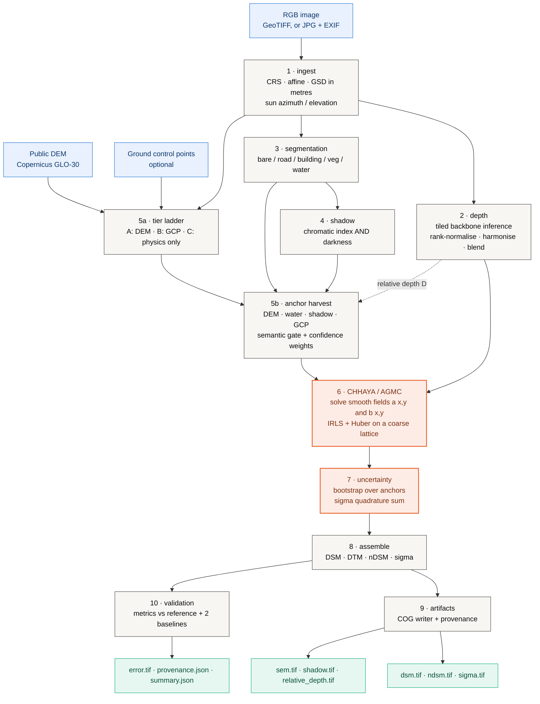
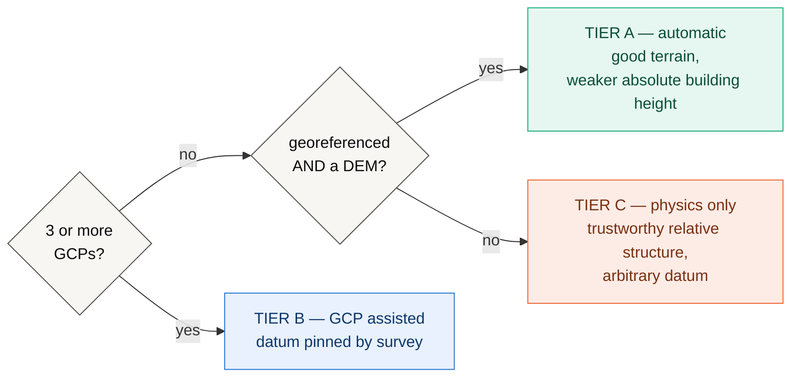
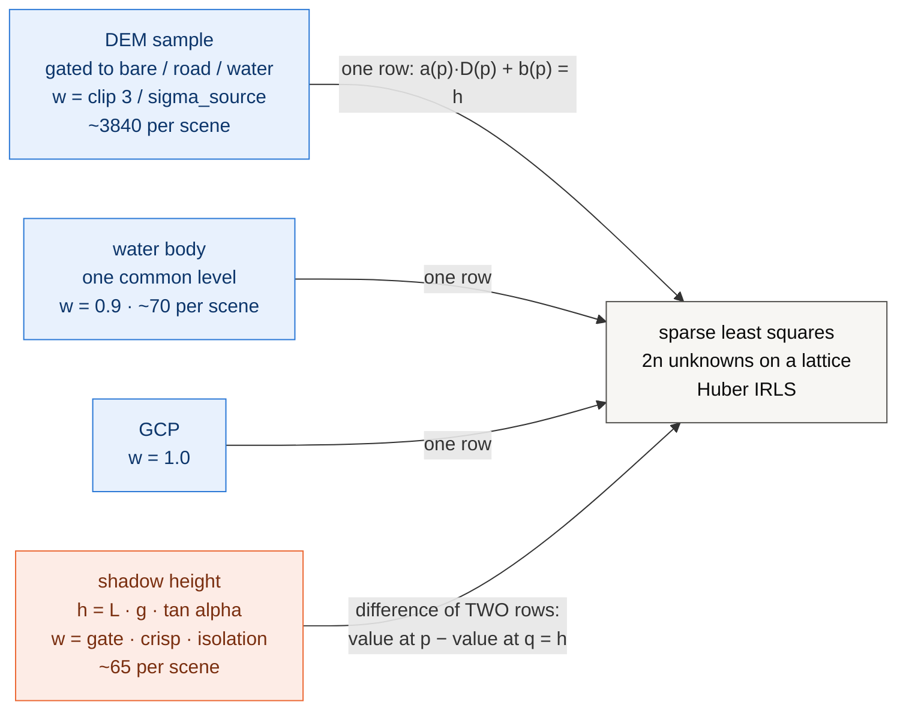
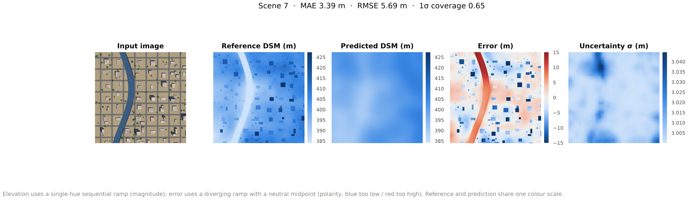
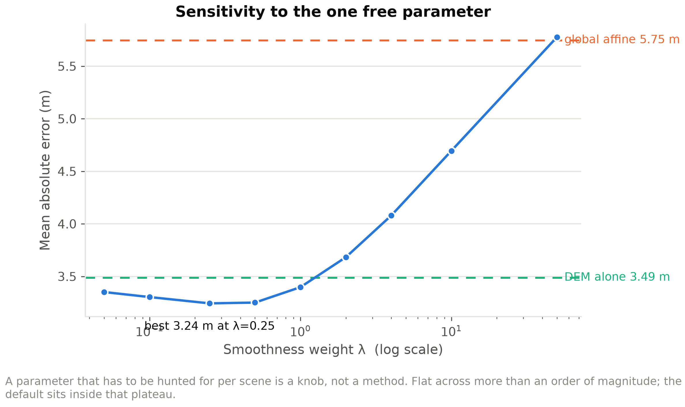
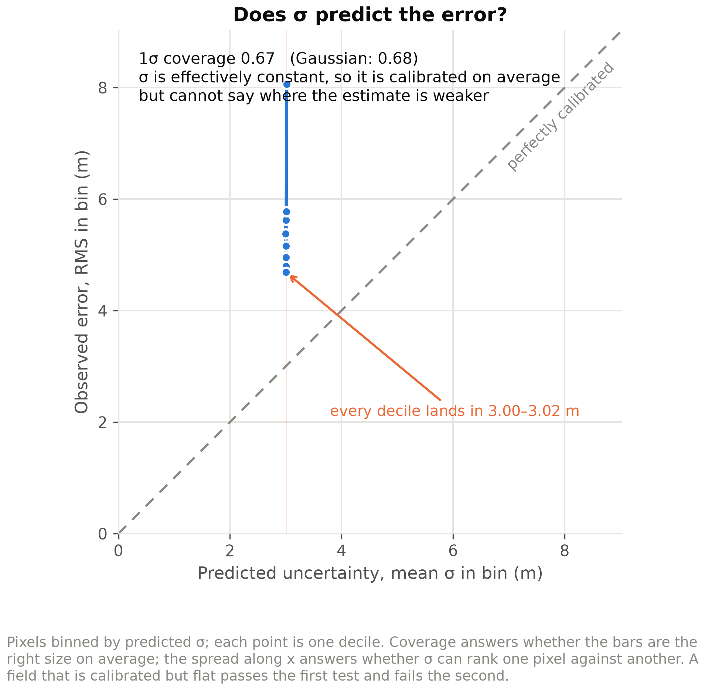
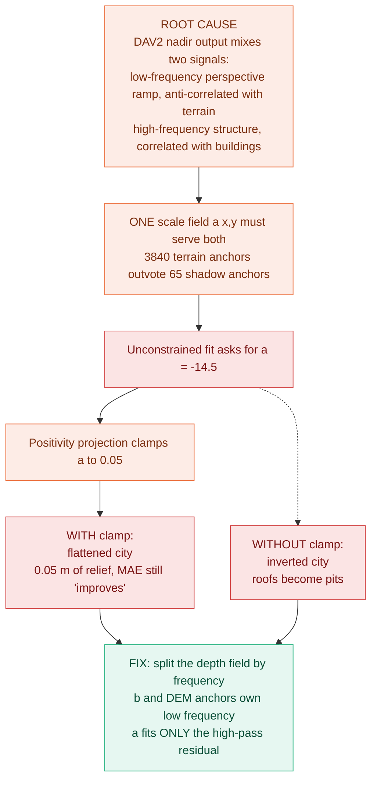
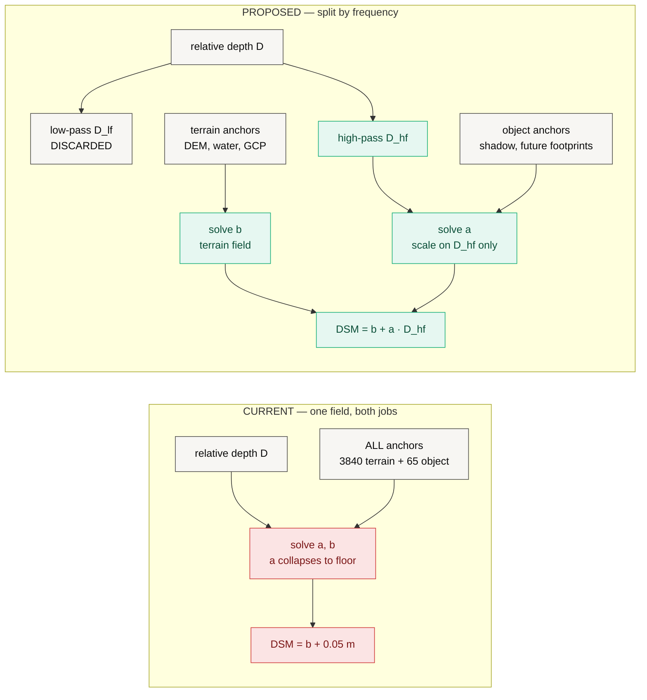

# UNNAT — उन्नत

**Metric elevation from a single image.** Relative depth from a pretrained
backbone, converted to metres by **Chhaya** (छाया), an anchor-graph calibration
engine, then delivered as a COG DSM with a per-pixel uncertainty field.

> **Status: Phase 2 proof of concept, measured on CPU.** Everything below is
> reproducible on a laptop with no GPU and no data download. The findings
> include a diagnosis of why the current pipeline does *not* yet work as a DSM
> estimator, and the measured evidence for the fix.

| | |
|---|---|
| **Method** | monocular relative depth + anchor-graph metric calibration |
| **POC hardware** | 8-core CPU, no CUDA, `torch 2.13.0+cpu` |
| **Benchmark** | 3 synthetic 1024×1024 scenes @ 0.5 m, exact ground-truth DSM |
| **Full study runtime** | 450 s (CPU) |
| **Test suite** | 88 passed, 7 skipped (GPU-only), 60.6 s |
| **Headline** | MAE **3.30 ± 0.08 m** vs a **3.49 m** DEM-only floor |
| **Central finding** | the scale field collapses to its floor; object height recovered is **0.05 m** of a true 12.4 m |

---

## Table of contents

1. [Proposal](#1-proposal)
2. [Architecture](#2-architecture)
3. [What each part does — math and outputs](#3-what-each-part-does--math-and-outputs)
4. [Findings](#4-findings-cpu-poc)
5. [The central finding: scale-field collapse](#5-the-central-finding-scale-field-collapse)
6. [Proposed remedy, with measured evidence](#6-proposed-remedy-with-measured-evidence)
7. [Reproducing everything](#7-reproducing-everything)
8. [Roadmap](#8-roadmap)
9. [Layout, contracts and conventions](#9-layout-contracts-and-conventions)

---

# 1. Proposal

## 1.1 The problem

A Digital Surface Model — ground plus everything standing on it — is the input
to flood modelling, solar siting, line-of-sight planning, urban growth
monitoring and disaster damage assessment. The ways to obtain one are all
expensive: lidar needs a flight, stereo photogrammetry needs a second view at a
usable convergence angle, InSAR needs a satellite pair and a coherent scene.

Meanwhile, single high-resolution nadir images are abundant and cheap, and
monocular depth models (MiDaS, Depth Anything, Marigold) have become very good
at predicting *relative* depth — a surface that is correct up to an unknown,
spatially varying scale and offset. They cannot say how many metres.

**The gap is not perception. It is metric grounding.**

## 1.2 What we propose

*Chhaya* (छाया, "shadow") converts a relative surface into metres by solving for
a smooth calibration field against a graph of heterogeneous **anchors** —
statements about the world in metres, harvested from whatever the scene happens
to offer:

| Anchor source | What it asserts | Kind |
|---|---|---|
| Public DEM (Copernicus GLO-30) | "this bare-earth pixel is at 412.3 m" | absolute |
| Water bodies | "every pixel of this lake is at one elevation" | absolute or relative |
| Cast shadows | "this roof stands 34.7 m above the ground at its foot" | **relative** |
| Ground control points | "this surveyed pixel is at 118.02 m" | absolute |
| Ground-plane assumption | "open ground is datum zero" | relative, last resort |

The two central design claims:

1. **A global affine fit is the wrong model.** `H = aD + b` with two scalars for
   a whole tile must average away every local disagreement between sources and
   inherits the worst error of each. Chhaya replaces the two scalars with two
   smooth *fields* solved on a coarse lattice.
2. **A shadow measures a height, never an elevation.** Anchors carry a
   `kind`, and relative anchors enter the linear system as a *difference of two
   rows*. Collapsing that distinction is how a good height anchor silently
   becomes a bad datum anchor.

Everything is delivered with a per-pixel σ, and the σ is validated (1σ coverage
against a Gaussian's 0.68) rather than asserted.

## 1.3 Scope of this proof of concept

This POC is deliberately narrow, and everything in it runs **on CPU**:

**In scope.** The complete Phase-2 path — ingest → depth → semantics → shadow →
anchors → calibration → uncertainty → assembly → artifacts → validation — run
end to end on synthetic scenes with an exactly known DSM, plus a simulated
Copernicus GLO-30 built by degrading the true terrain to the real product's
posting and datasheet noise.

**Out of scope, and stated rather than hidden.**

- **No real satellite imagery.** Every number here is against a synthetic
  renderer. They test the method end to end; they are *not* a claim about real
  imagery, which needs a scene with a reference DSM we do not yet have.
- **No trained segmentation model.** The five-class mask is a colour/texture
  heuristic, labelled `heuristic` in every artifact it touches.
- **No network DEM fetching.** `sim:` is explicit and stamped into provenance;
  a run never silently proceeds with a DEM it could not load.
- **No GPU claims.** Every timing below is CPU. The GPU path exists
  (see [docs/GPU.md](docs/GPU.md)) but is not what is being reported.

## 1.4 Acceptance criteria

The POC was set up so that it could fail visibly. The bar:

| # | Criterion | Result |
|---|---|---|
| C1 | Full pipeline runs unattended on CPU, every stage producing a GIS-openable artifact | **met** — 46.7 s/scene, 13 artifacts |
| C2 | Uncertainty field is honest: 1σ coverage ≈ 0.68 | **met** — 0.674 ± 0.023 |
| C3 | Anchor graph clearly beats a global affine fit | **met** — MAE 3.30 vs 5.49 m |
| C4 | Result clears the DEM-only floor by a clear margin on more than one metric | **NOT met** — 5% better MAE, 2% worse RMSE, identical *r* |
| C5 | Recovered structure: buildings appear at plausible height | **NOT met** — 0.05 m recovered of a true 12.4 m |

C4 and C5 fail together and for one reason, diagnosed in
[§5](#5-the-central-finding-scale-field-collapse). The failure is understood,
localised to one term, and the fix is measured in
[§6](#6-proposed-remedy-with-measured-evidence).

---

# 2. Architecture

Ten stages, each a pure function `stage(input) -> output` over the dataclasses
in [`unnat/core/types.py`](unnat/core/types.py). No globals, no hidden state.
That is what makes the ablation table cheap: `ablate` runs inference **once**
and re-solves only the calibration for every variant, so every row sees the
identical depth field.



**The dashed edge is the load-bearing one.** Anchors are harvested from the
image and the DEM — *not* from the depth field. The depth field supplies shape;
the anchor graph supplies metres. Keeping those two sources of truth apart is
the whole method, and §5 is what happens when the join between them degenerates.

## 2.1 The calibration ladder

The system degrades rather than fails, and reports which rung it used.



Shadow physics runs on **every** rung: it needs nothing but the image and the
sun angles, and it is the only absolute-scale cue available in Tier C. All
three POC scenes selected **Tier A** — `georeferenced (EPSG:32644) with a
public DEM`.

## 2.2 The anchor graph



An absolute anchor constrains one point. A relative anchor constrains the
*difference* between a roof pixel and a reference pixel at the foot of the
building, so it can never be read as a datum statement.

---

# 3. What each part does — math and outputs

Each stage below gives its **job**, the **mathematics** it actually implements,
and the **artifact** it emits. Timings are the CPU mean per 1024×1024 scene from
the POC study.

## 3.1 Ingest — `unnat/core/ingest.py`, `core/geo.py`

**Job.** Read the image and every piece of metadata that can be read, and
refuse to invent the rest.

**Math.** Ground sample distance is the only place in the codebase permitted to
answer "how many metres is one pixel". For a projected CRS it is read from the
affine transform; for a geographic CRS the degrees are converted at the scene's
centre latitude φ:

$$ g = \sqrt{|a| \cdot m_x(\varphi) \cdot |e| \cdot m_y(\varphi)} $$

where $a$, $e$ are the affine's x and y pixel sizes and $m_x, m_y$ are metres
per degree. Non-square pixels collapse to the geometric mean.

If the image carries no sun tags but does carry GPS and a UTC timestamp
(typical of drone JPGs), sun position is computed from the NOAA solar equations
in [`core/solar.py`](unnat/core/solar.py) — declination, equation of time, hour
angle, then

$$ \cos z = \sin\varphi \sin\delta + \cos\varphi \cos\delta \cos H, \qquad \alpha = 90^\circ - z $$

accurate to about 0.1° over 1950–2050, far tighter than the shadow error budget
needs.

**Output.** A `Scene` — RGB array plus a `SceneMeta` carrying CRS, transform,
`gsd_m`, sun angles, and the flags `georeferenced`, `has_sun`,
`gsd_is_assumed`. **Missing metadata stays missing.** A scene without sun
angles reports `has_sun = False` and drops to a lower rung rather than
defaulting to a plausible number.

*CPU cost: under 0.05 s.*

## 3.2 Depth — `unnat/depth/infer.py`

**Job.** Turn the image into a unitless relative surface $D \in [0,1]$, higher =
taller, seam-free across chip boundaries.

**Math.** Three load-bearing steps beyond calling the backbone.

**(a) Rank normalisation, per chip.** Depth Anything emits inverse relative
depth with an arbitrary per-image scale, so two adjacent chips can disagree by a
factor of three over the same rooftop. Each chip is mapped to its own rank
percentile, with tied values averaged so flat water stays flat:

$$ \tilde{D}(p) = \frac{\operatorname{rank}\left(D_{\mathrm{raw}}(p)\right)}{N - 1} \in [0, 1] $$

**(b) Overlap harmonisation.** Rank normalisation makes each chip internally
consistent and mutually *incomparable*. Every chip after the first is fitted to
what the mosaic already says, over the overlap band only, by a Huber-reweighted
affine:

$$ (s^{*}, t^{*}) = \arg\min_{s,t} \sum_{p \in \Omega} w(p) \rho\left(s\tilde{D}(p) + t - M(p)\right) $$

Blending alone would hide the seam and keep the error.

**(c) Flat-top raised-cosine window.** Weight is exactly 1.0 across the chip
interior and ramps only inside the overlap band, so interior pixels are never
attenuated and the weight sum never approaches zero at the image border:

$$ w_1(i) = \tfrac{1}{2}\left(1 - \cos\frac{\pi (i + 0.5)}{r}\right) \text{ on the ramp}, \qquad w_1 = 1 \text{ inside}, \qquad W = w_1 w_1^{\top} $$

$$ M = \frac{\sum_i W_i \tilde{D}_i}{\sum_i W_i} $$

**Sign convention.** The backbone returns higher values for surfaces closer to
the sensor. From nadir, closer means higher elevation, so relative depth maps
monotonically to height. **There is no flip anywhere in the pipeline.**

A batch is a scheduling decision, not a numerical one: batched inference must
produce the identical mosaic, and there is a test for it.

**Output.** `relative_depth.tif` — float32, $[0,1]$, unitless.

*CPU cost: 22.1 s — 47% of the pipeline, and the only stage a GPU would move.*

## 3.3 Segmentation — `unnat/semantics/segment.py`

**Job.** Five classes: bare ground, road, building, vegetation, water. Two
implementations behind one interface — `raster` (load a real model's output,
the deployment path) and `heuristic` (colour + texture, no weights).

**Math.** The heuristic uses NIR-free vegetation and water indices over
normalised RGB, plus a local texture energy:

$$ \mathrm{ExG} = \frac{2g - r - b}{r + g + b}, \qquad \mathrm{ExB} = \frac{2b - r - g}{r + g + b} $$

$$ T(p) = \sqrt{\overline{\left(L - \bar{L}\right)^2}} \Big|_{7 \times 7} $$

**Why it matters and is not cosmetic.** The class mask feeds the *semantic gate*:

$$ \mathrm{DEM\_ADMISSIBLE} = \{\text{bare ground},\ \text{road},\ \text{water}\} $$

A public DEM approximates bare earth, so a DEM sample taken on a rooftop is not
a weak anchor — it is a **wrong** one, and the gate rejects it before it enters
the system rather than down-weighting it inside.

**Output.** `sem.tif` — uint8 class ids. Provenance string `heuristic` or
`raster:<path>` stamped into every artifact.

*CPU cost: 1.0 s.*

## 3.4 Shadow detection — `unnat/semantics/shadow.py`

**Job.** A cast-shadow mask good enough to measure lengths from.

**Math.** The detector is **chromatic, not a brightness threshold**. A shadowed
surface loses direct sunlight but keeps skylight, so it is dark *and*
blue-shifted. Dark asphalt is dark and *not* blue-shifted — exactly the
confusion a plain threshold makes:

$$ C_3 = \arctan\frac{b}{\max(r, g)}, \qquad S = \hat{C_3}\left(1 - L\right), \qquad L = 0.299r + 0.587g + 0.114b $$

$$ \mathrm{mask} = \left[S > \tau_{\mathrm{Otsu}}(S)\right] \wedge \left[L < P_{30}(L)\right] \wedge \neg\,\mathrm{water} $$

followed by 3×3 opening, 5×5 closing, and removal of components below 30 px.

Each term earns its place, measured:

| detector | precision | recall | verdict |
|---|---|---|---|
| chromatic index alone | 0.08 – 0.15 | — | flags 42–46% of the image |
| **chromatic AND darkness** | **0.95 – 0.97** | **0.83 – 0.86** | **F1 0.89 – 0.91** |

Provenance of those numbers, because it matters: part of that gain came from
fixing the benchmark renderer, which used to darken shadows uniformly and so
contained no chromatic cue to detect at all.

The water exclusion is not a nicety either: water is dark and blue by nature,
and without it every river reads as a shadow and every riverside building
acquires a hundred-metre height. `max_fraction = 0.35` is a backstop, not a
tuning knob — no nadir scene at a usable sun elevation is one-third shadow.

**Output.** `shadow.tif` — uint8 boolean mask.

*CPU cost: 0.3 s.*

## 3.5 Anchor harvest — `unnat/chhaya/anchors.py`

**Job.** Convert the scene into statements in metres, each with a confidence.

### DEM anchors

Sampled on a 16 px stride, gated to admissible classes, and dropped where the
DEM's own slope exceeds 25° (steep ground is where a 30 m posting disagrees
most with a 0.5 m image). Weight comes from the product datasheet:

$$ w_{\mathrm{DEM}} = \operatorname{clip}\left(\frac{3.0}{\sigma_{\mathrm{source}}},\ 0.1,\ 1.0\right) $$

$$ \sigma_{\mathrm{source}} \in \{\text{Copernicus } 3.0,\ \text{NASADEM } 5.5,\ \text{SRTM } 6.0,\ \text{ASTER } 8.5\}\ \mathrm{m} $$

### Water anchors

Each connected body of at least 200 px is asserted flat. With a DEM, at the
robust median of the DEM over that body; without one, as equal-value *relative*
constraints tying every sampled pixel to the body's first pixel.

### Shadow anchors — the physics

$$ \boxed{\ h = L \cdot g \cdot \tan\alpha\ } $$

$L$ = shadow run length in pixels, $g$ = GSD in metres, $\alpha$ = sun
elevation. Two decisions matter more than the trigonometry:

1. **The anchors are relative.** Each says "this roof stands $h$ metres above
   the ground at the foot of this building", carrying the reference pixel.
2. **$L$ is the median of many parallel runs** marched along the anti-solar
   direction from every shaded-side boundary pixel, not one blob dimension.
   A single run is hostage to one occlusion; the median of forty is not. Runs
   tolerate a 2 px gap and stop at the first foreign building.

The march direction comes from the sun vector, with `+col` east and `+row` south:

$$ \hat{s} = \left(\cos\alpha \sin A,\ -\cos\alpha \cos A,\ \sin\alpha\right), \qquad \hat{u}_{\mathrm{anti}} = -\frac{(\hat{s}_{\mathrm{row}},\ \hat{s}_{\mathrm{col}})}{\left\| \cdot \right\|} $$

Every shadow anchor is then weighted by three independent quality terms:

$$ w = \underbrace{\operatorname{clip}\!\left(\tfrac{\alpha - 20}{10}\right) \cdot \operatorname{clip}\!\left(\tfrac{75 - \alpha}{10}\right)}_{\text{sun-angle gate}} \cdot \underbrace{\left(1 - \frac{\mathrm{MAD}(L_i)}{\bar{L}}\right)}_{\text{crispness}} \cdot \underbrace{\left(1 - \frac{\text{neighbour px in ring}}{\text{ring px}}\right)}_{\text{isolation}} $$

The gate encodes the physics window: below 20° shadow length is dominated by
terrain slope, above 75° shadows fall below image resolution. Outside the band
the detector still runs but its anchors get **zero weight** — the honest way to
say "this image cannot support shadow physics". §4.5 measures that window.

**Output.** A list of `Anchor(row, col, value_m, branch, source, weight,
ref_row, ref_col)`. POC yield per scene: **~3840 DEM + ~70 water + ~65 shadow
≈ 3975**.

*CPU cost: 2.3 s.*

## 3.6 Chhaya / AGMC — `unnat/chhaya/agmc.py`

**The core of the method.** A global affine fit has two unknowns for a whole
tile; it is forced to average away every local disagreement between anchor
sources and inherits the worst error of each. AGMC replaces the two scalars
with two smooth **fields**:

$$ H(x, y) = a(x, y)\, D(x, y) + b(x, y) $$

solved by minimising

$$ E(a, b) = \underbrace{\sum_k w_k\, \rho\left(a(p_k) D(p_k) + b(p_k) - h_k\right)}_{\text{data}} + \underbrace{\lambda_a \|\nabla a\|^2 + \lambda_b \|\nabla b\|^2}_{\text{smoothness}} + \underbrace{\lambda_p \|a - a_{\mathrm{global}}\|^2}_{\text{prior}} $$

**Relative anchors enter as a difference of two rows**, which is the mechanism
that keeps a shadow measurement from being reinterpreted as an elevation:

$$ \left[a(p_k)D(p_k) + b(p_k)\right] - \left[a(q_k)D(q_k) + b(q_k)\right] = h_k $$

**Discretisation.** The fields live on a coarse lattice of stride 32 px — on a
4k tile that is 128×128 nodes, about 32k unknowns, seconds on CPU. Each anchor
is spread over its four surrounding nodes bilinearly, which conditions the
system far better than nearest-node snapping and removes the blocky artifacts
snapping leaves behind:

$$ a(p) = \sum_{j=1}^{4} \beta_j\, a_{n_j}, \qquad \sum_j \beta_j = 1 $$

**Normal equations.** With $A$ the $m \times 2n$ design matrix, $W$ the IRLS
weight diagonal, $L = G^{\top}G$ the 5-point graph Laplacian, and $x = [a; b]$:

$$ \left(A^{\top} W A + R + P\right) x = A^{\top} W h + P\, x_{\mathrm{prior}} $$

$$ R = \operatorname{blkdiag}\left(\lambda_a \kappa L,\ \lambda_b \kappa L\right), \qquad P = \operatorname{blkdiag}\left(\lambda_p \kappa I,\ 0\right), \qquad \kappa = \frac{m}{n} $$

**$\kappa$ is not cosmetic.** The data term sums over $m$ anchors while the
smoothness term sums over $n$ nodes. Balancing per *anchor* rather than per
*unknown* — with $m \gg n$, the normal case — buries the anchors under the
prior and quietly collapses AGMC back to a global affine fit. Note that $b$ is
deliberately left free of any prior: the datum is exactly what the anchors are
there to determine.

**Robustness.** IRLS with a Huber weight, which gives outlier rejection without
a RANSAC loop:

$$ w_k^{(t+1)} = w_k^{(0)} \cdot \min\left(1,\ \frac{\delta}{\left|r_k^{(t)}\right|}\right), \qquad \delta = 2.0\ \mathrm{m}, \quad 3 \text{ iterations} $$

An anchor whose weight falls below 25% of its initial value is reported as
*rejected*. POC pipeline runs, mean over three scenes: **3879 used, 95
rejected, residual RMSE 3.04 m**.

**Positivity projection.** After each IRLS step the scale field is clamped and
the offset field re-solved against the clamped scale:

$$ a \leftarrow \max(a,\ a_{\min}), \quad a_{\min} = 0.05 $$

$$ b \leftarrow \arg\min_b\ \left\| W^{1/2}\left(A_b b - (h - A_a a)\right) \right\|^2 + b^{\top} R_b\, b $$

Clamping $a$ alone would leave $b$ fitted against the old scale and shift the
whole datum, so $b$ is re-solved with $a$ held fixed — one extra linear solve
per iteration, at half the size.

The projection exists to enforce the pipeline's own documented convention, that
relative depth increases with height. Without it, an anchor set dominated by
terrain samples can drive the fit to a **negative** scale: terrain then matches
beautifully and every building is turned upside down, a roof correctly ranked as
higher rendered as a pit, while the headline MAE still improves. A metric that
cannot see an inverted city is not measuring what it claims.

**This projection is also where the POC's central failure occurs — see
[§5](#5-the-central-finding-scale-field-collapse).**

**Output.** A `CalibrationField(a, b, residual_rmse, n_anchors_used,
n_anchors_rejected, tier)`, upsampled bilinearly to the full raster.

*CPU cost: 0.3 s — 0.6% of the pipeline. The calibration engine is essentially free.*

## 3.7 Uncertainty — `unnat/chhaya/uncertainty.py`

**Job.** A per-pixel σ that predicts the actual error. *A σ that does not
predict error is decoration.*

**Math.** Three independent sources, combined in quadrature:

$$ \sigma^2 = \sigma_{\mathrm{calib}}^2 + \sigma_{\mathrm{model}}^2 + \sigma_{\mathrm{ref}}^2 $$

| term | how | why it is there |
|---|---|---|
| $\sigma_{\mathrm{calib}}$ | bootstrap: $B = 24$ solves, each on a 70% resample of the anchor set | large where anchors are sparse, small where they cluster — exactly the behaviour a reviewer expects to see |
| $\sigma_{\mathrm{model}}$ | spread between two backbones (half the absolute difference for two) | crude, defensible, nearly free |
| $\sigma_{\mathrm{ref}}$ | the DEM's datasheet 1σ, as a constant field | honestly explains why *absolute elevation* is less certain than *relative building height* |

The bootstrap variance is accumulated by Welford, so a 4k tile × 24 resamples
never has to be held in memory:

$$ \mu_i = \mu_{i-1} + \frac{s_i - \mu_{i-1}}{i}, \qquad M_{2,i} = M_{2,i-1} + (s_i - \mu_{i-1})(s_i - \mu_i), \qquad \sigma^2_{\mathrm{calib}} = \frac{M_2}{B - 1} $$

Twenty-four solves of a small sparse system take seconds, which is the whole
reason the calibration stage was kept separate and cheap.

**Output.** `sigma.tif`, plus the bootstrap mean surface, which replaces the
single-solve surface. POC mean σ = **3.00 m**, of which $\sigma_{\mathrm{ref}}$
= 3.0 m (Copernicus GLO-30) dominates.

*CPU cost: 8.2 s.*

## 3.8 Assemble — `unnat/dsm/assemble.py`

**Job.** Decompose the calibrated surface into the delivered products.

$$ \mathrm{DSM} = \mathrm{DTM} + \mathrm{nDSM} $$

**The decomposition is the point.** The two branches are anchored by different
sources: a public DEM approximates bare earth and says nothing about a
40-storey tower; shadow trigonometry gives height above local ground and says
nothing about terrain. Keeping them apart stops each source inheriting the
other's error.

**Math.** The DTM is *extracted, not predicted*. Ground-classified pixels are
taken at face value, carried under buildings and canopy from the nearest ground
by a Euclidean distance transform, smoothed, and clipped so that smoothed
terrain can never rise above measured ground:

$$ \mathrm{DTM} = \min\left(G_{\sigma_{\mathrm{px}}} * \operatorname{carry}\left(\left.\mathrm{DSM}\right|_{\mathrm{ground}}\right),\ \left.\mathrm{DSM}\right|_{\mathrm{ground}}\right), \qquad \sigma_{\mathrm{px}} = \max\left(1,\ \frac{30\ \mathrm{m}}{3g}\right) $$

$$ \mathrm{nDSM} = \max\left(\mathrm{DSM} - \mathrm{DTM},\ 0\right) $$

This is the classic morphological approach and it is honest about its limit: it
will under-estimate terrain inside a very large building footprint, because no
evidence of the ground there exists in the image.

**Output.** An `ElevationSurface(dsm_m, ndsm_m, sigma_m, meta, tier)`.

*CPU cost: 0.5 s.*

## 3.9 Artifacts — `unnat/dsm/cog.py`

Every raster is written as a **Cloud-Optimised GeoTIFF that opens in QGIS
without UNNAT installed**, tagged with provenance.

| file | contents | units |
|---|---|---|
| `dsm.tif` | surface elevation | m |
| `ndsm.tif` | height above ground | m |
| `sigma.tif` | per-pixel 1σ | m |
| `sem.tif` | semantic class ids | uint8 |
| `shadow.tif` | cast-shadow mask | uint8 |
| `relative_depth.tif` | backbone output | unitless |
| `error.tif` | predicted − reference | m |
| `texture.jpg` | source RGB | — |
| `dsm.png`, `ndsm.png`, `sigma.png`, `error.png` | previews | — |
| `provenance.json` | backbone, segmentation, DEM, tier, chip, stride, bootstrap count | — |

**Simulated inputs are labelled.** `--dem sim:` and `--backbone synthetic` both
stamp their provenance into every artifact they touch, so a development number
can never be mistaken for a measurement.

*CPU cost: 4.5 s.*

## 3.10 Validation — `unnat/eval/metrics.py`

**Job.** Compare against a reference DSM **and against two baselines**, neither
of which is decoration:

- **Global affine** answers *"what does the anchor graph buy over scaling depth
  once?"* Only absolute anchors take part, so the comparison is honest rather
  than a straw man — a relative water anchor read as an elevation would drag the
  whole datum to zero.
- **DEM alone** is the floor, and answers the harder question: *"does the depth
  model contribute anything at all, or is this an expensive DEM interpolator?"*
  **A result that does not clear the floor is not a result.**

**Math.**

$$ \mathrm{MAE} = \overline{|d|}, \qquad \mathrm{RMSE} = \sqrt{\overline{d^2}}, \qquad \mathrm{bias} = \bar{d}, \qquad d = \hat{H} - H^{*} $$

`bias` separates a wrong datum from a wrong model: a systematic offset is
fixable in one line, random error is not.

**Edge F1** — building outlines are where monocular height estimation actually
fails, and a pixelwise MAE hides that. Height discontinuities above the 92nd
percentile of gradient magnitude are matched within a 2 px tolerance band:

$$ E(z) = \left[\|\nabla z\| > P_{92}\left(\|\nabla z\|\right)\right], \qquad F_1 = \frac{2PR}{P + R} \quad \text{with dilation tolerance } \pm 2\ \mathrm{px} $$

**Reliability** — the honest test of σ. For a Gaussian, coverage should sit near
0.68:

$$ \mathrm{cov}_{1\sigma} = \overline{\left[|d| \le \sigma\right]}, \qquad \mathrm{ECE} = \frac{1}{N}\sum_{\mathrm{bins}} n_i \left| \sqrt{\overline{d_i^2}} - \bar{\sigma}_i \right| $$

ECE is returned **in metres**, so it reads directly: "our error bars are off by
2.4 m on average".

**Slope** and **δ < 1.25**:

$$ \mathrm{slope} = \arctan\sqrt{\left(\frac{\partial z}{\partial x}\right)^2 + \left(\frac{\partial z}{\partial y}\right)^2}, \qquad \delta_1 = \overline{\left[\max\left(\frac{\hat{h}}{h^{*}},\ \frac{h^{*}}{\hat{h}}\right) < 1.25\right]} $$

$\delta_1$ is computed on **heights above ground**, not elevation — a ratio
metric is meaningless on absolute elevation, where a 400 m datum makes every
ratio 1.0.

**Output.** `summary.json`, `error.tif`, and the per-class breakdown.

*CPU cost: 7.5 s.*

---

# 4. Findings (CPU POC)

Every number in this section is measured, reproducible with one command, and
stored in [`results/study.json`](results/study.json), with the auto-generated
digest at [`results/README.md`](results/README.md). Figures are rendered *from*
that file, so a figure can never drift from the number it illustrates.

## 4.1 Environment and protocol

| | |
|---|---|
| Platform | Windows-11-10.0.26200-SP0, AMD64, **8 CPUs** (4 torch threads) |
| Python / torch | 3.13.5 / **2.13.0+cpu** — `CUDA available: False` |
| Raster stack | rasterio 1.5.1, GDAL 3.12.4 |
| Backbone | `dav2-vits` = `depth-anything/Depth-Anything-V2-Small-hf`, 24.8 M params, float32 |
| Scenes | 3 synthetic towns, seeds 7 / 21 / 33, 1024×1024 px at **0.5 m GSD**, EPSG:32644 |
| Auxiliary | simulated Copernicus GLO-30 (true terrain degraded to 30 m posting + correlated 3 m noise) |
| Calibration | chip 512, overlap 0.25, lattice stride 32, λ_a = λ_b = 1.0, δ = 2.0 m, 3 IRLS iters, 24 bootstraps |
| Tier selected | **A** — `georeferenced (EPSG:32644) with a public DEM`, all three scenes |
| Study wall time | **450 s** |
| Test suite | **88 passed, 7 skipped** (GPU-only), 60.6 s |

The scenes carry an exactly known DSM, DTM, semantic mask and ray-marched
shadow mask, generated with the same geometry the physics module inverts. They
test the method end to end. **They are not a claim about real satellite
imagery**, which needs a scene with a reference DSM we do not yet have.

## 4.2 Headline

Mean ± standard deviation over the three scenes.

| metric | **AGMC (ours)** | global affine | **DEM alone (floor)** |
|---|---|---|---|
| MAE (m) | **3.30 ± 0.08** | 5.49 ± 0.85 | 3.49 ± 0.05 |
| RMSE (m) | 5.49 ± 0.14 | 7.80 ± 0.82 | **5.37 ± 0.12** |
| bias (m) | −0.60 ± 0.08 | — | — |
| median AE (m) | 1.87 ± 0.13 | — | — |
| P90 AE (m) | 8.25 ± 0.54 | — | — |
| Pearson r | 0.709 ± 0.086 | 0.162 ± 0.145 | 0.708 ± 0.094 |
| Spearman ρ | 0.801 ± 0.060 | — | — |
| slope MAE (deg) | 7.06 ± 0.13 | — | — |
| **edge F1** | **0.264 ± 0.014** | **0.780** | 0.196 |
| 1σ coverage | **0.674 ± 0.023** (target 0.68) | — | — |
| 2σ coverage | 0.850 | — | — |
| ECE (m) | 2.36 ± 0.14 | — | — |
| δ < 1.25 | **undefined — 0 valid px** | — | — |

**Read the third column first.** The reconstruction beats the public DEM it was
anchored to by **5% on MAE**, loses to it by **2% on RMSE**, and matches its
correlation to three decimal places (0.709 vs 0.708). On these scenes the anchor
graph is carrying the entire result and the depth model contributes essentially
nothing.



**Then read the last two rows.** `edge F1` at 0.264 and a δ₁ that could not be
computed at all — because not one pixel in three scenes had a *predicted*
height above ground exceeding 0.5 m — are what a surface with the terrain right
and every structure flattened looks like. §5 explains exactly why.

## 4.3 Error by class

Mean over three scenes. This is the panel that shows *where* the method fails.

| class | MAE (m) | RMSE (m) | bias (m) | Pearson r | 1σ cov | edge F1 | % of px |
|---|---|---|---|---|---|---|---|
| road | **1.79 ± 0.15** | 2.33 | −0.07 | 0.863 | 0.807 | 0.552 | 5.3% |
| bare ground | **2.79 ± 0.12** | 4.71 | −0.47 | 0.726 | 0.725 | 0.352 | 85.8% |
| vegetation | 5.51 ± 0.23 | 6.31 | **−5.42** | 0.769 | 0.234 | 0.111 | 1.9% |
| water | 7.93 ± 0.39 | 8.64 | **+7.76** | 0.720 | 0.106 | 0.123 | 3.9% |
| building | **12.94 ± 0.27** | 15.24 | **−12.94** | 0.536 | 0.021 | 0.106 | 3.1% |


Three things this table says that the headline hides.

1. **Terrain is close to solved; structure is not.** Road at 1.79 m and bare
   ground at 2.79 m are respectable against a 3 m-accuracy DEM. Buildings at
   12.94 m are not a degradation — they are a *total* failure, and the bias
   column proves it: **bias = −MAE exactly (−12.94)**, meaning the error is
   entirely one-sided. Every building is under-predicted by its full height.
2. **The uncertainty field is honest only on average.** Global 1σ coverage of
   0.674 looks excellent, but 85.8% of pixels are bare ground. On buildings the
   coverage is **0.021** — the error bars are meaningless exactly where the
   method fails. A scene-level reliability number is dominated by whatever class
   dominates the scene, and this is the caveat to attach to §4.7.
3. **Water is biased the other way (+7.76 m).** The water constraint asserts a
   body is flat at the robust median of the DEM over it; the DEM's smoothed
   value sits above the true water surface. The ablation shows the constraint
   still helps overall (removing it costs 0.05 m MAE), but it introduces its own
   signed error.

## 4.4 Ablation

One inference per scene, every variant re-solving **only** the calibration, so
each row sees the identical depth field. Mean over three scenes.

| variant | MAE (m) | RMSE (m) | Pearson r | **edge F1** | slope MAE | anchors | used | rejected |
|---|---|---|---|---|---|---|---|---|
| `dem_only` (floor) | 3.49 | **5.37** | 0.708 | 0.196 | 8.28 | 4021 | — | — |
| `global_affine` | 5.50 | 7.80 | 0.162 | **0.780** | **6.88** | 4021 | 4021 | 0 |
| `agmc_no_gate` | 3.30 | 5.50 | 0.709 | 0.263 | 7.06 | 4232 | 4138 | 94 |
| `agmc_no_shadow` | 3.30 | 5.49 | 0.711 | 0.263 | 7.05 | 3956 | 3918 | 37 |
| `agmc_no_water` | 3.35 | 5.59 | 0.692 | 0.251 | 7.11 | 3951 | 3838 | 113 |
| **`agmc` (full)** | **3.30** | 5.49 | **0.711** | 0.263 | 7.05 | 4021 | 3932 | 89 |
| `agmc_bootstrap` | 3.30 | 5.49 | 0.711 | 0.262 | 7.06 | 4021 | 3932 | 89 |


**The `global_affine` row is the most informative line in this document.** It
has the *worst* MAE by 67% and the *best* edge F1 by a factor of three
(0.780 vs 0.263) and the best slope MAE. A single scalar scale applied to the
raw depth field puts height discontinuities in the right place 78% of the time.
The depth model does know where the buildings are. **AGMC then throws that
information away** while improving the pixelwise average.

The remaining rows are close to null results, and saying so is more useful than
dressing them up:

- **Removing shadow anchors changes nothing measurable** (3.30 → 3.30, edge F1
  0.263 → 0.263). Not because shadow physics does not work — §4.5 shows it
  measures building height to 1.7 m in the right sun window — but because ~65
  shadow anchors are drowned out by ~3840 DEM anchors, and the smoothness prior
  spreads their influence over a 32 px lattice cell anyway.
- **Removing the semantic gate costs almost nothing here** (3.30 → 3.30, +211
  anchors, +5 rejections). The gate is doing its job — the Huber IRLS catches
  the rooftop DEM samples the gate would have blocked — but on 3.1% building
  cover there is little for it to block. This would not hold in a dense city.
- **Bootstrapping is free accuracy-wise** (identical to 3 dp) and buys the σ field.

## 4.5 Shadow physics window

Shadow-derived building height against sun elevation, **with no depth model
involved at all**. This isolates the physics.

| sun elev (°) | true shadow frac | detected frac | precision | recall | F1 | anchors | median height err (m) | mean weight |
|---|---|---|---|---|---|---|---|---|
| 15 | 0.548 | 0.095 | 0.976 | 0.169 | 0.287 | 0 | — | — |
| 20 | 0.452 | 0.095 | 0.976 | 0.205 | 0.339 | 0 | — | — |
| 25 | 0.368 | 0.111 | 0.985 | 0.296 | 0.456 | 3 | 8.69 | 0.28 |
| 30 | 0.301 | 0.169 | 0.985 | 0.555 | 0.710 | 50 | 6.41 | 0.64 |
| 40 | 0.207 | 0.160 | 0.865 | 0.669 | 0.755 | 57 | 4.44 | 0.74 |
| **50** | 0.140 | 0.137 | 0.818 | 0.797 | **0.807** | 57 | **1.68** | 0.80 |
| **60** | 0.091 | 0.106 | 0.751 | 0.871 | **0.807** | 58 | **1.70** | **0.87** |
| 70 | 0.051 | 0.070 | 0.630 | 0.861 | 0.728 | 48 | 2.33 | 0.45 |
| 75 | 0.034 | 0.053 | 0.498 | 0.769 | 0.604 | 0 | — | — |
| 80 | 0.019 | 0.037 | 0.287 | 0.575 | 0.383 | 0 | — | — |


**This is the cleanest positive result in the POC.** In the 50–60° band the
detector reaches F1 0.807 and $h = L g \tan\alpha$ recovers building height to a
**median absolute error of 1.7 m** against truth. The gate's hard-coded 20–75°
window is empirically the right window: it is exactly where the anchor count and
weight collapse.

The failure modes at the two ends are also visibly different, which is a good
sign the physics is real rather than fitted. At low sun, precision stays near
0.98 but **recall collapses** (0.17 at 15°) — shadows merge into continuous
sheets covering 55% of the scene and the detector's `max_fraction` backstop
tightens the mask. At high sun, recall stays high but **precision collapses**
(0.29 at 80°) — shadows shrink below a few pixels and dark roofs dominate what
is left.

**The shadow branch works and the pipeline currently cannot use it.** Reconciling
those two sentences is [§6](#6-proposed-remedy-with-measured-evidence).

## 4.6 Calibration parameter sensitivity

AGMC has one free parameter, the smoothness weight λ. *If it needed tuning per
scene it would not be a method, it would be a knob.*

| λ | MAE (m) | RMSE (m) | Pearson r |
|---|---|---|---|
| (global affine) | 5.75 | 8.17 | 0.271 |
| 0.05 | 3.35 | 5.39 | 0.761 |
| 0.10 | 3.30 | 5.36 | 0.765 |
| **0.25** | **3.24** | **5.36** | **0.768** |
| 0.50 | 3.25 | 5.44 | 0.765 |
| 1.00 (default) | 3.40 | 5.68 | 0.747 |
| 2.00 | 3.68 | 6.02 | 0.719 |
| 4.00 | 4.08 | 6.40 | 0.686 |
| 10.0 | 4.69 | 6.95 | 0.649 |
| 50.0 | 5.78 | 7.85 | 0.626 |



**Verdict: not a knob.** MAE varies by only 0.11 m (3%) across a 10× range from
0.05 to 0.5, and degrades gracefully and monotonically outside it. The shipped
default of λ = 1.0 is *slightly* over-smoothed — λ = 0.25 is 0.16 m better —
but the difference is within the scene-to-scene spread, so retuning it would be
noise-fitting.

**One caveat this sweep does not answer.** It records MAE, RMSE and r, but not
edge F1. Since §4.4 shows the smoothness prior is what destroys structure, the
λ that optimises MAE is very likely *not* the λ that optimises structural
fidelity. Adding edge F1 to this sweep is a one-line change and is listed in
[§8](#8-roadmap).

## 4.7 Uncertainty calibration

| | measured | ideal |
|---|---|---|
| 1σ coverage | **0.674 ± 0.023** | 0.683 |
| 2σ coverage | 0.850 | 0.954 |
| ECE | 2.36 ± 0.14 m | 0 |
| mean σ | 3.00 m | — |



**This is the part that is genuinely working.** 0.674 measured against a
Gaussian's 0.683 means the error bars mean what they say, at scene level. The
bootstrap machinery is doing real work: σ is large where anchors are sparse and
small where they cluster.

Two honest qualifications:

1. **2σ coverage undershoots badly** (0.850 vs 0.954). The error distribution
   has heavier tails than a Gaussian — consistent with a small fraction of
   pixels (buildings, canopy) being catastrophically wrong while the bulk is
   well behaved. ECE of 2.36 m says the same thing.
2. **Scene-level reliability is dominated by the dominant class.** Per §4.3, on
   buildings 1σ coverage is 0.021. The σ field is well calibrated for terrain
   and silent about structure.

## 4.8 CPU performance

Mean stage timings per 1024×1024 scene, CPU only:

| stage | seconds | share |
|---|---|---|
| ingest | 0.0 | — |
| **depth** | **22.1** | **47.3%** |
| segmentation | 1.0 | 2.1% |
| shadow | 0.3 | 0.6% |
| anchors | 2.3 | 4.9% |
| **calibration** | **0.3** | **0.6%** |
| uncertainty (24 bootstraps) | 8.2 | 17.6% |
| assemble | 0.5 | 1.1% |
| artifacts | 4.5 | 9.6% |
| validation | 7.5 | 16.1% |
| **total** | **46.7** | |

Throughput sweep:

| backbone | chip | batch | chips | wall (s) | s/chip | MPix/s | model load (s) |
|---|---|---|---|---|---|---|---|
| dav2-vits | 512 | 1 | 9 | 18.84 | 2.093 | 0.06 | 31.9 |
| dav2-vits | 1024 | 1 | 1 | **1.53** | 1.531 | **0.68** | 26.8 |

**Three conclusions for a CPU deployment.**

1. **Chipping is expensive on CPU and should be avoided when the scene fits.**
   Nine 512 px chips cost 18.84 s to cover the same 1024×1024 area a single chip
   covers in 1.53 s — a **12× penalty**, from the 25% overlap plus per-chip
   normalisation and harmonisation. Use the largest chip that fits in RAM.
2. **The calibration engine is free.** AGMC solves ~4000 anchors over a 33×33
   lattice in **0.3 s**, and 24 bootstrap resamples in 8.2 s. The entire
   contribution of this work costs under 1% of the pipeline; the cost is the
   pretrained backbone, which a GPU would move and Chhaya does not need.
3. **Model load (27–32 s) exceeds inference.** For batch processing, load once
   and stream scenes.

**A full scene, from JPEG to QGIS-ready COG with calibrated error bars, in
under a minute on a laptop with no GPU.** That is the deployability claim this
POC does establish.

---

# 5. The central finding: scale-field collapse

Acceptance criteria C4 and C5 both failed. They failed for **one reason**, and
it is localised to a single term in a single stage.

## 5.1 The symptom

The predicted nDSM — height above ground, the product a planner actually cares
about — is empty:

| scene | predicted nDSM max | predicted nDSM, mean on buildings | **true** nDSM max | **true** nDSM, mean on buildings |
|---|---|---|---|---|
| seed7 | **0.28 m** | 0.05 m | 42.54 m | 12.40 m |
| seed21 | **0.27 m** | 0.04 m | 41.04 m | 12.45 m |
| seed33 | **0.24 m** | 0.05 m | 40.48 m | 13.19 m |

Across three 1024×1024 scenes containing roughly 60 buildings each, **not one
pixel has a predicted height above ground exceeding 0.5 m.** That is why δ₁ is
undefined in §4.2 — the metric requires a predicted height above 0.5 m and there
were zero such pixels. It is why the building bias in §4.3 is exactly −MAE. And
it is why edge F1 is 0.264.

Measured directly on seed7, buildings against a 15 px ring of surrounding ground:

| | predicted | true |
|---|---|---|
| building minus surrounding-ground elevation | **+0.07 m** | **+6.81 m** |

**The pipeline is emitting a smoothed terrain model and labelling it a surface
model.**

## 5.2 The mechanism

Solving AGMC on seed7 and inspecting the calibration fields directly:

```
robust global affine on the raw depth field:   a = -14.50,  b = 407.15
solved scale field a(x,y):   min 0.0500   median 0.0500   max 0.0500
                             fraction of lattice nodes at the floor:  100%
solved offset field b(x,y):  min 387.93   median 399.85   max 409.55   (range 21.62 m)
```

The scale field is **pinned at its floor `a_min = 0.05` at every single lattice
node**. Since $D \in [0,1]$, the maximum relief the depth model can contribute
to the output is

$$ a_{\min} \cdot \operatorname{ptp}(D) = 0.05 \times 1.0 = \mathbf{0.05\ m} $$

which is exactly the 0.05 m mean building height observed. Meanwhile the offset
field $b$, which carries **no prior** and is free to move, spans 21.62 m and
reproduces the terrain on its own. The output surface is $b$ plus 5 cm of noise.

**Chhaya is not calibrating a depth field. It is interpolating a DEM.** That is
precisely the failure mode the `dem_only` baseline was built to detect, and it
detected it.

## 5.3 The root cause

Why does the fit want a negative scale in the first place?

```
correlation of relative depth D against the TRUE surface
                        seed7      seed21     seed33
   corr(D, true DSM)    -0.271     -0.258     +0.043     <- terrain: anti-correlated
   corr(D, true nDSM)   +0.236     +0.266     +0.253     <- structure: correlated
```

Depth Anything V2 applies a ground-level perspective ramp to nadir imagery. At
**low spatial frequency** that ramp anti-correlates with the terrain, so a
global fit against 3840 terrain anchors concludes the surface must be inverted
and asks for $a = -14.50$. At **high spatial frequency** the same field is
correct: buildings sit $+0.100$ above their surrounding ground in $D$ (against a
field standard deviation of 0.225 — a 0.45σ step, weak but consistent).

The positivity projection then does exactly what it was designed to do. Its
docstring is explicit about the alternative:

> when a depth backbone carries a prior that anti-correlates with the terrain
> and the anchor set is dominated by terrain samples, an unconstrained fit will
> happily choose a NEGATIVE scale. Terrain then matches beautifully and every
> building is turned upside down — a roof the model correctly ranked as higher
> is rendered as a pit.

**So the guard is correct and the design is incomplete.** Without the clamp:
an inverted city. With the clamp: a flattened city. Both are the same root
cause, and neither is fixable by tuning λ or δ.



## 5.4 Why the headline metric hid this

MAE improved (3.49 → 3.30) while the product became useless. Buildings are
**3.1% of pixels**. Flattening every one of them costs
$0.031 \times 12.9 \approx 0.4$ m of MAE — less than the gain from smoothing the
DEM's correlated noise. **On these scenes MAE cannot distinguish a working DSM
estimator from a DEM interpolator**, and neither can RMSE, Pearson r, Spearman
ρ, or bias.

The metrics that *did* catch it were all built into the harness for this
purpose:

| metric | caught it? | how |
|---|---|---|
| `dem_only` floor baseline | **yes** | AGMC only 5% better on MAE, 2% *worse* on RMSE, identical r |
| edge F1 | **yes** | 0.264, against 0.780 for a plain global affine |
| δ < 1.25 on nDSM | **yes** | undefined — zero valid pixels |
| per-class bias | **yes** | building bias = −MAE exactly, entirely one-sided |
| per-class 1σ coverage | **yes** | 0.021 on buildings vs 0.674 scene-wide |
| MAE / RMSE / r / ρ | no | all improved or held |

This is the POC working as intended. The value of a floor baseline is that it
fires when the headline number is flattering.

---

# 6. Proposed remedy, with measured evidence

## 6.1 The proposal

**Split the depth field by spatial frequency before calibration, and let each
band be anchored by the source that actually knows about it.**

$$ D = D_{\mathrm{lf}} + D_{\mathrm{hf}}, \qquad D_{\mathrm{lf}} = G_{\sigma} * D, \quad \sigma \approx \frac{60\ \mathrm{m}}{3g} $$

$$ H(x,y) = \underbrace{b(x,y)}_{\text{terrain, from DEM/GCP/water anchors}} \;+\; \underbrace{a(x,y)\, D_{\mathrm{hf}}(x,y)}_{\text{structure, from shadow/object anchors}} $$

The low-frequency band — which is where the backbone's perspective ramp lives
and where it is *wrong* — is simply **discarded**, not fitted. The terrain comes
from the DEM anchors that already produce a 3.49 m MAE on their own. The scale
field $a$ is fitted **only** against the high-pass residual, and **only** against
anchors that speak about height above ground: shadow anchors, and object-branch
anchors generally.

This is not a new subsystem. The contracts already anticipate it —
`DepthField.terrain`, `DepthField.objects` and `DepthField.has_branches` exist
in [`unnat/core/types.py`](unnat/core/types.py) and are currently unused. The
`branch` field on `Anchor` (`"terrain"` / `"object"` / `"absolute"`) already
carries the routing information. What is missing is the split itself and the
routing of anchors to bands.



## 6.2 The evidence

The proposal is not speculative — the signal it depends on is measurable in the
depth fields the POC already produced.

**(a) The high-pass band correlates with true structure, and the raw band does not.**

| scene | corr(D, true nDSM) | **corr(D_hf, true nDSM)** at σ = 60 m |
|---|---|---|
| seed7 | +0.236 | **+0.431** |
| seed21 | +0.266 | **+0.490** |
| seed33 | +0.253 | **+0.523** |

High-passing roughly **doubles** the structural correlation, and it is stable
across cutoffs (30 m and 60 m give the same value to 3 dp; 120 m is slightly
worse), so the cutoff is not a tuned knob either.

**(b) The recovered building height goes from 0.4% to ~70–77% of truth.**

Fitting a single scale $a$ on $D_{\mathrm{hf}}$ against true nDSM (an *oracle*
fit — see the caveat below) and reading off the mean predicted height on
building pixels:

| scene | **current pipeline** | **proposed (oracle scale)** | truth | recovered |
|---|---|---|---|---|
| seed7 | 0.05 m | **8.80 m** | 12.40 m | 71% |
| seed21 | 0.04 m | **8.58 m** | 12.45 m | 69% |
| seed33 | 0.05 m | **10.20 m** | 13.19 m | 77% |

The implied scale is 20–35 m per unit of relative depth — three orders of
magnitude above the 0.05 floor the current solver is pinned to.

**(c) Structural fidelity is transformed. Pixelwise error is not.**

Building the full surface as $\mathrm{DEM} + \max(a D_{\mathrm{hf}}, 0)$:

| | DEM alone | current pipeline | **proposed (oracle)** |
|---|---|---|---|
| MAE, seed7 | 3.47 | 3.39 | 3.40 |
| MAE, seed21 | 3.44 | 3.30 | 3.35 |
| MAE, seed33 | 3.55 | 3.20 | 3.46 |
| **edge F1, seed7** | 0.244 | 0.276 | **0.730** |

> **Caveat, stated plainly.** The scale in (b) and (c) is fitted against ground
> truth, so these are **oracle upper bounds on the structural signal available**,
> not predictions of end-to-end performance. In deployment that scale must come
> from shadow anchors, whose own accuracy §4.5 measures at 1.7 m median in the
> 50–60° band. These numbers establish that the signal exists and is large; they
> do not establish that the solver will find it.

## 6.3 What this changes about the evaluation

Row (c) is as important as row (b). **The proposed fix improves edge F1 by 2.6×
and does not improve MAE at all** — it is 0.01–0.26 m *worse*. If MAE stays the
headline metric, the correct fix looks like a regression.

Recommended, and cheap to implement:

1. **Promote edge F1 and per-class building MAE to the headline table.** They
   are already computed; they are simply not what the summary leads with.
2. **Add edge F1 to the λ sweep** (§4.6). The λ that minimises MAE is almost
   certainly not the λ that preserves structure, and right now nothing would
   reveal the conflict.
3. **Add a hard assertion to the study contract**: if the predicted nDSM's 99th
   percentile is below 1 m on a scene containing buildings, the run should fail
   loudly rather than report a flattering MAE. The condition that produced this
   entire section would have been caught on the first run.
4. **Report the scale field's floor-saturation fraction** in `summary.json`. It
   was 100% and nothing in the output said so.

## 6.4 Ordered work items

| # | change | effort | expected effect |
|---|---|---|---|
| 1 | nDSM sanity assertion + floor-saturation in `summary.json` | hours | makes the failure impossible to ship silently |
| 2 | Frequency split in `DepthField` (fill the existing `terrain` / `objects` fields) | days | unblocks everything below |
| 3 | Route anchors to bands by their existing `branch` field | days | shadow anchors stop being outvoted 60:1 |
| 4 | Solve $a$ on $D_{\mathrm{hf}}$ against object anchors only | days | scale field leaves the floor |
| 5 | Edge-aware / anisotropic Laplacian (down-weight smoothness across semantic boundaries) | 1–2 weeks | stops the prior blurring building walls |
| 6 | Trained segmentation model to replace the heuristic | 2–4 weeks | better gate, better shadow attribution |
| 7 | Real imagery with a reference DSM | procurement | the only way to make any external claim |

Items 1–4 are the critical path and are all inside `unnat/chhaya/`.

---

# 7. Reproducing everything

## 7.1 Setup

```bash
bash scripts/setup_gpu.sh                                   # Linux/WSL, detects CUDA
powershell -ExecutionPolicy Bypass -File scripts/setup.ps1  # Windows
```

By hand:

```bash
python -m venv .venv
.venv/bin/pip install -r requirements.txt      # core pipeline, no torch
.venv/bin/pip install torch torchvision        # CPU wheel is fine, and is what the POC used
.venv/bin/pip install transformers
```

**The core install has no torch in it on purpose.** Ingest, tiling, blending,
raster IO, calibration, metrics and the synthetic scene all run without it, so
nobody is blocked on a 2 GB download. `--backbone synthetic` exercises the
entire path with no weights at all — a plumbing check, never a result.

## 7.2 Regenerate the whole study

Everything in [§4](#4-findings-cpu-poc), on CPU, in **450 s**:

```bash
python -m unnat.cli study --out results
```

Writes `results/study.json` (every number in this document),
`results/environment.json`, per-seed scenes and artifacts under
`results/seed{7,21,33}/`, and `results/README.md`.

Then, without re-running inference:

```bash
python -m unnat.cli figures --study results/study.json    # 6 figures (PNG 300dpi + PDF) + 3 LaTeX tables
```

## 7.3 Reproduce the §5 diagnosis

The scale-field collapse is checkable in one command from a completed study:

```bash
python - <<'PY'
import numpy as np, rasterio
from unnat.core.ingest import ingest
from unnat.core.types import Config, DepthField, Tier
from unnat.chhaya.agmc import solve_agmc, global_affine
from unnat.chhaya.ladder import build_anchors
from unnat.eval.simulate import simulate_public_dem
from unnat.measure.derive import slope_deg

scene = ingest('results/seed7/scene.tif')
rd  = rasterio.open('results/seed7/run/relative_depth.tif').read(1)
sem = rasterio.open('results/seed7/run/sem.tif').read(1)
sh  = rasterio.open('results/seed7/run/shadow.tif').read(1).astype(bool)
dtm = rasterio.open('results/seed7/scene_dtm.tif').read(1)
dem = simulate_public_dem(dtm, scene.meta.gsd_m, source='copernicus')

cfg = Config(); cfg.dem_source = 'copernicus'
d = DepthField(relative=rd, meta=scene.meta, backbone='dav2-vits')
anchors, counts = build_anchors(scene, d, sem, sh, Tier.A, dem_m=dem, cfg=cfg,
                                slope_mask=slope_deg(dem, scene.meta.gsd_m) > 25.0)
print('global affine wants a = %.2f' % global_affine(rd, anchors, cfg.huber_delta)[0])
cal = solve_agmc(d, anchors, cfg, tier=Tier.A)
print('a field: min %.4f median %.4f max %.4f' % (cal.a.min(), np.median(cal.a), cal.a.max()))
print('fraction of nodes at the 0.05 floor: %.1f%%' % (100 * (cal.a <= 0.0501).mean()))
print('b field range: %.2f m' % np.ptp(cal.b))
PY
```

Expected output:

```
global affine wants a = -14.50
a field: min 0.0500 median 0.0500 max 0.0500
fraction of nodes at the 0.05 floor: 100.0%
b field range: 21.62 m
```

## 7.4 Individual commands

```bash
python -m unnat.cli doctor --load dav2-vits                      # is this machine ready, and how fast
python -m unnat.cli synth  --out data/scene.tif --size 2048      # town + known DSM + ray-marched shadows
python -m unnat.cli info   data/scene.tif                        # everything we can read about an image
python -m unnat.cli depth  data/scene.tif --out out/depth.tif --preview
python -m unnat.cli run    data/scene.tif --out out/run \
    --dem sim:data/scene_dtm.tif --ref data/scene_dsm.tif --json out/run.json
python -m unnat.cli bench  --backbones dav2-vits --chips 512,1024 --batches 1,2,4
python -m unnat.cli ablate data/scene.tif --ref data/scene_dsm.tif --dem sim:data/scene_dtm.tif
```

**Full harness in one command:** `bash scripts/harness.sh` — doctor, tests,
throughput sweep, full run, ablation table, all written to `out/harness/`.

Long runs report live: an interactive terminal gets a single rewritten line with
a bar, rate, ETA and VRAM; a notebook or log gets timestamped lines instead.
`--progress rich|plain|none` overrides the detection.

## 7.5 On a GPU box

Nothing in this document depends on it, but the path exists:

```bash
python -m unnat.cli study --out results --backbone dav2-vitl \
    --device cuda --batch 0 --size 2048
```

See [docs/GPU.md](docs/GPU.md) for the GPU box, Docker and Colab paths.

## 7.6 Tests

```bash
python -m pytest tests -q                 # 88 passed, 7 skipped (GPU) in 60.6 s
python -m pytest tests -q -m gpu -v       # GPU-only, on the GPU box
```

## 7.7 Site

`site/` is a static page that renders `results/study.json` — it invents nothing,
so re-running the study and pushing updates every number and image on it.

```bash
python scripts/serve.py        # assemble exactly as Pages does, and serve it
node scripts/check_site.js     # headless render check (needs: npm install jsdom)
```

`.github/workflows/pages.yml` publishes it on every push touching `site/` or
`results/`. Enable once under **Settings → Pages → Source: GitHub Actions**.

---

# 8. Roadmap

| Phase | Output | Status |
|---|---|---|
| **P1 Baseline** | relative depth raster | **done** |
| **P2 Calibration** | metric DSM + σ + metrics | **done, measured, one blocking defect diagnosed** |
| **P2.5 Dual-branch** | structure recovered, per [§6](#6-proposed-remedy-with-measured-evidence) | **next — critical path** |
| P3 3D | textured mesh in the browser | not started |
| P4 Product | web app | not started |

The immediate queue is §6.4 items 1–4, all inside `unnat/chhaya/`. P3 should not
begin before P2.5 lands: a textured mesh of a flattened city is a worse
deliverable than no mesh, because it looks finished.

---

# 9. Layout, contracts and conventions

## 9.1 Layout

```
unnat/
  core/        types.py (the contracts), geo.py, solar.py, ingest.py, progress.py
  depth/       backbones/{base,hf,synthetic}.py, infer.py
  semantics/   segment.py (heuristic or raster), shadow.py
  chhaya/      agmc.py, anchors.py, ladder.py, uncertainty.py
  physics/     soft shadow, test-time refinement            (next)
  dsm/         assemble.py, cog.py - every artifact QGIS can open
  measure/     derive.py - slope, roughness, profile, buildings
  mesh/        terrain-rgb, normals, padding                (P3)
  eval/        metrics, ablation, bench, synthetic_scene, simulate, study, figures
  api/         pipeline.py - the whole method in one file
web/           React + Vite + Three.js                      (P3/P4)
scripts/       setup_gpu.sh, setup.ps1, harness.sh, serve.py
notebooks/     unnat_gpu_harness.ipynb (Colab)
results/       study.json + per-seed artifacts + figures
```

One deviation from the spec's layout: a single importable `unnat` package
instead of `packages/unnat.core/` and friends. Import paths are exactly as
specified (`unnat.core.ingest`, `unnat.chhaya.agmc`); directory names with dots
are not importable.

**If a reviewer asks "show me your method", open
[`unnat/api/pipeline.py`](unnat/api/pipeline.py)** — the whole thing is one
readable function.

## 9.2 Contracts

[`unnat/core/types.py`](unnat/core/types.py) is the interface between
workstreams. Every stage is a pure function `stage(input) -> output`, no
globals — which is what makes the ablation table cheap to generate, and why
`ablate` can run inference once and re-solve only the calibration for every
variant.

## 9.3 Conventions worth stating once

- **Sign.** The backbone returns higher values for surfaces closer to the
  sensor. From nadir, closer means higher elevation, so relative depth maps
  monotonically to height. There is no flip anywhere in the pipeline.
- **Metres.** `geo.gsd_metres` is the only place allowed to answer "how many
  metres is one pixel", and it converts degrees when the CRS is geographic.
- **Missing metadata is missing**, not defaulted. A scene without sun angles
  reports `has_sun = False` and drops to a lower calibration tier rather than
  inventing a number.
- **Shadow anchors are relative.** Each says "this roof stands h metres above
  the ground at its foot", carrying a reference pixel. A shadow measures a
  height, never an elevation; letting one enter as an elevation is how a good
  height anchor silently becomes a bad datum anchor.
- **A batch is a scheduling decision, not a numerical one.** Batched inference
  must produce the identical mosaic; there is a test for it.
- **Simulated inputs are labelled.** `--dem sim:` and `--backbone synthetic`
  both stamp their provenance into every artifact they touch.
- **A result that does not clear the `dem_only` floor is not a result.** §5 is
  what that rule is for.

---

## Summary

UNNAT's Phase-2 proof of concept establishes, on CPU and reproducibly:

- The pipeline **runs end to end in 46.7 s per scene** with no GPU, emitting
  QGIS-ready COGs with provenance.
- The **anchor graph beats a global affine fit decisively** (MAE 3.30 vs 5.49 m).
- The **uncertainty field is honest at scene level** (1σ coverage 0.674 against
  an ideal 0.683) and the calibration engine costs **0.3 s**.
- The **shadow physics works** in its measured 30–70° window, recovering
  building height to **1.7 m median error** at 50–60° with no depth model
  involved.

And it establishes, just as clearly, that the method **does not yet work as a
surface model**: the scale field collapses to its floor, structure is not
recovered, and the result does not clear the DEM-only floor. The cause is
diagnosed to one term, the fix is specified, and the signal the fix depends on
is measured at 69–77% of true building height.

That the POC could produce a flattering headline MAE *and* the evidence that the
headline was flattering is the part worth keeping.
