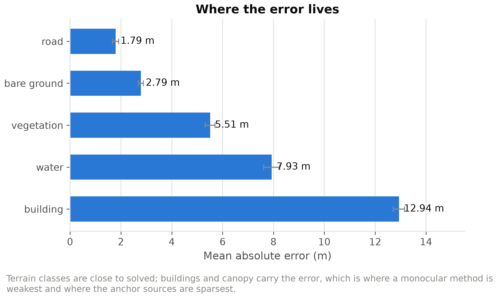
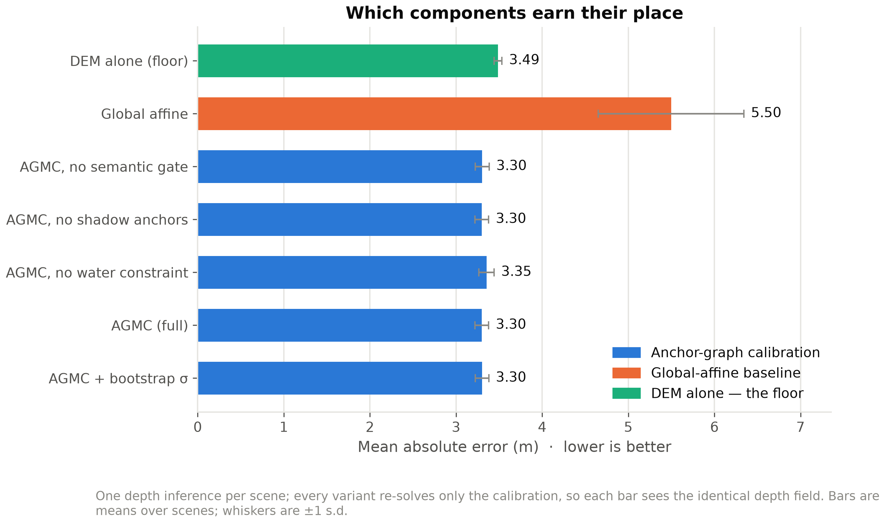
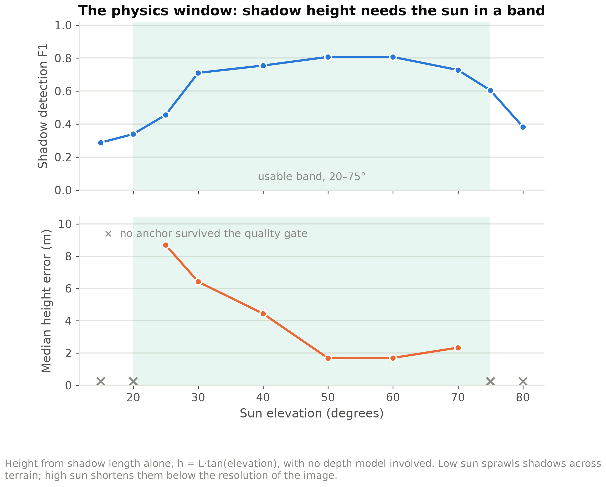
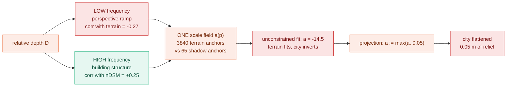
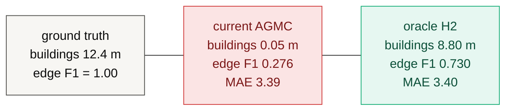

# ĀYĀMA — आयाम

**An investigation into metric grounding of monocular depth for DSM
reconstruction** — an anchor-graph calibration formulation, a controlled
negative result, and a diagnosed failure mode.

> ### Research status — proof of concept, failure diagnosed
>
> ĀYĀMA demonstrates reproducible spatially-varying metric calibration on
> synthetic scenes, and **does not yet produce a usable Digital Surface Model.**
> The central failure is *scale-field collapse*: terrain-dominated calibration
> drives the spatial scale field to its positivity floor and suppresses building
> relief to 0.05 m against a true 12.4 m. We isolate the mechanism, show why the
> positivity constraint is behaving correctly, measure the high-frequency depth
> signal that survives, and formulate a dual-frequency calibration hypothesis
> that has **not yet been tested end to end**.

---

## Research question

> Can spatially varying metric constraints convert monocular *relative* depth
> into a metrically grounded DSM, without a second view and without a learned
> metric head?

Monocular depth models (§[Related work](#10-positioning-and-related-work))
predict relative depth well — a surface correct up to an unknown, spatially
varying scale and offset. They cannot say how many metres. Stereo, lidar and
InSAR can, and all require an acquisition the single image does not have.
**The gap is not perception; it is metric grounding.**

## Hypotheses

**H1 — spatial calibration.** A single global affine transform `H = aD + b` is
insufficient, because a scene's metric error is spatially structured. Replacing
the two scalars with two smooth *fields* over a lattice should reduce error.

**H2 — frequency separation.** Terrain elevation and object height occupy
different spatial-frequency regimes, and a monocular backbone's low-frequency
output is not merely noisy but *anti-correlated* with terrain. Metric grounding
should therefore decompose depth by frequency and constrain each band with the
source that observes it — terrain from a DEM, structure from shadows.

**Status: H1 tested and supported. H2 formulated from the failure of H1,
implemented, and run end to end — its mechanism is confirmed and its scale
estimator is not solved (§5.5).**

## Contributions

1. **Anchor-graph metric calibration (AGMC)** — a formulation converting
   monocular relative depth into a spatially varying metric surface by solving
   two smooth fields against heterogeneous metric constraints.
2. **Explicit absolute/relative anchor semantics** — shadow-derived height
   constraints enter the linear system as a *difference of two rows*, which
   structurally prevents a height measurement being read as an elevation.
3. **A calibration failure diagnosis** — terrain-dominated fitting drives the
   scale field to its positivity floor at 100% of lattice nodes, reducing the
   method to a DEM interpolator.
4. **A frequency-domain explanation** — the backbone's depth is anti-correlated
   with terrain at low frequency (r = −0.27, −0.26, +0.04) while retaining
   structural information at high frequency (r = +0.43 … +0.52).
5. **A dual-frequency calibration formulation** derived from that diagnosis.
6. **An evaluation protocol designed to expose degenerate reconstructions**
   rather than rely on global MAE — a DEM-only floor baseline, an edge-structure
   metric, and a ratio metric on height-above-ground. All three fired on a
   result that MAE reported as an improvement.

Contribution 6 is the one we would defend hardest: **MAE improved while the
product became useless**, and the protocol caught it.

## Status at a glance

| | |
|---|---|
| Formulation | spatially varying scale + offset fields, IRLS/Huber, lattice-discretised |
| Evaluation | 3 synthetic scenes, N=3, exact ground truth, CPU only |
| H1 (spatial > global) | **supported** — MAE 3.30 vs 5.49 m |
| Clears DEM-only floor? | **no** — 3.30 vs 3.49 m MAE, *worse* RMSE, identical *r* |
| Structure recovered | **no** — 0.05 m of a true 12.4 m |
| Uncertainty calibrated | **at scene level** — 1σ coverage 0.674 (ideal 0.683) |
| H2 (frequency split) | **implemented and run**: mechanism confirmed (floor 100%→0%, edge F1 0.25→0.78), scale estimator unsolved (2-4x over) |
| Real imagery | **none** |

---

# 1. Method


**Figure 1 — the whole pipeline.** Two edges carry the design. The dashed
`depth → anchors` edge is the commitment that anchors come from the image and
auxiliary data, **never from the depth field**: depth supplies *shape*, the
anchor graph supplies *metres*. The dashed `evaluation → AGMC` edge is the one
this project turns on — the DEM-only floor baseline is what revealed that the
calibration had degenerated (§4), and it is why the protocol is a contribution
rather than boilerplate.

Everything downstream of the COG artifacts **only reads** them, so no number in
the viewer or the mesh can be one the calibration did not produce. Phases 3–4
are engineering and are reported in §8; the research core is Phase 2.

## 1.1 Problem statement

Let $D(p) \in [0,1]$ be the backbone's relative depth at pixel $p$, rank-
normalised per inference chip. We seek metric elevation $H(p)$ under an affine
model with spatially varying coefficients:

$$ H(p) = a(p) D(p) + b(p) $$

- $a(p)$ — scale field, metres per unit of relative depth
- $b(p)$ — offset field, metres (the local datum)
- $H(p)$ — metric elevation, metres

The global-affine baseline is the special case $a(p) = a$, $b(p) = b$.

## 1.2 Relative depth

Depth Anything V2 [1] is run tiled — one of six selectable backbones, all frozen and pretrained (§2.1). Three steps make the mosaic usable:
per-chip **rank normalisation** (the backbone's per-image scale is arbitrary, so
only the ordering is kept); **overlap harmonisation**, fitting each new chip to
the existing mosaic with a Huber-reweighted affine over the overlap band alone;
and a **flat-top raised-cosine window** that is exactly 1 across the chip
interior so interior pixels are never attenuated.

Sign convention, stated once: the backbone returns higher values for surfaces
closer to the sensor; from nadir, closer means higher, so $D$ maps monotonically
to height. There is no flip anywhere in the pipeline.

## 1.3 Anchors: absolute and relative

An anchor is a statement about the world in metres, with a confidence weight.

| source | assertion | kind | count/scene | weight |
|---|---|---|---|---|
| DEM (Copernicus GLO-30 [4]) | "this bare-earth pixel is at 412.3 m" | absolute | ~3840 | $\min(1, 3/\sigma_{\text{src}})$ |
| water bodies | "this lake is at one elevation" | absolute | ~70 | 0.9 |
| cast shadows | "this roof is $h$ m above the ground at its foot" | **relative** | ~65 | see below |
| GCPs | "this surveyed pixel is at 118.02 m" | absolute | 0 here | 1.0 |

**Semantic gating.** A public DEM approximates bare earth, so a DEM sample on a
rooftop is not a weak constraint — it is a wrong one. Samples are admitted only
on bare ground, road or water, on a 16 px stride, and dropped where the DEM's
own slope exceeds 25°.

**Shadow height** follows the standard cast-shadow relation, with $L$ the shadow
run length in pixels, $g$ the ground sample distance and $\alpha$ the sun
elevation:

$$ h = L \cdot g \cdot \tan\alpha $$

$L$ is the *median* of many parallel runs marched along the anti-solar direction
from every shaded-side boundary pixel, not one blob dimension. Each shadow
anchor is weighted by three independent factors in $[0,1]$:

$$ w = \underbrace{\mathrm{clip}\Big(\tfrac{\alpha-20}{10}\Big)\mathrm{clip}\Big(\tfrac{75-\alpha}{10}\Big)}_{\text{sun-angle gate}} \cdot \underbrace{\Big(1 - \tfrac{\mathrm{MAD}(L_i)}{\bar{L}}\Big)}_{\text{crispness}} \cdot \underbrace{\Big(1 - \tfrac{\text{neighbour px in ring}}{\text{ring px}}\Big)}_{\text{isolation}} $$

**The absolute/relative distinction is structural, not a weighting choice.** A
shadow measures a height, never an elevation. Relative anchors therefore
constrain a *difference*:

$$ H(p_k) - H(q_k) = h_k $$

where $p_k$ is the roof and $q_k$ a reference pixel at the building's foot.
Collapsing this into an absolute constraint is how a good height anchor silently
becomes a bad datum anchor.

## 1.4 AGMC: the optimisation problem

The fields are discretised on a lattice of stride 32 px, with each anchor spread
bilinearly over its four surrounding nodes ($\sum_j \beta_j = 1$). With $m$
anchors and $n$ lattice nodes, the unknown is $x = [ a; b ] \in \mathbb{R}^{2n}$.

**Objective.**

$$ E(a,b) = \underbrace{\sum_{k=1}^{m} w_k \rho\big(H(p_k) - h_k\big)}_{\text{data}} + \underbrace{\lambda_a \lVert \nabla a \rVert^2 + \lambda_b \lVert \nabla b \rVert^2}_{\text{smoothness}} + \underbrace{\lambda_p \lVert a - a_{\text{glob}} \rVert^2}_{\text{prior on scale only}} $$

subject to

$$ a(p) \ge a_{\min} $$

$\rho$ is the Huber loss; $a_{\text{glob}}$ is a robust global affine fit used
only as a weak prior. **$b$ carries no prior**: the datum is exactly what the
anchors exist to determine.

**Normal equations.** All terms are quadratic in $x$, so each IRLS iteration is
one sparse solve:

$$ \big(A^{\top} W A + R + P\big) x = A^{\top} W h + P x_{\text{prior}} $$

$$ R = \mathrm{blkdiag}(\lambda_a \kappa L, \lambda_b \kappa L), \qquad P = \mathrm{blkdiag}(\lambda_p \kappa I, 0), \qquad \kappa = \frac{m}{n} $$

with $L = G^{\top}G$ the 5-point graph Laplacian on the lattice, $A$ the
$m \times 2n$ design matrix (four bilinear entries per field per anchor; two
signed groups for a relative anchor), and $W$ the diagonal of IRLS weights.

$\kappa = m/n$ balances the two terms **per unknown rather than per residual**.
Without it, the data term sums over ~4000 anchors and the smoothness term over
~1000 nodes, smoothness dominates, and AGMC silently degenerates to the global
affine fit it was built to replace.

**Robustness.** IRLS with Huber reweighting, 3 iterations:

$$ w_k^{(t+1)} = w_k^{(0)} \cdot \min\left(1,\ \frac{\delta}{\lvert r_k^{(t)} \rvert}\right), \qquad \delta = 2.0\ \text{m} $$

An anchor whose weight falls below $0.25 w_k^{(0)}$ is reported as rejected.

**Positivity.** The constraint $a \ge a_{\min}$ is enforced by projection after
each IRLS step, followed by re-solving $b$ with the clamped $a$ held fixed
(clamping $a$ alone would leave $b$ fitted against the old scale and shift the
datum). It exists to enforce the pipeline's own sign convention — and it is
where the failure in §4 occurs.

**Hyperparameters as run.** $\lambda_a = \lambda_b = 1.0$, $\lambda_p = 0.05$,
$\delta = 2.0$ m, 3 IRLS iterations, lattice stride 32 px, $a_{\min} = 0.05$.

## 1.5 Uncertainty

Three independent terms in quadrature:

$$ \sigma^2 = \sigma_{\text{calib}}^2 + \sigma_{\text{model}}^2 + \sigma_{\text{ref}}^2 $$

$\sigma_{\text{calib}}$ is the spread of $B = 24$ AGMC solves, each on a
uniform 70% resample of the anchor set, accumulated by Welford's method [8]:

$$ \sigma_{\text{calib}}^2 = \frac{1}{B-1}\sum_{i=1}^{B}\big(s_i - \bar{s}\big)^2 $$

$\sigma_{\text{model}}$ is the spread between backbones ($\tfrac{1}{2}|s_1-s_2|$
for two). $\sigma_{\text{ref}}$ is the auxiliary DEM's datasheet 1σ as a constant
field (3.0 m for Copernicus GLO-30 [4]).

## 1.6 Proposed: frequency-separated calibration (H2)

Derived from §4, **not yet evaluated end to end.** Decompose depth with a
Gaussian of radius ≈ 60 m and discard the low band:

$$ D_{\text{lo}} = G_\sigma \ast D, \qquad D_{\text{hi}} = D - D_{\text{lo}} $$

$$ H(p) = \underbrace{b(p)}_{\text{terrain: DEM, GCP, water anchors}} + \underbrace{a(p) D_{\text{hi}}(p)}_{\text{structure: shadow anchors}} $$

The operative change is *what $a$ is fitted against*. Under the current model it
must serve terrain and structure simultaneously and ~3840 terrain anchors
outvote ~65 shadow anchors. Under H2 it never sees terrain.

This is not new machinery: `DepthField.terrain`, `DepthField.objects` and the
`branch` field on `Anchor` already exist in
[`ayama/core/types.py`](ayama/core/types.py) and are unused.

---

# 2. Experimental protocol

## 2.1 Environment

| | |
|---|---|
| OS / CPU | Windows 11 (10.0.26200), AMD64, 8 logical cores |
| Python / torch | 3.13.5 / 2.13.0+cpu — **CUDA unavailable** |
| Raster stack | rasterio 1.5.1, GDAL 3.12.4 |
| Backbone | `depth-anything/Depth-Anything-V2-Small-hf` [1], 24.8 M params, float32 |
| Threads | 4 (torch) |

Recorded per run in [`results/study.json`](results/study.json) → `environment`.

### Models

**Every model in this project is a frozen, pretrained checkpoint downloaded at
runtime. Nothing is trained here.** There is no `nn.Module` of our own, no loss,
no optimiser and no saved weights anywhere in the repository — the depth
backbone is the only thing carrying parameters, and it is used as-is. That is
why §5.5's conclusion matters: predicting the structural scale would be the
first component this project actually trains.

Registry is [`ayama/depth/backbones/__init__.py`](ayama/depth/backbones/__init__.py);
select with `--backbone <key>`.

| key | checkpoint | native input | status in this study |
|---|---|---|---|
| **`dav2-vits`** | `depth-anything/Depth-Anything-V2-Small-hf` | 518 px | **every committed number**, 24.8 M params, fp32 on CPU |
| `dav2-vitb` | `depth-anything/Depth-Anything-V2-Base-hf` | 518 px | registered, never run |
| `dav2-vitl` | `depth-anything/Depth-Anything-V2-Large-hf` | 518 px | registered, never run — needs a GPU |
| `dpt-large` | `Intel/dpt-large` [6] | 384 px | registered, never run |
| `dpt-hybrid` | `Intel/dpt-hybrid-midas` [2] | 384 px | registered, never run |
| `synthetic` | — no weights at all | — | plumbing tests and CI only |

Parameter counts are given only where measured. `dav2-vits` at 24.8 M comes out
of [`results/study.json`](results/study.json) → `bench`; the rest were never
loaded on this machine and are not guessed at here.

Two things this table is meant to make impossible to miss. **The whole study
rests on one 24.8 M-parameter model** — which is why "test a second backbone"
is item 5 of the roadmap and one of the four ways §5.4 could falsify H2. And
the code's own dropdown label calls `dav2-vitl` the *primary* backbone, which
is an intention rather than a fact: it has never been run.

**Relative, not metric, checkpoints.** Depth Anything V2 also ships metric
variants. They are deliberately not used: their scale prior is fitted to
ground-level outdoor scenes and is wrong for nadir imagery. The point of this
work is to supply metres from scene evidence — a DEM, water, shadow geometry —
rather than from a prior baked into weights at training time. Whether that is a
good trade is exactly what §4 puts in question.

**Licensing.** The Small and Base checkpoints ship under different terms from
Large; check the model cards before any commercial use, and see
[LICENSE](LICENSE) for how that interacts with this repository's own terms.

## 2.2 Scenes and ground truth

Synthetic scenes with exactly known ground truth, generated by
[`ayama/eval/synthetic_scene.py`](ayama/eval/synthetic_scene.py).

| | |
|---|---|
| Scenes | **N = 3**, seeds 7 / 21 / 33 |
| Resolution | 1024 × 1024 px |
| GSD | 0.5 m (512 × 512 m extent) |
| CRS | EPSG:32644 |
| Sun | 138.4° azimuth / 61.2° elevation |
| Ground truth | exact DSM, DTM, nDSM, semantic mask, ray-marched shadow mask |
| Auxiliary DEM | simulated Copernicus GLO-30: true DTM at 30 m posting, bilinear upsample, spatially correlated noise at 3 m 1σ |
| Building cover | 3.1% of pixels |

Shadows are ray-marched from the true DSM using the same geometry the physics
module inverts, so `harvest_shadow` can be validated against truth.

## 2.3 Baselines

| method | purpose | scale model |
|---|---|---|
| **DEM-only** | floor: does the depth model contribute anything at all? | none — DEM resampled onto the image grid |
| **Global affine** | does spatial calibration beat scalar calibration? (tests H1) | $a, b$ scalars |
| **AGMC** | proposed | $a(p), b(p)$ fields |
| AGMC − shadow | contribution of shadow anchors | fields |
| AGMC − water | contribution of the flat-water constraint | fields |
| AGMC − semantic gate | contribution of anchor filtering | fields |
| *Dual-frequency (H2)* | *tests H2 — **not yet run end to end*** | *$b(p)$ + $a(p)D_{\text{hi}}$* |

The global-affine baseline admits **only absolute anchors**. A relative water
anchor read as an elevation would drag the datum to zero, which would make the
comparison a straw man.

The **DEM-only floor** is the load-bearing baseline. A monocular method anchored
to a DEM can score well by ignoring the image entirely; without this column that
is invisible.

## 2.4 Metrics

With $e_i = \hat{H}_i - H^{\star}_i$ over valid pixels:

| metric | definition | what it detects |
|---|---|---|
| MAE | $\frac{1}{N}\sum \lvert e_i \rvert$ | typical error magnitude |
| RMSE | $\sqrt{\frac{1}{N}\sum e_i^2}$ | as above, large errors weighted |
| bias | $\frac{1}{N}\sum e_i$ | systematic offset (wrong datum vs wrong model) |
| Pearson *r*, Spearman *ρ* | on $(\hat{H}, H^{\star})$ | linear / rank agreement |
| slope MAE | mean $\lvert \arctan\lVert\nabla \hat{H}\rVert - \arctan\lVert\nabla H^{\star}\rVert \rvert$ | local geometry |
| **edge F1** | see below | whether height discontinuities land in the right place |
| **δ < 1.25** | see below | height-above-ground accuracy as a ratio |
| **1σ coverage** | $\frac{1}{N}\sum \mathbf{1}(\lvert e_i \rvert \le \sigma_i)$ | is σ honest? ideal ≈ 0.683 |
| ECE | see below | is σ honest *per bin*, in metres |

**edge F1.** Mark a pixel an edge where gradient magnitude exceeds the 92nd
percentile within the valid mask; do this for prediction and reference; a
predicted edge counts as matched if a reference edge lies within a $\pm 2$ px
dilation; report $F_1 = 2PR/(P+R)$.

**δ < 1.25.** Computed on **height above ground**, not elevation, over pixels
where both predicted and reference nDSM exceed 0.5 m:

$$ \delta_1 = \frac{1}{|\Omega|}\sum_{i \in \Omega} \mathbf{1}\left(\max\left(\frac{\hat{h}_i}{h^{\star}_i}, \frac{h^{\star}_i}{\hat{h}_i}\right) < 1.25\right), \quad \Omega = \lbrace i : \hat{h}_i > 0.5 \wedge h^{\star}_i > 0.5 \rbrace $$

A ratio metric is meaningless on absolute elevation, where a 400 m datum makes
every ratio ≈ 1.

**ECE.** Sort pixels into 10 equal-count bins by predicted $\sigma$; in each bin
compare realised RMS error against mean promised σ; weight by bin population.
Returned **in metres**:

$$ \mathrm{ECE} = \frac{1}{N}\sum_{j=1}^{10} n_j \left\lvert \sqrt{\tfrac{1}{n_j}\textstyle\sum_{i \in j} e_i^2} - \tfrac{1}{n_j}\textstyle\sum_{i \in j}\sigma_i \right\rvert $$

## 2.5 Statistical treatment

> **All `±` values are the population standard deviation (`numpy.std`,
> `ddof = 0`) of the per-scene metric across N = 3 scenes.** They are a
> descriptive spread, **not** a standard error and **not** a confidence
> interval. At N = 3 no inferential interval is warranted, and none is claimed.
> Per-scene values are in [`results/study.json`](results/study.json) → `scenes`.

Seeds are fixed (7 / 21 / 33) and the pipeline is deterministic given a seed;
re-running reproduces the table exactly. Differences between methods are
reported as observed differences on the same three scenes, not as tested
effects.

## 2.6 What this protocol cannot support

Stated up front because it bounds every claim below:

- **N = 3 scenes.** Far too few for a statistical claim about method superiority.
- **Synthetic imagery only.** One renderer, one generation pipeline. Performance
  on real imagery is **unmeasured**.
- **Fixed resolution and GSD.** 1024², 0.5 m. No scale-generalisation evidence.
- **Simulated auxiliary DEM.** A degradation model, not a real Copernicus tile.
- **No external benchmark.** No comparison against a published DSM dataset.
- **No cross-domain test**, no held-out scene family, no urban-density sweep.
- **Heuristic segmentation**, not a trained model.

---

# 3. Results

Full data: [`results/study.json`](results/study.json). Regenerate in 450 s:
`python -m ayama.cli study --out results`.

## 3.1 Headline

| metric | **AGMC** | global affine | **DEM-only (floor)** |
|---|---|---|---|
| MAE (m) | **3.30 ± 0.08** | 5.49 ± 0.85 | 3.49 ± 0.05 |
| RMSE (m) | 5.49 ± 0.14 | 7.80 ± 0.82 | **5.37 ± 0.12** |
| Pearson *r* | 0.709 ± 0.086 | 0.162 ± 0.145 | 0.708 ± 0.094 |
| bias (m) | −0.60 ± 0.08 | — | — |
| **edge F1** | **0.264 ± 0.014** | **0.780** | 0.196 |
| 1σ coverage | 0.674 ± 0.023 | — | — |
| ECE (m) | 2.36 ± 0.14 | — | — |
| **δ < 1.25** | **undefined — 0 valid px** | — | — |

**H1 is supported:** spatial calibration beats scalar calibration by a wide
margin (MAE 3.30 vs 5.49 m; *r* 0.71 vs 0.16).

**But the third column withdraws the result.** AGMC beats the DEM it was
anchored to by 5% on MAE, *loses* by 2% on RMSE, and matches its correlation to
three decimals. **The anchor graph is carrying the entire result.**

**And the last two rows say what kind of surface this is.** edge F1 of 0.264,
and a δ₁ that could not be computed at all — because across three scenes not one
pixel had a *predicted* height above ground exceeding 0.5 m.

## 3.2 Error by class

| class | MAE (m) | bias (m) | 1σ cov | % px |
|---|---|---|---|---|
| road | 1.79 ± 0.15 | −0.07 | 0.807 | 5.3 |
| bare ground | 2.79 ± 0.12 | −0.47 | 0.725 | 85.8 |
| vegetation | 5.51 ± 0.23 | −5.42 | 0.234 | 1.9 |
| water | 7.93 ± 0.39 | **+7.76** | 0.106 | 3.9 |
| **building** | **12.94 ± 0.27** | **−12.94** | **0.021** | 3.1 |



Building `bias = −MAE` **exactly**: the error is entirely one-sided, every
building under-predicted by its full height. σ is honest on average (0.674) and
meaningless where it matters (0.021 on buildings) — a scene-level reliability
number is dominated by whichever class dominates the scene.

## 3.3 Ablation

One inference per scene; every variant re-solves only the calibration, so all
rows see an identical depth field.

| variant | MAE (m) | RMSE (m) | *r* | **edge F1** | anchors |
|---|---|---|---|---|---|
| DEM-only | 3.49 | **5.37** | 0.708 | 0.196 | 4021 |
| global affine | 5.50 | 7.80 | 0.162 | **0.780** | 4021 |
| AGMC − gate | 3.30 | 5.50 | 0.709 | 0.263 | 4232 |
| AGMC − shadow | 3.30 | 5.49 | 0.711 | 0.263 | 3956 |
| AGMC − water | 3.35 | 5.59 | 0.692 | 0.251 | 3951 |
| **AGMC (full)** | **3.30** | 5.49 | **0.711** | 0.263 | 4021 |



**The global-affine row is the most informative line in this study.** Worst MAE
by 67%, best edge F1 by a factor of three. A single scalar applied to the raw
depth field places height discontinuities correctly 78% of the time — the depth
model *does* know where the buildings are, and AGMC discards that while
improving the pixelwise average. This observation motivates §4 and §5.

Component ablations are near-null and we report them as such: removing shadow
anchors changes nothing measurable, because ~65 shadow anchors are outvoted by
~3840 DEM anchors. Removing the semantic gate costs little *at 3.1% building
cover*; this would not hold in a dense city.

## 3.4 Shadow physics, isolated

Building height from shadow length with **no depth model involved** — a direct
test of the relation in §1.3.

| sun elevation | shadow F1 | anchors | median height error |
|---|---|---|---|
| 15–20° | 0.29–0.34 | 0 | — |
| 25° | 0.46 | 3 | 8.69 m |
| 30° | 0.71 | 50 | 6.41 m |
| 40° | 0.75 | 57 | 4.44 m |
| **50°** | **0.81** | 57 | **1.68 m** |
| **60°** | **0.81** | 58 | **1.70 m** |
| 70° | 0.73 | 48 | 2.33 m |
| 75–80° | 0.38–0.60 | 0 | — |



The strongest positive result here. At 50–60° the relation recovers building
height to **1.7 m median absolute error**. The two failure modes are
qualitatively different — low sun retains precision (0.98) and loses recall as
shadows merge; high sun retains recall and loses precision as shadows fall below
resolution — which is consistent with the physics rather than with a fitted
curve. **This branch works and the pipeline cannot currently use it** (§4).

## 3.5 Uncertainty calibration

| | measured | ideal |
|---|---|---|
| 1σ coverage | **0.674 ± 0.023** | 0.683 |
| 2σ coverage | 0.850 | 0.954 |
| ECE | 2.36 ± 0.14 m | 0 |
| mean σ | 3.00 m | — |

Well calibrated at 1σ. The 2σ shortfall indicates error tails heavier than
Gaussian, consistent with a small population of catastrophically wrong pixels
(buildings, canopy) inside a well-behaved bulk.

## 3.6 Parameter sensitivity

MAE varies 3.24–3.35 m across a 10× range of the smoothness weight
(λ = 0.05 → 0.5) and degrades monotonically outside it, so λ is not a per-scene
knob. Caveat: the sweep records MAE but not edge F1, and §4 gives reason to
expect the λ minimising MAE is not the λ preserving structure.

---

# 4. Failure analysis: terrain-dominated scale-field collapse

## 4.1 Observation

The scale field is saturated at its constraint boundary across the entire
lattice, and the predicted surface contains essentially no relief above ground.

```
seed7, solved calibration fields
  a(p):  min 0.0500   median 0.0500   max 0.0500
         lattice nodes at the a_min floor:  100%
  b(p):  387.93 .. 409.55            (range 21.62 m)

predicted height above ground, all three scenes
  max:   0.28 / 0.27 / 0.24 m        true max: 42.54 / 41.04 / 40.48 m
  mean on building pixels: 0.05 m    true: 12.40 / 12.45 / 13.19 m
```

Measured directly on seed7, buildings against a 15 px ring of surrounding
ground: predicted **+0.07 m**, true **+6.81 m**.

## 4.2 Mechanism

Because $D \in [0,1]$ and $a$ is pinned at $a_{\min}$, the maximum relief the
depth model can contribute anywhere in the scene is

$$ a_{\min} \cdot \big(\max D - \min D\big) = 0.05 \times 1.0 = 0.05\ \text{m} $$

— exactly the observed building height. Meanwhile $b$, which carries no prior
(§1.4), is free and spans 21.62 m, reproducing the terrain unaided.

**The surface is $b$ plus 5 cm of noise. ĀYĀMA is not calibrating a depth field;
it is interpolating a DEM** — precisely the degeneracy the DEM-only floor
baseline exists to detect.

## 4.3 Evidence

The unconstrained robust global fit asks for a **negative** scale:

```
robust global affine on the raw depth field:   a = -14.50,  b = 407.15
```

Correlation of the backbone's depth against truth explains why:

| | seed7 | seed21 | seed33 |
|---|---|---|---|
| corr(*D*, true DSM) — terrain | **−0.271** | **−0.258** | +0.043 |
| corr(*D*, true nDSM) — structure | +0.236 | +0.266 | +0.253 |



**Figure 2.** Depth Anything applies a ground-level perspective ramp to nadir
imagery. At low spatial frequency that ramp anti-correlates with terrain, so a
fit dominated by 3840 terrain anchors concludes the surface is inverted. At high
frequency the same field is correct.

## 4.4 Consequence

The positivity projection prevents the inverted solution and, in doing so,
collapses structural amplitude to the constraint boundary.

**The guard is correct and the design is incomplete.** Without the clamp: an
inverted city, roofs rendered as pits, while MAE still improves. With it: a
flattened city. Both are symptoms of one cause — a single scale field asked to
serve two frequency regimes whose relationship to the truth has opposite sign.
Neither is reachable by tuning $\lambda$ or $\delta$.

## 4.5 Why the headline metric did not catch it

MAE improved from 3.49 → 3.30 m while the product became useless. Buildings are
3.1% of pixels, so flattening every one costs ≈ 0.4 m of MAE — less than the
gain from smoothing the DEM's correlated noise.

| diagnostic | caught it? | how |
|---|---|---|
| DEM-only floor baseline | **yes** | 5% better MAE, *worse* RMSE, identical *r* |
| edge F1 | **yes** | 0.264 vs 0.780 for a plain global affine |
| δ < 1.25 on nDSM | **yes** | undefined — zero qualifying pixels |
| per-class bias | **yes** | building bias = −MAE exactly |
| per-class σ coverage | **yes** | 0.021 on buildings vs 0.674 scene-wide |
| MAE / RMSE / *r* / *ρ* | **no** | all improved or held |

This is the protocol working. A floor baseline earns its cost precisely when the
headline number is flattering.

## 4.6 Failure inventory

| failure | evidence | status |
|---|---|---|
| Scale-field collapse | 100% of lattice nodes at $a_{\min}$ | **diagnosed** (§4) |
| Building flattening | 0.05 m predicted vs 12.4 m true | **unresolved** — H2 proposed |
| Terrain bias | bare-ground bias −0.47 m | partially understood |
| Water bias | +7.76 m; flat-water uses the DEM's smoothed median | diagnosed |
| Vegetation bias | −5.42 m | characterised, not diagnosed |
| Low-sun shadows | recall 0.17 at 15° | characterised |
| High-sun shadows | precision 0.29 at 80° | characterised |
| Heavy-tailed uncertainty | 2σ coverage 0.850 vs 0.954 | characterised |
| Shadow anchors inert | ablation null; 65 vs 3840 anchors | diagnosed, addressed by H2 |

---

# 5. Hypothesis test: frequency-separated calibration (H2)

> ## ⚠️ ORACLE RESULT — NOT END-TO-END PERFORMANCE
>
> **Everything in this section fits the structural scale $a$ against ground
> truth.** These are **upper bounds on the signal available** in the depth
> field, not measurements of a working method. In deployment $a$ must come from
> shadow anchors, whose own accuracy is 1.7 m median (§3.4). No end-to-end
> dual-frequency result exists. Do not read "8.80 m of a true 12.40 m" as
> "recovers 71% of building height."

## 5.1 Does a structural signal survive?

High-passing at 60 m roughly doubles structural correlation, stably across
cutoffs (30 m and 60 m agree to three decimals):

| scene | corr(*D*, true nDSM) | **corr(*D*<sub>hi</sub>, true nDSM)** |
|---|---|---|
| seed7 | +0.236 | **+0.431** |
| seed21 | +0.266 | **+0.490** |
| seed33 | +0.253 | **+0.523** |

## 5.2 How much height could it support? *(oracle)*

| scene | current pipeline | **oracle-scaled $D_{\text{hi}}$** | truth |
|---|---|---|---|
| seed7 | 0.05 m | 8.80 m | 12.40 m |
| seed21 | 0.04 m | 8.58 m | 12.45 m |
| seed33 | 0.05 m | 10.20 m | 13.19 m |

## 5.3 What it would do to the metrics *(oracle)*

Constructing $\mathrm{DEM} + \max(a D_{\text{hi}}, 0)$ on seed7:

| | DEM-only | current | **oracle H2** |
|---|---|---|---|
| MAE (m) | 3.47 | 3.39 | 3.40 |
| **edge F1** | 0.244 | 0.276 | **0.730** |



**Figure 3.** The structural metric moves 2.6×; the pixelwise metric does not
move at all. **If MAE remains the headline, a correct fix is indistinguishable
from a regression.** This is the single strongest argument for the evaluation
protocol in §2.4.

## 5.5 H2 implemented and run end to end — mechanism confirmed, estimator not

`solve_agmc(..., dual_branch=True)` implements §1.6 and is off by default. Run on
the same three scenes with **no oracle anywhere** — the scale comes from the
shadow anchors, as it would at inference:

| seed | mode | MAE (m) | edge F1 | median `a` | nodes at floor | building height | true |
|---|---|---|---|---|---|---|---|
| 7 | single | 3.27 | 0.254 | 0.05 | **100%** | 0.07 m | 12.40 m |
| 7 | **dual** | 13.32 | **0.804** | 190.8 | **0%** | 27.03 m | 12.40 m |
| 21 | single | 3.24 | 0.272 | 0.05 | **100%** | 0.07 m | 12.45 m |
| 21 | **dual** | 22.60 | **0.783** | 326.0 | **0%** | 47.71 m | 12.45 m |
| 33 | single | 3.19 | 0.228 | 0.05 | 97.6% | 0.08 m | 13.19 m |
| 33 | **dual** | 6.08 | **0.764** | 87.6 | **0%** | 12.00 m | 13.19 m |

**The mechanism is confirmed.** Routing terrain anchors to the offset field
alone releases the scale field completely — floor saturation goes 100% → 0% on
every scene — and structure comes back: edge F1 rises from ~0.25 to **0.78**,
which is the global-affine figure from §3.3, the one that showed the depth model
does know where the buildings are. §4's diagnosis was correct and the fix
addresses it.

**The estimator is not solved.** The scale overshoots by 2–4×, so MAE gets
much worse. The cause is measurable and specific: a shadow anchor pairs a roof
pixel with a reference 2 px beyond the building edge, and in the high-pass band
that gap is

```
depth gap, roof vs foot:  median +0.003        with 22-31 of ~65 anchors NEGATIVE
implied a = h / gap:      2515 / 4439 / 20929  against an oracle answer near 20-35
```

A 2-pixel probe cannot measure a band whose filter is 60 m wide; it measures
noise, and a third of the anchors report the roof as *lower* than the ground
beside it. A scale-matched probe — each building blob's median high-pass against
a surrounding ground ring — does not rescue it either: implied `a` comes out at
171 / 181 / 178 with an interquartile range of 30 to 460, from only 7–13 usable
blobs per scene.

**What this changes.** The oracle in §5.2–5.3 fitted one scale by least squares
over every pixel against ground truth. That information does not exist at
inference, and the geometric substitutes tested here are one to three orders of
magnitude too noisy. So the open problem is no longer "does a structural signal
survive" — §5.1 answered that — but **"where does the structural scale come
from"**, and the honest answer is that it will not come from 65 point pairs.

That is a well-posed supervised problem with a real target, and it is the first
thing in this project that genuinely needs a GPU and training data: predict
`a(p)` from image evidence, supervised on nDSM ground truth. §10 lists the
datasets that provide it.

## 5.4 What would falsify H2

H2 is not established. It predicts, and can be refuted by:

1. ~~**End-to-end run with shadow-derived $a$** (no oracle).~~ **Run — see
   §5.5.** edge F1 rose to 0.78, so H2 survives this test on structure. It fails
   a second one it implied: the scale magnitude is 2-4x too large, because the
   shadow branch cannot resolve it.
2. **Scenes with low shadow yield** — dense blocks, low sun. H2 depends on the
   shadow branch, which §3.4 shows is narrow-band.
3. **A different backbone.** If the low-frequency anti-correlation is specific to
   Depth Anything V2 on this renderer, the diagnosis generalises less than
   claimed. Testing `dav2-vitl` and a second family (e.g. Marigold [3]) is the
   cheapest available check.
4. **Real imagery**, where the perspective ramp may differ in magnitude or sign.

---

# 6. Limitations

Beyond the protocol limits in §2.6:

- **The headline claim is a negative result.** ĀYĀMA does not currently produce
  a usable DSM, and no claim of state of the art is made or implied.
- **H2 is untested end to end.** §5 is an oracle signal test.
- **The diagnosis is single-backbone.** Verified for `dav2-vits` only.
- **σ is validated at scene level only.** Per-class it is unreliable (0.021 on
  buildings).
- **Novelty is unaudited.** §10 positions the work against known literature but
  no systematic prior-art search has been performed; nothing here should be read
  as a priority claim.
- **The oracle scale uses ground truth**, so §5 cannot bound end-to-end error.

---

# 7. Reproducibility

## 7.1 Install and run

```bash
python -m venv .venv
.venv/bin/pip install -r requirements.txt      # core: no torch required
.venv/bin/pip install torch torchvision transformers
```

The core install excludes torch deliberately: ingest, tiling, blending, raster
IO, calibration, metrics and the synthetic scene run without it, and
`--backbone synthetic` exercises the whole path with no weights (a plumbing
check, never a result).

| command | produces | time (CPU) |
|---|---|---|
| `python -m ayama.cli study --out results` | §3 and §4 — `results/study.json` | 450 s |
| `python -m ayama.cli run <scene> --workers 8` | one scene, threaded bootstrap | 42 s |
| `python -m ayama.cli preflight --device cuda` | end-to-end verdict on one device | 20 s |
| `python -m ayama.cli delivery results/seed7/run --out results` | §8 — `results/delivery.json` | 68 s |
| `python -m ayama.cli viewer results/seed7/run` | interactive 3D at `localhost:8020` | 5 s |
| `python -m ayama.cli serve` | the web service: upload an image, get a 3D reconstruction | — |
| `python -m pytest tests -q` | 181 passed, 7 skipped (GPU) | 78 s |

## 7.2 Reproduce the §4 diagnosis

Directly, in about 10 s, with no inference:

```bash
python - <<'PY'
import numpy as np, rasterio
from ayama.core.ingest import ingest
from ayama.core.types import Config, DepthField, Tier
from ayama.chhaya.agmc import solve_agmc, global_affine
from ayama.chhaya.ladder import build_anchors
from ayama.eval.simulate import simulate_public_dem
from ayama.measure.derive import slope_deg

scene = ingest('results/seed7/scene.tif')
rd  = rasterio.open('results/seed7/run/relative_depth.tif').read(1)
sem = rasterio.open('results/seed7/run/sem.tif').read(1)
sh  = rasterio.open('results/seed7/run/shadow.tif').read(1).astype(bool)
dtm = rasterio.open('results/seed7/scene_dtm.tif').read(1)
dem = simulate_public_dem(dtm, scene.meta.gsd_m, source='copernicus')

cfg = Config(); cfg.dem_source = 'copernicus'
d = DepthField(relative=rd, meta=scene.meta, backbone='dav2-vits')
anchors, _ = build_anchors(scene, d, sem, sh, Tier.A, dem_m=dem, cfg=cfg,
                           slope_mask=slope_deg(dem, scene.meta.gsd_m) > 25.0)
print('global affine wants a = %.2f' % global_affine(rd, anchors, cfg.huber_delta)[0])
cal = solve_agmc(d, anchors, cfg, tier=Tier.A)
print('a field: min %.4f median %.4f max %.4f' % (cal.a.min(), np.median(cal.a), cal.a.max()))
print('fraction at the a_min floor: %.1f%%' % (100 * (cal.a <= 0.0501).mean()))
PY
```

Expected: `a = -14.50`, field flat at `0.0500`, **100%** at the floor.

## 7.3 The whole thing on Colab

Paste these in order. This replaces the notebook that used to live in
`notebooks/` — same sequence, one less file to keep in sync.

**Do not run `setup_gpu.sh` here.** Colab's torch is already built against its
own driver, and the image ships without `ensurepip`, so `python -m venv`
half-succeeds and leaves an interpreter that imports nothing.

```python
# 1 — GPU, then the code
!nvidia-smi
!git clone -q https://github.com/Sisigoks/AYAMA.git
%cd AYAMA
!pip install -q -r requirements.txt
```

```python
# 2 — does the whole pipeline run on this GPU? stop here if not.
!python -m ayama.cli preflight --device cuda --backbone dav2-vits
```

```python
# 3 — throughput, so the study below can be sized honestly
!python -m ayama.cli bench --backbones dav2-vits,dav2-vitl \
    --chips 518,1024,2048 --batches 1,2,4,8 --device cuda --json out/bench.json
```

```python
# 4 — reproduce the CPU study on GPU first (should match section 3)
!python -m ayama.cli study --out results/smoke --backbone dav2-vits \
    --device cuda --batch 0 --size 1024 --seeds 7,21,33 --progress plain
```

```python
# 5 — the real one. figures and LaTeX tables are rendered automatically.
!python -m ayama.cli study --out results/gpu --backbone dav2-vitl \
    --device cuda --batch 0 --size 2048 --seeds 1,2,3,4,5,6,7,8,9,10 --progress plain
```

```python
# 6 — read it
from glob import glob
from IPython.display import Image, Markdown, display
display(Markdown(open('results/gpu/README.md').read()))
for f in sorted(glob('results/gpu/figures/*.png')):
    print(f); display(Image(f))
```

```python
# 7 — Phases 3 and 4
!python -m ayama.cli mesh results/gpu/seed1/run --out results/gpu/tiles --bits 12
!python -m ayama.cli delivery results/gpu/seed1/run --out results/gpu/delivery --obj-strides 2,4
from IPython.display import Markdown, display
display(Markdown(open('results/gpu/delivery/DELIVERY.md').read()))
```

```python
# 8 — the 3D app, live, through Colab's port proxy
import subprocess, time
from google.colab.output import eval_js
subprocess.Popen(['python','-m','ayama.cli','serve',
                  '--host','0.0.0.0','--port','8000','--device','cuda'])
time.sleep(6)
print(eval_js('google.colab.kernel.proxyPort(8000)'))
```

```python
# 9 — take it home
!zip -qr ayama_results.zip results/gpu out/bench.json
from google.colab import files; files.download('ayama_results.zip')
```

`study` checkpoints `study.json` and `README.md` after every stage, so a
disconnect costs a stage rather than the run — but it does **not** resume, so
keep the seed count within one session. `--host 0.0.0.0` in cell 8 is required
for Colab's proxy and there is no authentication behind it; that is acceptable
inside a Colab session and nowhere else.

## 7.4 Compute: the CPU baseline and the GPU path

> **No GPU numbers are measured in this repository.** The reference machine
> reports `CUDA available: False`, so every timing in this README is CPU. The
> GPU path is implemented and tested (9 tests, skipped here with a reason), and
> the projections below are arithmetic from the measured CPU profile — not
> observations. Run `ayama doctor` and `ayama bench` on a CUDA box to replace
> them with measurements.

**The CPU POC is the reproducible baseline and stays that way.** Everything in
§3–§5 runs without a GPU, without downloading data, in 450 s. That is a
deliberate property: the negative result in §4 must be checkable by anyone.

### What the GPU actually touches

| stage | CPU (s/scene) | share | on GPU |
|---|---|---|---|
| **depth inference** | 22.1 | **52.4%** | **yes** — fp16 autocast, batched, VRAM-aware |
| uncertainty (24 solves) | 3.5 | 8.3% | no — sparse solves, now threaded (below) |
| validation | 7.5 | 17.8% | no — NumPy/SciPy over rasters |
| artifacts | 4.5 | 10.7% | no — PNG/GeoTIFF encode, IO bound |
| anchors | 2.3 | 5.5% | no |
| segmentation, shadow, assemble, ingest | 2.1 | 5.0% | no |
| **total** | **42.1** | | |

The depth backbone is the only tensor workload in the pipeline. AGMC is a sparse
linear solve, the anchors are connected-component and ray-marching work, and the
artifact stage is compression — none of which belong on a GPU.

### The ceiling this implies

With GPU-addressable fraction *p* = 0.524, Amdahl bounds the whole pipeline at

$$ S_{\max} = \frac{1}{1-p} = 2.10\times $$

| depth speedup | per scene | pipeline speedup |
|---|---|---|
| 1× (CPU) | 42.1 s | 1.00× |
| 3× | 27.4 s | 1.54× |
| 5× | 24.5 s | 1.72× |
| 10× | 22.2 s | 1.89× |
| ∞ | 20.0 s | 2.10× |

**A GPU is worth roughly 2× on this pipeline, not 10×** — and only because the
CPU remainder was first reduced. That is the honest framing: buying a GPU does
not make the science faster to iterate on; it makes a bigger *scene* tractable,
which is a different argument.

Where a GPU changes the answer rather than the clock: `dav2-vitl` at 2048² or
4096². On CPU that is minutes per scene and `dav2-vits` at 1024² is what the
budget allows — so the backbone-family check in §5.4 is a GPU task, not a CPU one.

### What was fixed on the way to that number

The uncertainty bootstrap was 8.2 s (17.5%) of the pipeline, running 24
independent sparse solves serially on one of eight cores. SciPy releases the GIL
inside its sparse factorisation, so a thread pool gives **2.34× measured** on the
real workload, taking the stage to 3.5 s and the pipeline to 42.1 s.

It is on by default (`--workers 0`), and it is **bit-identical to serial**: the
resample indices are drawn up front from the seeded generator, and results are
accumulated in index order rather than completion order. Accumulating as futures
land would make σ depend on thread scheduling — irreproducibility that is hard
to notice and impossible to defend. There is a test asserting equality.

### Verifying it end to end on a GPU

Whether the pipeline runs on a GPU is not answerable by inspection, so it is
answerable by a command. `preflight` runs synth → depth → anchors → AGMC →
uncertainty → artifacts → tileset on the requested device, checks the device
that was **actually used** rather than the one asked for, asserts every headline
metric came back finite, and exits non-zero if anything failed:

```bash
python -m ayama.cli preflight --device cuda --backbone dav2-vits
```

```
PREFLIGHT OK - the full pipeline runs end to end on cuda:0
```

On this CPU-only machine it correctly refuses, which is the same mechanism
working:

```
PREFLIGHT FAILED
  ! CUDA is not available to torch 2.13.0+cpu - this is a CPU-only build
  ! install a CUDA build of torch, e.g.
      pip install torch torchvision --index-url https://download.pytorch.org/whl/cu124
```

That refusal path is tested; so is a full end-to-end preflight pass on CPU. What
is **not** tested here is the CUDA success path, for the obvious reason.

On a **managed notebook (Colab, Kaggle)**, do not build a virtualenv. The
preinstalled torch is already matched to that machine's driver, and those images
often lack `ensurepip`, so `python -m venv` half-succeeds and leaves an
interpreter that imports nothing:

```bash
pip install -q -r requirements.txt
python -m ayama.cli preflight --device cuda --backbone dav2-vits
```

`scripts/setup_gpu.sh` detects those environments and skips the venv on its own;
`scripts/harness.sh` validates that its interpreter can actually import the
package rather than assuming a `.venv` that exists is a `.venv` that works.

The full Colab sequence — clone, install, preflight, study, figures, Phase 3/4,
and the 3D viewer over Colab's port proxy — is [§7.3](#73-the-whole-thing-on-colab).

On a **machine you own**:

```bash
bash scripts/setup_gpu.sh                    # detects CUDA, builds .venv, verifies
python -m ayama.cli preflight --device cuda --backbone dav2-vits   # <- start here
python -m ayama.cli doctor --load dav2-vitl  # device, VRAM, load and warm-up time
python -m ayama.cli bench --backbones dav2-vits,dav2-vitl \
    --chips 518,1024,2048 --batches 1,2,4,8  # throughput sweep, writes JSON
python -m pytest tests -q -m gpu -v          # the 9 GPU tests, un-skipped
```

`--batch 0` sizes the batch from free VRAM rather than making you guess;
`--device auto` resolves CUDA → MPS → CPU.

**Docker**, if you would rather not touch the host environment:

```bash
docker build -t ayama:gpu .
docker run --gpus all --rm -it -v ayama-cache:/cache -v "$PWD:/work" ayama:gpu \
    bash scripts/harness.sh
```

The `/cache` volume holds the Hugging Face weights, so restarting the container
does not re-download 1.3 GB of ViT-L.

### Knobs that actually change something

| knob | effect |
|---|---|
| `--chip 518` | Depth Anything's native size. Larger chips are resized inside the processor, so 1024 costs more and adds no detail — bench both before choosing. |
| `--batch 0` | Auto from free VRAM. Set it explicitly to reproduce a timing. |
| `--dtype float16` | Default on CUDA. Roughly 2×, and it moves the surface by far less than the calibration residual — a GPU test asserts exactly that. |
| `--overlap 0.25` | Below ~0.15 the overlap band is too small to harmonise chips against each other (§1.2). |
| `--bootstrap 24` | 24 sparse solves, threaded; seconds. `0` turns σ off entirely. |
| `--stride 32` | AGMC lattice stride in pixels. 32 on a 4k tile is a 128×128 lattice, ~32k unknowns. |
| `--lam 1.0` | AGMC smoothness weight. Flat over roughly 0.25–4 (§3.6), which is what a correctly scaled parameter looks like. Push past 10 and AGMC collapses back to a global affine fit. |
| `--workers 0` | Threads for the bootstrap; auto. `1` forces serial. Bit-identical either way. |
| `--dual-branch` | Experimental H2 (§5.5). Releases the scale field, overshoots the magnitude. Off by default. |

### What a GPU is actually for here

Not speed. §2.6 lists the protocol's limits and every one of the top three is a
*scale* problem that a CPU cannot solve in reasonable time:

| limitation | CPU today | what a GPU makes feasible |
|---|---|---|
| **N = 3 scenes** | 450 s for 3 at 1024² | N = 30 in a comparable wall time |
| **one backbone** | `dav2-vits` only | `dav2-vitl`, and a second family, to test whether the §4 anti-correlation is model-specific |
| **fixed 1024² / 0.5 m** | 2048² is minutes/scene | 2048² and 4096², testing scale generalisation |

**This is the useful GPU study**, and it is the one that would move §3 from
"observed on three scenes" toward something defensible:

```bash
python -m ayama.cli study --out results/gpu \
    --backbone dav2-vitl --device cuda --batch 0 \
    --size 2048 --seeds 1,2,3,4,5,6,7,8,9,10,11,12,13,14,15,16,17,18,19,20
```

Then re-run the H2 falsification list in §5.4 against it. A GPU does not make
the negative result in §4 go away — the collapse is a property of the
formulation, not of the compute — but it is what turns N = 3 into a sample and
one backbone into a comparison.

### What the GPU tests assert

Correctness first, speed second — a faster wrong answer is not progress:

- CUDA is visible and reports memory; device resolution prefers it.
- The backbone's parameters actually land on the device.
- **fp16 on GPU agrees with fp32 on CPU** for the same chip (*r* > 0.995).
  This is the one that matters: it licenses the fp16 autocast.
- **Batched inference reproduces single-chip inference**, so a batch stays a
  scheduling decision and never a numerical one.
- The suggested batch size fits in the memory actually free.
- The full pipeline runs end to end on the GPU.


Every artifact is a Cloud-Optimised GeoTIFF that opens in QGIS without ĀYĀMA
installed. Simulated inputs are labelled: `--dem sim:` and
`--backbone synthetic` stamp their provenance into every artifact they touch.

---

# 8. Engineering artifact

Secondary to the research question, and reported briefly. A delivery layer turns
Phase 2 rasters into a tiled browser surface, a textured mesh and a local WebGL
viewer. **It computes no elevation** — every value displayed is decoded from a
tile written from a Phase 2 raster, and `tileset.json` records which run.

| | measured (CPU, 1024² scene) |
|---|---|
| tileset build | 2.59 s (5.07 s with OBJ export) |
| round-trip fidelity | **16/16** layer-LOD pairs within half an encoding step |
| payload | 2.86 MB at 12-bit encoding (9.08 MB at 24-bit; 76% saving) |
| viewer first paint | 4.34 MB, 35 ms CPU |
| decode throughput | 244 Mpix/s (JavaScript) |

Full report: [`results/DELIVERY.md`](results/DELIVERY.md).

Two design points carry over to the research posture. **Two encodings, because
one is insufficient**: the nDSM layer spans 0.276 m in total, so Mapbox
Terrain-RGB's [5] fixed 0.1 m step would quantise it to three levels and the
viewer would display an encoding artifact rather than a measurement. And
**`derive_notes` inspects the surface before shipping it** — on the seed7 run
the viewer states, unprompted, that predicted height above ground reaches only
0.28 m and that this is a defect rather than a rendering choice. A 3D view of a
flattened city that does not say so is worse than no 3D view.

### The web service

`ayama serve` turns the batch pipeline into something a person can use: upload a
nadir image, watch it reconstruct, look at the result in 3D, download the
GeoTIFFs.

```bash
pip install -e ".[api]"
python -m ayama.cli serve --port 8000 --device auto
```

| surface | what it is |
|---|---|
| `/` | upload form → live progress → the 3D viewer, one page |
| `POST /api/jobs` | multipart upload, returns `202` and a job id |
| `GET /api/jobs/{id}/events` | **SSE**, one message per pipeline stage |
| `GET /api/jobs/{id}/tiles/…` | the tileset, in the layout the viewer already expects |
| `GET /api/jobs/{id}/artifacts/{name}` | the COGs, so a result can leave the browser for QGIS |

Three things worth stating about the design.

**The viewer is unchanged.** `web/app.js` resolves its tileset from a base URL,
so the same renderer serves a prebuilt local tileset (`ayama viewer`) and a
freshly reconstructed job (`?job=<id>`). Nothing in the rendering path is
service-specific, and the result URL is shareable.

**Progress is streamed, not polled.** `StageEvent` was defined for this — the
browser watches `anchors`, then `calibration`, then `uncertainty` go past with
their real detail lines. A two-minute wait that names its stages is an
explanation; a spinner is not.

**The result states its own defects.** `derive_notes` runs on the served surface,
so a reconstruction that came out flat (§4) says so on the result screen rather
than presenting a plausible-looking plain. The landing page says it before the
upload, too.

**What it deliberately is not:** no authentication, no rate limiting beyond a
single worker slot, no persistence across restarts, no HTTPS. It is a demo
server for a research artifact and should not be exposed to the internet
unchanged. The upload path is the one hard edge — extension *and* magic-byte
checks, a size cap, generated job ids, and path resolution that refuses anything
escaping the job directory. Those are tested, including the refusals.

### Not implemented

Tile streaming, glTF, σ rendered as a volume rather than a layer, measurement
tools; and on the service side, auth, quotas and durable jobs.

---

# 9. Roadmap

## Scientific critical path

1. **Frequency-separated calibration**, end to end, no oracle scale (tests H2).
2. **Shadow-conditioned structural calibration** — route anchors to bands by the
   existing `branch` field so 65 shadow anchors are not outvoted by 3840 DEM ones.
3. **End-to-end evaluation of H2** against the same baselines and metrics.
4. **Scale the evaluation**: N = 3 → N ≥ 20 scenes, varied building density,
   varied sun elevation, varied GSD.
5. **Second backbone** (`dav2-vitl`, and a second family) to test whether the
   low-frequency anti-correlation is model-specific.
6. **Real imagery with an independent reference DSM.** The only path to an
   external claim.
7. **Cross-domain evaluation** and per-class uncertainty validation.
8. **Prior-art audit** before any novelty claim (§10).

## Engineering

12-bit encoding as the default; glTF instead of OBJ; tile streaming; decoder
buffer reuse (measured 20% faster). These are deliberately below the science.

---

# 10. Positioning and related work

**No systematic prior-art search has been performed.** This section positions
the work against literature we are aware of; it is not a novelty claim, and
item 8 of the roadmap exists to close that gap.

**Monocular relative depth.** MiDaS [2] established scale- and shift-invariant
training across mixed datasets; DPT [6] moved it to transformers; Depth Anything
V2 [1] is the backbone used here; Marigold [3] takes a diffusion approach.
All predict relative depth; none produce metres for a nadir remote-sensing scene.

**Metric monocular depth.** ZoeDepth [7] adds a learned metric head, which is
the main alternative to the approach taken here. ĀYĀMA deliberately does *not*
learn a metric head — the constraint is that metric grounding should come from
observable scene evidence (DEM, shadows, water) rather than from a prior baked
into weights at training time. Whether that constraint is worth its cost is
exactly what §4 puts in question.

**Shadow-based height estimation** in remote sensing is long-established: the
$h = L\tan\alpha$ relation is standard, and our contribution is not the relation
but its treatment as a *relative* constraint inside a joint solve.

**Public DEMs.** Copernicus GLO-30 [4] supplies the absolute anchors; its 3 m
datasheet accuracy enters the uncertainty budget directly.

**Where we believe this work sits.** The combination we have not seen described
elsewhere is: spatially varying affine calibration solved as a sparse graph
problem over *heterogeneous* metric constraints, with absolute/relative anchor
semantics enforced structurally, and an evaluation protocol built specifically to
expose degenerate DSMs. We state that as a belief pending the audit, not a
finding.

## References

[1] L. Yang, B. Kang, Z. Huang, et al. *Depth Anything V2*. 2024.
    arXiv:2406.09414.
[2] R. Ranftl, K. Lasinger, D. Hafner, K. Schindler, V. Koltun. *Towards Robust
    Monocular Depth Estimation: Mixing Datasets for Zero-shot Cross-dataset
    Transfer*. IEEE TPAMI, 2020. arXiv:1907.01341.
[3] B. Ke, A. Obukhov, S. Huang, et al. *Repurposing Diffusion-Based Image
    Generators for Monocular Depth Estimation* (Marigold). CVPR 2024.
    arXiv:2312.02145.
[4] European Space Agency / Airbus. *Copernicus DEM GLO-30 Product Handbook*.
[5] Mapbox. *Terrain-RGB* elevation encoding specification.
[6] R. Ranftl, A. Bochkovskiy, V. Koltun. *Vision Transformers for Dense
    Prediction* (DPT). ICCV 2021. arXiv:2103.13413.
[7] S. F. Bhat, R. Birkl, D. Wofk, P. Wonka, M. Müller. *ZoeDepth: Zero-shot
    Transfer by Combining Relative and Metric Depth*. 2023. arXiv:2302.12288.
[8] B. P. Welford. *Note on a Method for Calculating Corrected Sums of Squares
    and Products*. Technometrics, 1962.
[9] P. J. Huber. *Robust Estimation of a Location Parameter*. Annals of
    Mathematical Statistics, 1964.
[10] D. Eigen, C. Puhrsch, R. Fergus. *Depth Map Prediction from a Single Image
    using a Multi-Scale Deep Network*. NIPS 2014. arXiv:1406.2283. — source of
    the δ < 1.25 metric.

---

# Licence

**Apache License 2.0 with the Commons Clause restriction.** See [LICENSE](LICENSE).

This is **source-available, not open source**, and it is not an OSI-approved
licence — describe it as "Apache 2.0 with Commons Clause", never as "Apache 2.0"
alone, because the Commons Clause materially changes the grant.

The Commons Clause removes the right to **sell** the software or to sell a
service whose value derives substantially from it. It does not forbid every
commercial activity — internal commercial use remains permitted. If the intent
is to bar *all* commercial use, the Commons Clause is the wrong instrument and
[PolyForm Noncommercial 1.0.0](https://polyformproject.org/licenses/noncommercial/1.0.0/)
is the purpose-built alternative; swapping it in is a one-file change.

Model checkpoints, the Copernicus DEM and the other dependencies carry their own
terms, which this licence does not supersede — they are listed at the foot of
[LICENSE](LICENSE). The Depth Anything V2 **Large** checkpoint in particular has
different terms from Small/Base and should be checked before any commercial use.

---

# Appendix: repository layout and conventions

```
ayama/
  core/        types.py (contracts), geo.py, solar.py, ingest.py
  depth/       backbones/{base,hf,synthetic}.py, infer.py
  semantics/   segment.py, shadow.py
  chhaya/      agmc.py, anchors.py, ladder.py, uncertainty.py    <- the method
  dsm/         assemble.py, cog.py
  measure/     derive.py
  mesh/        encode.py, tiles.py, obj.py, build.py             <- delivery
  eval/        metrics, ablation, bench, study, figures, delivery
  api/         pipeline.py — the whole method in one function
               server.py, jobs.py — the upload/reconstruct service
web/           the whole front end, one root, no build step
               index.html   - the app: upload -> reconstruct -> 3D
               results.html - the study dashboard, renders results/study.json
               data/        - the committed demo tileset the 3D loads
results/       study.json, delivery.json, DELIVERY.md, figures, per-seed artifacts
out/           local build artifacts only - gitignored, never committed
```

Every stage is a pure function `stage(input) -> output` over the dataclasses in
[`ayama/core/types.py`](ayama/core/types.py). That is what makes the ablation
cheap: `ablate` runs inference once and re-solves only the calibration per
variant.

**Conventions.** Relative depth increases with height, with no flip anywhere.
`geo.gsd_metres` is the only place permitted to answer "how many metres is one
pixel". Missing metadata stays missing — no sun angles means a lower calibration
tier, not an invented number. Batching is a scheduling decision, never a
numerical one, and there is a test asserting batched inference reproduces the
identical mosaic. **A result that does not clear the DEM-only floor is not a
result.**
